# PoseC3D Campus Safety Training Log

> 校园安防视频行为识别项目的完整工程记录：训练历史、数据工程、部署调优、问题编年史。

---

## 目录

1. [项目信息](#1-项目信息)
2. [训练历史（Round 1–11）](#2-训练历史round-111)
3. [准确率趋势总表](#3-准确率趋势总表)
4. [MIL 数据清洗（突破 85% 的关键）](#4-mil-数据清洗突破-85-的关键)
5. [数据管线](#5-数据管线)
6. [关键配置总表](#6-关键配置总表)
7. [训练/评估命令](#7-训练评估命令)
8. [E2E 部署调优历史（Round 1–13）](#8-e2e-部署调优历史round-113)
9. [E2E 规则引擎当前完整逻辑](#9-e2e-规则引擎当前完整逻辑)
10. [问题编年史](#10-问题编年史)
11. [辅助组件](#11-辅助组件)
12. [经验教训](#12-经验教训)

---

## 1. 项目信息

| 项 | 内容 |
|---|---|
| **任务** | 校园安防视频行为识别（第17届服创赛 A28） |
| **主管线** | YOLO11m-Pose + ByteTrack → PoseC3D (PYSKL) |
| **辅助管线** | YOLO11 三类小物体模型（phone / smoking / falling） + 规则引擎 |
| **服务器** | AutoDL, RTX 3090 |
| **环境** | conda `dtc`, Python 3.10, PyTorch 2.1.0, CUDA 11.8, mmcv-full 1.7.0, PYSKL |
| **目标** | top1 ≥ 90% |
| **最终达成** | R11 val 89.9% / test **93.3%** |

---

## 2. 训练历史（Round 1–11）

### Round 1 — 8 Classes Baseline

| Item | Detail |
|---|---|
| Classes | 8 (normal, fighting, bullying, falling, climbing, vandalism, smoking, phone_call) |
| Result | top1 = **41.5%** |
| Problem | vandalism weight=6.0 主导所有预测 |
| Diagnosis | Class weight 过激 |

### Round 2 — 7 Classes

| Item | Detail |
|---|---|
| Classes | 7（移除一类）|
| Result | top1 = **31.8%** |
| Problem | fighting 主导所有预测 |
| Diagnosis | 减类数解决不了类别不平衡 |

### Round 3 — 6 Classes + Balanced Data

| Item | Detail |
|---|---|
| Classes | 6 |
| Changes | 引入 `fix_and_balance.py`：undersample CAP=6000, oversample MAX=3× |
| Result | top1 = **65.1%** |
| Problem | vandalism 过预测 |
| Diagnosis | vandalism 数据质量差（vandalism2 源 70.8% 零关键点） |

### Round 4 — with_limb=True（灾难）

| Item | Detail |
|---|---|
| Classes | 6 |
| Changes | 启用 `with_limb=True` |
| Result | top1 = **33.1%** |
| Diagnosis | 数据有 bug（零关键点 + 脏数据），limb 特征放大了噪声 |

### Round 5 — Fixed keypoint_score

| Item | Detail |
|---|---|
| Classes | 6 |
| Changes | 修复 keypoint_score 格式（PYSKL 要求 keypoint 和 keypoint_score 分离为 `(M,T,17,2)` 和 `(M,T,17)`）|
| Result | top1 = **56.2%** |
| Problem | **vandalism "垃圾桶类"**：预测 5794 次，真实 1448 次 |
| Diagnosis | vandalism 约 70% 零关键点样本 → 模型把不确定输入丢进 vandalism |

### Round 6 — Removed vandalism (5 Classes)

| Item | Detail |
|---|---|
| Config | `finetune_campus_v3.py`, num_classes=5, dropout=0.5 |
| Classes | 5 (normal, fighting, bullying, falling, climbing) |
| class_weight | `[1.0, 1.0, 1.5, 1.0, 2.5]` |
| Data | `campus_balanced_v5.pkl` |
| Epochs | 50 |
| Result | top1 = **53.8%** |
| Problem | **bullying "垃圾桶类"**：预测 4528 次，真实 288 次，吸掉 40% normal / 36% falling / 18% fighting |
| Diagnosis | 36% 全样本零关键点 → bullying（零率 44%）成为新垃圾桶 |

### Round 7 — Data Quality Fix (v7 Dataset)

| Item | Detail |
|---|---|
| Config | `finetune_campus_v3.py`, num_classes=5 |
| class_weight | `[1.0, 1.0, 1.5, 1.0, 2.5]` |
| Data | `campus_balanced_v7.pkl`（过滤零关键点 + frame_dir 去重）|
| Epochs | 50 |
| Train top1 | ~99% |
| Val top1 | **17.8%** |
| Problem | **极度过拟合**（81 点差距）；**climbing "垃圾桶类"**：2998 normal / 1627 fighting / 1718 falling 全被预测为 climbing |

**Per-class (Round 7 Val):**

| Class | Correct | Total | Accuracy |
|---|---|---|---|
| normal | 0 | 3241 | 0.0% |
| fighting | 1313 | 2949 | 44.5% |
| bullying | 0 | 114 | 0.0% |
| falling | 3 | 1730 | 0.2% |
| climbing | 140 | 154 | 90.9% |

**Root Cause**：清洗掉 36% 零样本后，climbing 只损失 2.7%（最干净）。配合 `class_weight=2.5` + 3× oversampling 双重放大 → 50 epochs 过拟合。

### Round 8 — 5-Fold CV + Remove class_weight + 30 Epochs

| Item | Detail |
|---|---|
| Config | `finetune_campus_v3.py`（移除 class_weight，30 epochs）|
| class_weight | **移除** |
| Data | 5-Fold CV (`campus_kfold_0~4.pkl`) + 独立 test (`campus_test.pkl`) |
| 划分 | 10% test 视频级 hold-out，其余 90% 视频级 5-fold，每 fold 独立做 undersample+oversample |
| Epochs | **30** |

**Fold 0:**

| Metric | Val (7334) | Test (3606) |
|---|---|---|
| Overall top1 | **81.3%** | **83.5%** |
| Mean class acc | 76.3% | 76.5% |

| Class | Val Acc | Test Acc |
|---|---|---|
| normal | 81.1% | 81.8% |
| fighting | 74.7% | 79.0% |
| bullying | 56.4% | 51.0% |
| falling | 94.3% | 96.3% |
| climbing | 75.0% | 74.2% |

**Fold 1 Val top1:** 80.5%（与 Fold 0 差距 <1%，模型稳定）

**成功原因（17.8% → 81.3%）：**
1. 移除 class_weight（最大功臣）— 消除 climbing 垃圾桶
2. 去掉全零关键点数据（第二功臣）
3. 30 epochs 代替 50（辅助）

**当前瓶颈：**
- normal ↔ fighting 互混（两个 fold 一致的最大错误来源）
- bullying 样本极少（val ~100，test ~50）

### Round 9 — clip_len=64 + 更强正则化

| Item | Detail |
|---|---|
| Config | `finetune_campus_v4.py` |
| Changes vs R8 | clip_len 48→64, weight_decay 0.0003→0.001, epochs 30→50, eval interval 5→3 |
| Data | `campus_kfold_0.pkl`（同 fold 0）|
| work_dir | `posec3d_campus_v9` |

**前置实验**：R8 模型上 10-clip 推理取平均 → +0.0%（模型预测已稳定，瓶颈在特征区分）；故 R9 去掉 val num_clips=10。

**label_smooth_val 移除**：PYSKL CrossEntropyLoss 不支持该参数（是 mmaction2 新功能）。

| Metric | Val (7334) | Test (3606) |
|---|---|---|
| Overall top1 | **82.4%** | **84.2%** |
| Mean class acc | 78.9% | 76.3% |

**vs R8：** Val +1.1%, Test +0.7%。提升有限，normal↔fighting 互混仍是瓶颈。

### Round 10 — Limb-only (with_kp=False, with_limb=True)

| Item | Detail |
|---|---|
| Config | `finetune_campus_v5.py` |
| Changes vs R9 | with_kp=False, with_limb=True, resolution 56→64, videos_per_gpu 16→12 |
| work_dir | `posec3d_campus_v10` |

| Metric | Val | Test |
|---|---|---|
| Overall top1 | **80.7%** | **82.5%** |

**关键发现 — kp 与 limb 犯不同的错：**
- kp 擅长 normal / falling
- limb 擅长 fighting（fighting→normal 误判从 553 降到 519）
- **错误互补 → ensemble 是推向 90% 的潜在路线**

### Round 11 — MIL 清洗后训练（达成 90% 目标）

| Item | Detail |
|---|---|
| Config | `finetune_campus_mil.py` |
| Changes vs R9 | 仅改 ann_file 指向 MIL 清洗后数据，其余超参完全一致 |
| Data | `campus_mil_kfold_0.pkl`（清洗后，threshold=0.3，去掉 fighting+normal 噪声）|
| Epochs | 50 |
| work_dir | `posec3d_campus_mil` |

**在清洗后数据上评估：**

| Metric | Val (6401) | Test (3266) |
|---|---|---|
| Overall top1 | **90.5%** | **90.3%** |

**在原始未清洗数据上评估（公平对比）：**

| Metric | Val (7334) | Test (3606) |
|---|---|---|
| Overall top1 | **89.9%** | **93.3%** |
| Mean class acc | 92.7% | 91.8% |

**vs R9（Test）:**

| Class | R9 Test | R11 Test | Delta |
|---|---|---|---|
| normal | 82.2% | 93.3% | **+11.1%** |
| fighting | 80.8% | 89.7% | **+8.9%** |
| bullying | 45.1% | **78.4%** | **+33.3%** |
| falling | 96.1% | 99.1% | +3.0% |
| climbing | 77.4% | **98.4%** | **+21.0%** |

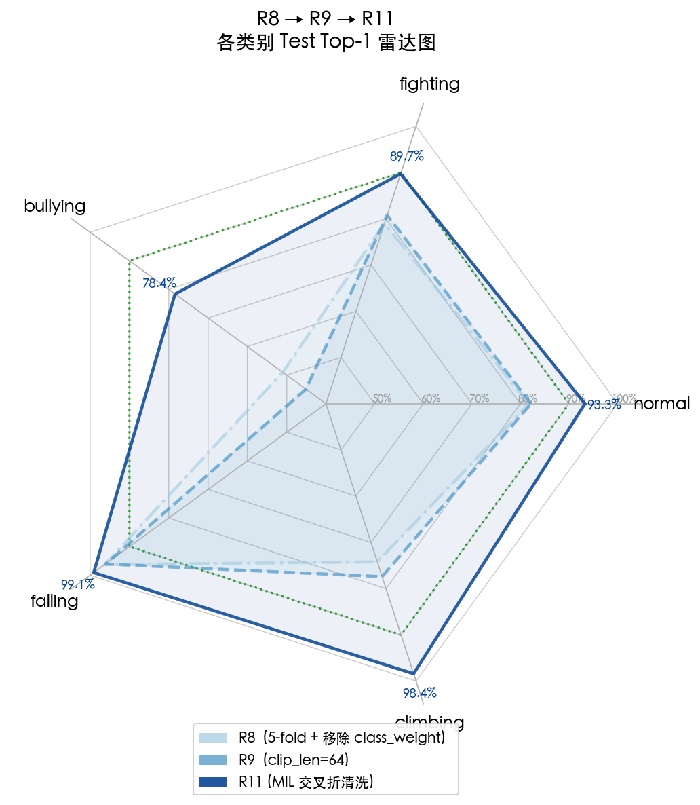

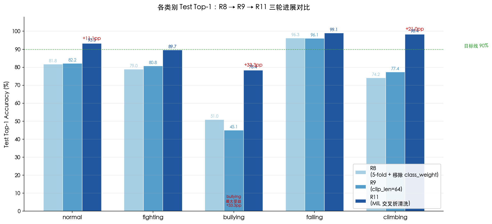

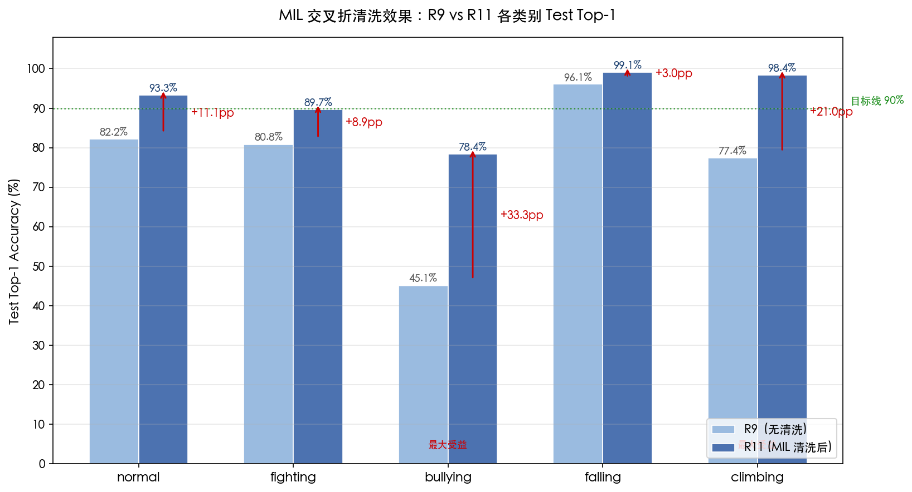

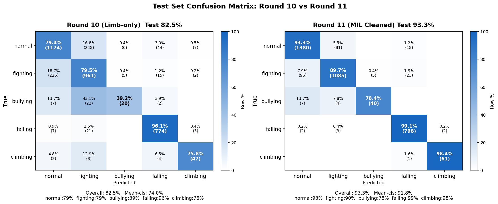

**成功原因：**
1. 清洗掉 4,755 个噪声样本（11.6%），消除了 fighting 视频中的 normal 片段标签噪声
2. normal↔fighting 互混大幅下降
3. bullying 起死回生（45% → 78%），之前被噪声样本误导
4. **Test 93.3% 已超过 90% 目标线**

---

## 3. 准确率趋势总表

| Round | Val top1 | Test top1 | 关键变化 |
|---|---|---|---|
| 1 | 41.5% | — | Baseline 8 classes |
| 2 | 31.8% | — | 7 classes |
| 3 | 65.1% | — | 6 classes + balanced |
| 4 | 33.1% | — | with_limb=True（数据 bug）|
| 5 | 56.2% | — | Fixed keypoint_score |
| 6 | 53.8% | — | 5 classes（移除 vandalism）|
| 7 | 17.8% | — | class_weight+oversample 碰撞 |
| 8 | **81.3%** | **83.5%** | **K-fold CV + 移除 class_weight + 30 epochs** |
| 9 | **82.4%** | **84.2%** | clip_len 48→64 + weight_decay 0.001 |
| 10 | 80.7% | 82.5% | with_limb=True（数据干净后可用，略低于 kp）|
| 11 | **89.9%** | **93.3%** | **MIL 交叉折清洗（threshold=0.3, -4755 噪声）** |

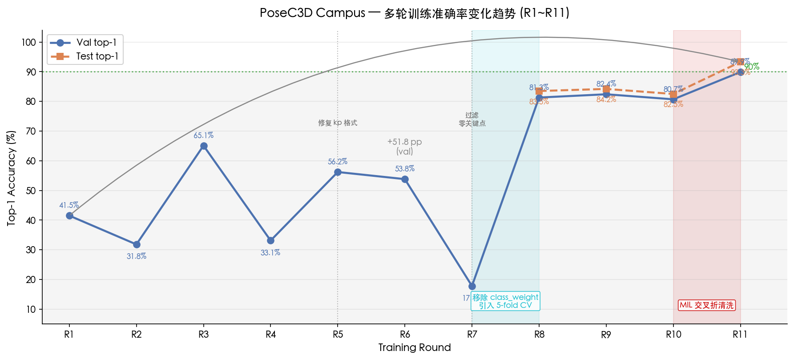

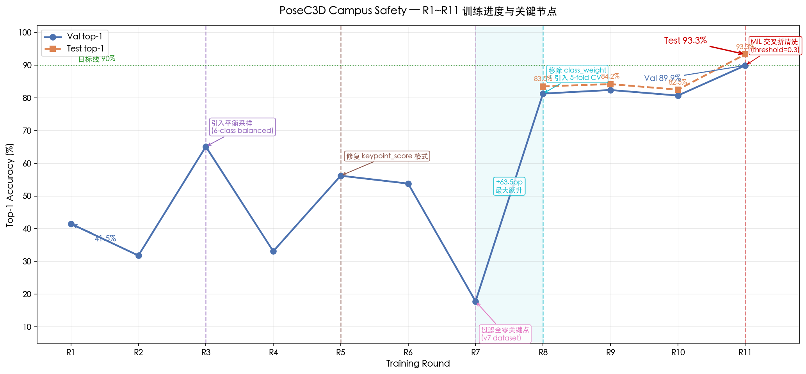

---

## 4. MIL 数据清洗（突破 85% 的关键）

### 背景

R9 卡在 84.2% test，主要瓶颈是 normal ↔ fighting 互混。根本原因：fighting 视频中大量片段其实是 normal 行为（1 分钟里 30 秒正常），但所有 clip 都继承了视频级 "fighting" 标签。

### 方法：交叉折打分（Cross-Fold Scoring）

用 5-fold 的模型对数据打分 — 每个样本只被**没见过它**的模型评分：

```
Fold i 模型（训练在 kfold_i train 上）→ 打分 kfold_i 的 val
合并 → 37,289 个样本都有无偏 P(true_label)
```

**重要教训**：最初尝试直接用 R9 模型对全量 `campus.pkl` 打分，但模型在训练集上达到 ~99% accuracy，对训练样本过度自信（P(true)≈1.0），无法区分噪声。改用交叉折后问题解决。

### 噪声分析结果

5-fold 全量覆盖（37,289 样本），各 fold 分布高度一致：

| 类别 | 总数 | P<0.3（明确噪声）| P<0.5（可疑）| 噪声程度 |
|---|---|---|---|---|
| fighting | 12,772 | 2,559 (20.0%) | 3,301 (25.8%) | 高 |
| normal | 14,917 | 2,196 (14.7%) | 3,045 (20.4%) | 中高 |
| bullying | 446 | 240 (53.8%) | 257 (57.6%) | 极高 |
| climbing | 608 | 142 (23.4%) | 179 (29.4%) | 中高 |
| falling | 8,546 | 347 (4.1%) | 478 (5.6%) | 低（最干净）|

P(true_label) 呈**双峰分布**，threshold=0.3 正好卡在谷底。

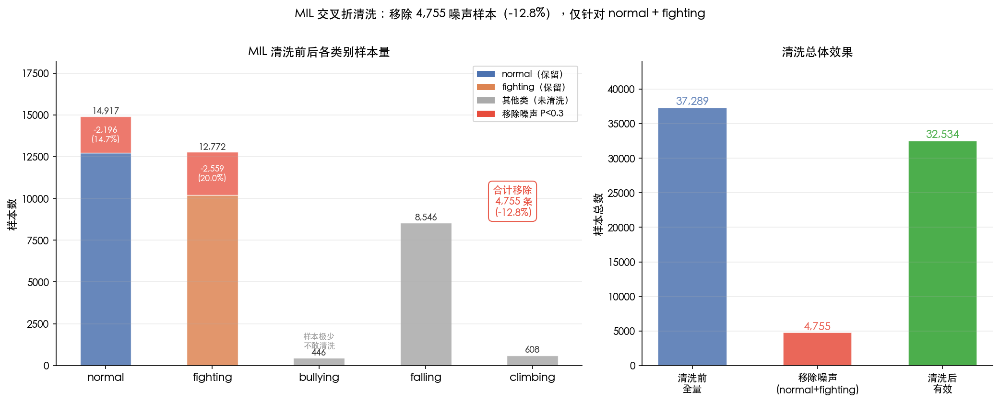

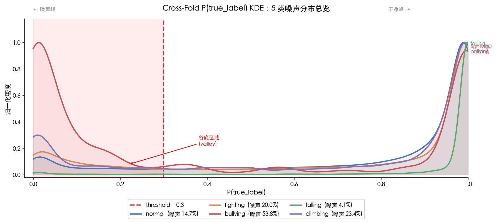

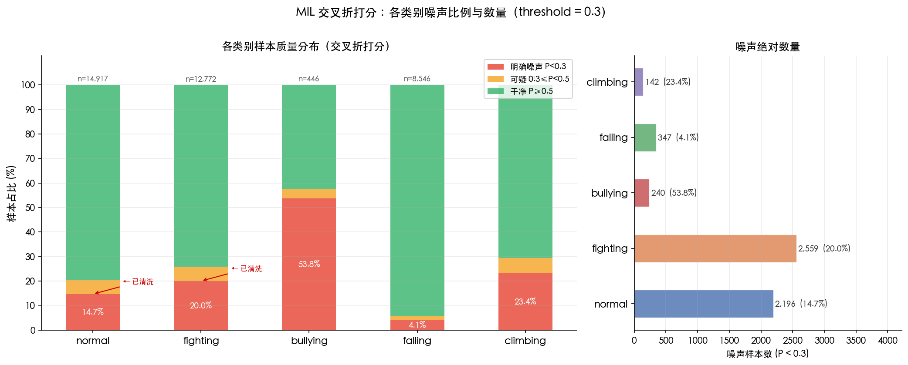

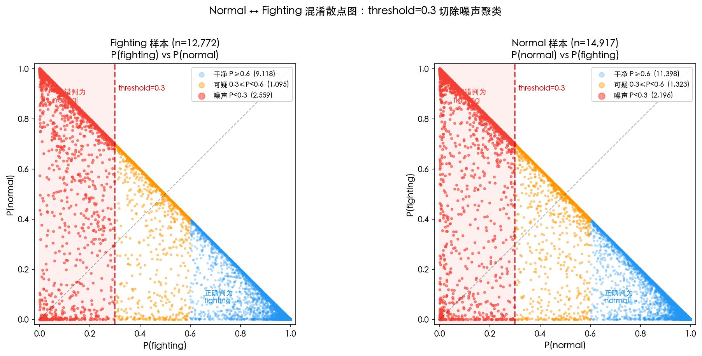

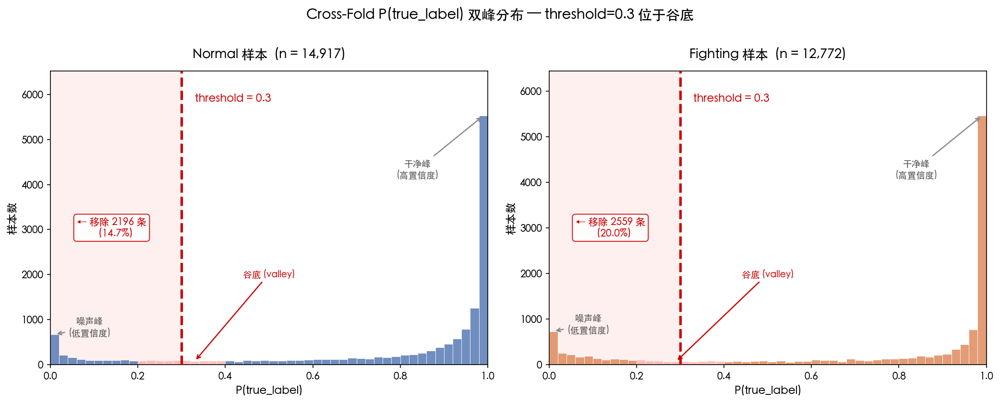

### 清洗策略

使用 `--threshold 0.3 --classes fighting normal`：

```
原始有效样本:  40,895
移除噪声:       4,755 (11.6%)
  - normal:     2,196
  - fighting:   2,559
清洗后:         36,140
```

### MIL 工具链

```
mil_cleaning/
├── score_samples.py       ← 交叉折打分
├── analyze_noise.py       ← 噪声分析 + 直方图
├── clean_and_rebuild.py   ← 阈值过滤 + 重建 kfold pkl
├── export_noisy_samples.py← 导出噪声样本清单
├── resolve_video_paths.py ← 查找源视频
├── collect_videos.py      ← 复制到审核文件夹
├── scores.pkl
├── noise_distribution.png
├── noise_report.txt
└── HANDOFF.md
```

---

## 5. 数据管线

```
step4_build_pkl.py    → train.pkl + val.pkl（原始骨骼提取）
        ↓
reformat_pkl.py       → campus.pkl（合并 split dict）
        ↓
build_kfold_data.py   → campus_kfold_0~4.pkl + campus_test.pkl   ← R8+
                         - 过滤 label >= 5
                         - 过滤全零关键点
                         - Dedup frame_dir
                         - 10% 视频级 held-out test
                         - 90% → 5-fold 视频级 CV
                         - 每 fold 独立 undersample(CAP=6000) + oversample(MAX=3×)
        ↓
mil_cleaning/*        → campus_mil_kfold_0~4.pkl + campus_mil_test.pkl  ← R11
                         - 5-fold 交叉折打分
                         - threshold=0.3 过滤 fighting/normal 噪声
```

旧流程（R7 及之前）：`fix_and_balance.py → campus_balanced_v7.pkl`（80/20 split，无 test set）。

---

## 6. 关键配置总表

### 6.1 训练配置（R6–R11）

| Parameter | R6 (v3) | R7 (v3) | R8 (fold) | R9 (v4) | R10 (v5) | R11 (mil) |
|---|---|---|---|---|---|---|
| num_classes | 5 | 5 | 5 | 5 | 5 | 5 |
| dropout | 0.5 | 0.5 | 0.5 | 0.5 | 0.5 | 0.5 |
| class_weight | [1,1,1.5,1,2.5] | [1,1,1.5,1,2.5] | **移除** | 移除 | 移除 | 移除 |
| clip_len | 48 | 48 | 48 | **64** | 64 | 64 |
| total_epochs | 50 | 50 | **30** | **50** | 50 | 50 |
| lr | 0.005 | 0.005 | 0.005 | 0.005 | 0.005 | 0.005 |
| weight_decay | 0.0003 | 0.0003 | 0.0003 | **0.001** | 0.001 | 0.001 |
| with_kp | True | True | True | True | **False** | True |
| with_limb | False | False | False | False | **True** | False |
| train resolution | 56 | 56 | 56 | 56 | **64** | 56 |
| videos_per_gpu | 16 | 16 | 16 | 16 | **12** | 16 |
| ann_file | v5.pkl | v7.pkl | kfold_0 | kfold_0 | kfold_0 | **mil_kfold_0** |

### 6.2 E2E Pipeline 参数（当前版本，Round 8 后）

| 参数 | 值 | 说明 |
|---|---|---|
| clip_len | 64 | PoseC3D 输入帧数 |
| stride | 16 | 推理步长 |
| buf_max | 256 (4×clip_len) | SkeletonBuffer 最大历史帧数 |
| min_infer_frames | 32 (clip_len//2) | 最少帧数即可推理 |
| pose_threshold | 0.3 | PoseC3D 最低置信度（fighting/bullying 也用此阈值）|
| attack_prob_threshold | 0.3 | **新增 R8**：fighting 或 bullying 概率触发攻击判定的阈值（不依赖 argmax）|
| vote_window | 5 | 时序投票窗口 |
| VOTE_ENTRY_MIN.fighting | 3 | 进入 fighting 所需窗口计数 |
| VOTE_ENTRY_MIN.bullying | 3 | 进入 bullying 所需窗口计数 |
| VOTE_ENTRY_MIN.falling | 2 | 进入 falling 所需窗口计数 |
| VOTE_ENTRY_MIN.climbing | 2 | 进入 climbing 所需窗口计数 |
| VOTE_HOLD_MIN.falling / climbing | 1 | R8 / R9 保持 |
| VOTE_HOLD_MIN.fighting / bullying | **2** | **R9**：1→2 防永锁（原 R8.1 设为 1 后进入态几乎退不出）|
| hysteresis upgrade | 允许 | **R8**：HOLD 时另一异常票数严格更多即切换 |
| attack_prob 触发 | ≥0.3 **且** ≥ normal_prob × 0.7 | **R9**：加相对优势判定，normal 主导时攻击门槛抬高 |
| asymmetry 逻辑 | `ratio<0.5 AND head_hip>0.15` | **R9**：OR→AND + 阈值收紧（原 R3: `<0.6 OR >0.1`）|
| YOLO falling deferred | 启用 | **R9 P7**：被 PoseC3D 弱攻击信号抢先时暂存，step 6 未判攻击则兜底返回 falling |
| proximity_factor | 1.5×max(身高) | fighting/bullying 近距离约束 |
| upright_threshold | 3% 画面高度 | falling 姿态验证阈值 |
| smooth_alpha | 0.5 | EMA 关键点平滑系数 |
| bbox overlap threshold | 10% | 替代距离判定（3D 纵深）+ pair coupling 门槛（R8.5）|
| pair coupling | 启用 | **R8.5**：bbox overlap ≥ 10% 的 track 对强制共享攻击态 |
| cross-label injection | 扩展到全攻击路径 | **R8.5**：rule_bullying/fighting 触发时向 bbox overlap 邻居 raw history 注入同标签 |
| reassoc max_dist_ratio | 15% 画面高 | 新 track 匹配旧 track 阈值 |
| vertical movement ratio | 5% 画面高 | climbing 必需垂直位移 |
| grace_frames | 90（~3s @30fps）| 遮挡宽限期 |
| loiter_time | 300s | 徘徊阈值 |
| small_obj_model | 3 路单类 | **R11 (E2E)**：v8 拆分为 3 个独立 YOLO11m 模型 — laying / smoking / phone。SingleClassDetector 统一语义映射 |
| YOLO gating | 帧级按需触发 | **R11 (E2E)**：falling 始终跑（安全兜底）；smoking/phone 在任一 track ∈ {fighting,bullying,falling,climbing} 时跳过（物理互斥）|

---

## 7. 训练/评估命令

### 训练

```bash
cd /home/hzcu/BullyDetection/pyskl && \
LD_LIBRARY_PATH=/home/hzcu/miniconda3/pkgs/cuda-cudart-11.8.89-0/lib:$LD_LIBRARY_PATH \
CUDA_VISIBLE_DEVICES=0 python -m torch.distributed.run --nproc_per_node=1 \
tools/train.py configs/posec3d/finetune_campus_mil.py --launcher pytorch
```

### 评估

```bash
cd /home/hzcu/BullyDetection && python per_class_eval_v2.py
```

### E2E 推理

```bash
cd /home/hzcu/mnt/autodl/e2e_pipeline && python run.py \
  --source <video_path> \
  --output <output_path>
```

---

## 8. E2E 部署调优历史（Round 1–13）

### 背景

R11 模型 test 93.3%，但在真实视频流上跑 E2E pipeline 表现差。**核心不是模型问题，是后处理管线多层过度过滤叠加**。

**Debug 统计（最初，542 次推理）：**

| 过滤层 | 吃掉数 | 机制 |
|---|---|---|
| threshold < 0.5 | 67 | fighting=0.498 等被强制归 normal |
| vote: current=normal 直接返回 | 417 | 一次 normal 立刻覆盖所有异常历史 |
| vote: 票数不够 | 21 | 首次 fighting 只有 1/3 票 |
| buffer 不足 SKIP | 3353 | 86% 帧无法推理（track 碎片化）|

### E2E Fix Round 1 — 后处理基础修复

| 修改 | 文件 | 详情 |
|---|---|---|
| 重写 `_vote_smooth` | rule_engine.py | 改为异常偏向：窗口内有 1 次异常就维持告警，全部 normal 才清除 |
| 降低 `pose_threshold` | rule_engine.py + pipeline.py | 0.5 → 0.3 |
| 允许半满 buffer 推理 | pipeline.py | `should_infer` 最低帧数 64 → 32 |
| CLI 默认参数 | run.py | vote-window 5→3, vote-ratio 0.6→0.34 |

**效果：**

| 指标 | 修复前 | 修复后 | 变化 |
|---|---|---|---|
| SKIP（buffer 不足）| 3353 | 622 | -81% |
| 被 threshold 过滤 | 67 | 17 | -75% |
| 被 vote 压成 normal | 21 | **0** | 消除 |
| FINAL fighting | 30 | 77 | +157% |
| FINAL falling | 37 | 78 | +111% |

**残余问题**：75% 推理仍输出 normal — 根因是训练/推理时序采样不一致。

### E2E Fix Round 2 — 均匀采样修复

| 修改 | 详情 |
|---|---|
| 扩大缓冲区 | `buf_max = clip_len * 4 = 256`（~8.5s）|
| 均匀采样 | `get_clip()` 用 `np.linspace` 从全部缓存帧均匀采 64 帧，模拟训练时 `UniformSampleFrames` |
| threshold 硬编码修复 | pipeline.py 硬编码 `pose_threshold=0.5` 覆盖了默认值，修为 0.3 |

### E2E Fix Round 3 — bullying/fighting 区分 + 误报控制

**问题**：坐着被误判 fighting；fighting 和 bullying 难以区分。

| 修改 | 详情 |
|---|---|
| `_vote_smooth` 分级响应 | falling/climbing 1 次即告警，fighting/bullying 需 2 次确认 |
| bullying 不对称检测 | `check_bullying_asymmetry()`：身高比<0.6 或 头-髋差>10%画面高 → fighting 改判 bullying |
| 传递完整骨骼数据 | 收集所有人的 (kps, scores) 传给规则引擎 |

### E2E Fix Round 4 — 正常视频误报修复

**问题**：靠墙站立误判 fighting → bullying；坐下过程误判 falling。

| 修改 | 详情 |
|---|---|
| fighting 近距离约束 | 必须有另一人在附近才算 fighting |
| fighting 置信度门槛 | fighting 单独要求 conf ≥ 0.5 |
| fighting vote 要求 | 窗口内需 3 次 fighting（最严格）|
| falling 姿态验证 | `_is_upright_posture()`：头-髋差 > 8% 画面高 → 躯干直立 → 非 falling |
| 高置信度也验证 | falling conf>0.7 也需过姿态验证 |

### E2E Fix Round 5 — Proximity 放宽 + Bbox 修复

**问题**：bully 视频中倒地者 proximity 太严杀掉 98 个 fighting；踢人者只显示骨架无框。

| 修改 | 详情 |
|---|---|
| Proximity 用两人最大身高 | `ref_height = max(my_height, neighbor_height) × 1.5` |
| Bbox 变量 bug | 每个 track 存储自己的 bbox，不再引用循环残留变量 |
| 始终显示 bbox + 标签 | 未推理时默认显示 normal + 绿色框 |

### E2E Fix Round 6 — YOLO 三类 + YOLO 辅助 falling + 遮挡宽限

**模型路径**：`/home/hzcu/yjm/home/yjm/VideoDetection/v6/runs/detect/campus_A28/unified_3class_model/weights/best.pt`

| 修改 | 详情 |
|---|---|
| SmallObjectDetector 自动读取类名 | class_map 不再硬编码，从 `model.names` 自动读取 |
| check_smoking 兼容新类名 | 匹配 'cigarette' 或 'smoking' |
| YOLO 辅助 falling 检测 | `check_fallen_by_yolo()`：YOLO detection bbox 与人物骨骼中心重叠（20% margin）|
| YOLO falling → bullying 升级 | 躺地 + 附近 track 历史含 fighting/bullying → bullying；否则 → falling |
| 遮挡宽限期（grace_frames=90）| 三组件统一：SkeletonBuffer / RuleEngine / Pipeline.track_labels，track 消失后保留状态 90 帧 |
| 默认加载小物体模型 | `--small-obj-model` 默认指向 unified_3class_model |

### E2E Fix Round 7 — Track 重关联 + 姿态/位移约束 + 投票升级 + Bbox 重叠

**问题**：T3 被遮挡后 ByteTrack 给同一个人新 ID（T4），grace 保留的 falling 白白浪费；坐着的人被识别为 falling/climbing；攻击历史一次即触发 bullying；3D 纵深场景距离判断失效。

| 修改 | 文件 | 详情 |
|---|---|---|
| Track 重关联 | pipeline.py + rule_engine.py | 新 track 出现时，按位置匹配宽限期内消失的旧 track（threshold=15% 画面高），迁移 SkeletonBuffer 帧、投票历史、显示标签 |
| Loitering 5 分钟 + 降优先级 | rule_engine.py | loiter_time 60→300s；优先级降到 PoseC3D 之后（避免 bullying 被误覆盖）|
| 坐姿检测（多次迭代）| rule_engine.py | 最终方案：`_is_sitting_posture` 用骨骼包围框纵横比 h/w > 1.0 → 非倒地；`_is_upright_posture` 阈值 8%→3% 画面高 |
| YOLO falling 路径加坐姿验证 | rule_engine.py | 之前坐姿检测只在 PoseC3D 路径，但 falling 实际从 YOLO 辅助路径走 |
| 信任 YOLO falling | rule_engine.py | 测试俯视角度躺地视频后，移除 YOLO 路径的姿态检查（像素坐标检查受相机角度影响）|
| Climbing 垂直位移约束 | rule_engine.py | `_has_vertical_movement`：近 30 位置 Y 范围 < 5% 画面高 → 无垂直运动 → 非 climbing |
| EMA 关键点平滑 | pipeline.py | SkeletonBuffer.update() 对 17 个关键点做 α=0.5 EMA |
| Bullying 攻击历史阈值 | rule_engine.py | 从「任意 1 次攻击」改为「历史≥2 且攻击占比≥50%」，避免路人误触发 |
| Vote 窗口 3→5 | rule_engine.py + run.py | falling/climbing vote_min 1→2, bullying 2→3, fighting 保持 3 |
| Bbox 重叠替代距离 | rule_engine.py + pipeline.py | YOLO bullying 判定改用 `_bbox_overlap_ratio`（重叠面积/较小 bbox 面积 > 10%）|

**提交链路：** `c9dec2b` 重关联 → `1a93399` loitering 阈值 → `2afec40~09395f0` 坐姿检测迭代 → `1d188fb` 垂直位移 → `e5edb69~add2edc` YOLO 纵横比 → `b081d01` EMA → `e4539df` 攻击历史持续性 → `4b196ae` vote 窗口 → `00d2e02` bbox 重叠。

---

### E2E Fix Round 8 — 滞回投票 + 攻击概率主导（本章核心：R7 部署后残留问题的系统性修复）

**背景**：R7 之后观察到两个严重 bug：
1. 明显的 fight/bully 行为无法持续识别，只有一段后变 normal
2. 倒地同时被 bully 的人持续被识别为 falling/normal 而非 bullying

根本原因链：VOTE 阈值过严 → 窗口内 fighting 计数跌到 2 立刻归 normal；施暴者 raw history 大量 normal → 受害者 50% 占比条件打不穿；falling 锁死在 HOLD 阻止 bullying 接管；YOLO falling 抢先返回 falling 跳过不对称检测；PoseC3D argmax=normal 但 fighting_prob>0.3 被丢弃。

本 Round 分四次提交修复：

#### R8.1 — 滞回投票 + 放宽受害者 + 双向传播（commit `9d8ced2`）

**文件**：`e2e_pipeline/rule_engine.py` (+79/-23)

| 修改 | 机制 |
|---|---|
| A. 滞回投票（hysteresis）| 新增 `VOTE_ENTRY_MIN`（入=3/2）和 `VOTE_HOLD_MIN`（维持=1）分离；新增 `_last_smoothed[tid]` 跟踪上次输出；异常态时只要 ≥HOLD_MIN 就继续 |
| B. 放宽受害者判定 | YOLO 躺地 + bbox overlap≥10% 的邻居判定：旧「攻击历史占比≥50%」→ 新「邻居 smoothed ∈ {fighting,bullying} **或** 最近 3 条 raw history 有攻击」|
| C. 双向传播 | 受害者被判 bullying 时，新增 `_inject_raw_history()` 向邻居 raw history 追加一条 `bullying` 弱证据，防重复（末尾相同则跳过）+ 截断到 vote_window |
| migrate_track / clear_stale_tracks 同步 | 迁移/清理 `_last_smoothed` |

**设计意图**：A 让告警不再因 PoseC3D 闪烁而断裂；B 解决攻击者 raw history 噪声打不穿 50% 阈值的问题；C 让受害者↔施暴者相互强化，形成稳定攻击状态。

#### R8.2 — 滞回升级（commit `1fa3a21`）

**背景**：R8.1 后日志显示受害者 RAW 判定正确输出 bullying，但 FINAL 全被 smooth 压回 falling：
```
[VOTE] T7 current=bullying → falling (HOLD 1>=1) | history=[falling,bullying,bullying,bullying,bullying]
→ 4 bullying vs 1 falling，但 falling HOLD_MIN=1 就锁死
```

**修改**：`_vote_smooth` 的 HOLD 分支内加入升级检查（+9 行）：
```python
if last_count >= hold_min:
    top_label, top_count = anomaly_counts.most_common(1)[0]
    if top_label != last and top_count > last_count:
        return top_label  # UPGRADE
    return last           # HOLD
```

**效果**：
```
history=[falling,bullying,bullying,bullying,bullying]
→ bullying:4 > falling:1 → UPGRADE 到 bullying ✓
```
票数相同或更少时仍 HOLD，避免振荡。

#### R8.3 — PoseC3D 优先于 YOLO falling（commit `ebbf93c`）

**背景**：日志 F330–F760，T4 受害者被持续殴打，PoseC3D 正确输出 fighting=0.5~0.8，但 step 2 的 YOLO falling 抢先返回 falling，跳过了 step 6 的不对称检测：
```
F346: PoseC3D fighting=0.794 → [RAW] falling (YOLO辅助检测)
F362: PoseC3D fighting=0.641 → [RAW] falling (YOLO辅助检测)
```

**修改**：`_raw_judge` 在 YOLO falling 默认返回之前，检查 PoseC3D 是否有攻击信号（+16/-4）：
```python
if pose_label == 'fighting' and pose_conf >= 0.5:
    # 跳过 YOLO falling，交给 step 6 处理
elif pose_label == 'bullying' and pose_conf >= pose_threshold:
    # 跳过 YOLO falling
else:
    return 'falling', ..., 'rule_yolo_falling'
```

**设计原则**：YOLO falling 的本意是补偿「一动不动 + PoseC3D 输出 normal」的盲区。当 PoseC3D 已检出攻击信号时，没有盲区要补偿——攻击信号优先。

#### R8.4 — 攻击概率主导（commit `18fad7c`）

**背景**：日志 F431–F767，T1 一直殴打躺地的 T4，但 PoseC3D 概率分布是：
```
F447: normal=0.526 fighting=0.370   ← fighting 触发 0.3 但 argmax=normal
F463: normal=0.479 fighting=0.403
F591: normal=0.667 fighting=0.314
F751: normal=0.508 fighting=0.480
```
每帧 `fighting ≥ 0.3`，但 argmax=normal → 输出 normal → 不进入不对称检测。

**修改**：重构 step 6（+70/-38），改为**攻击概率主导**，不依赖 argmax：

```python
attack_prob = max(fighting_prob, bullying_prob)
if attack_prob >= 0.3:
    if proximity_ok:                             # 必要保护
        if asymmetry_ok → bullying               # 不对称=霸凌
        elif bullying_prob >= fighting_prob → bullying
        else → fighting                          # 对称攻击
    else: 落到 argmax 路径（fighting/bullying argmax 降 normal）
else: 走 argmax 路径（normal/falling/climbing 的姿态验证）
```

同步调整 step 2 (YOLO falling) 的跳过条件：`argmax==fighting && conf>=0.5` → `fighting_prob>=0.3 or bullying_prob>=0.3`。

**保留的保护**：
- `proximity_ok`（孤立个体不算攻击）
- `check_bullying_asymmetry`（fighting → bullying 升级）
- vote ENTRY=3 在 5 窗口（噪声过滤）

**删除**：`fighting conf<0.5 → normal`（被 0.3 概率阈值替代）

#### R8.5 — Pair Coupling：bbox 重叠 track 强制共享攻击态（commit `20185f3`）

**背景**：R8.4 后日志发现仍有两个结构性 bug：

**Bug 1 (F575–F618)**：T1 持续殴打躺地的 T4，bbox 明显重叠，但 T4 持续被判 bullying，T1 持续被判 normal。

```
F554: T4 RAW=bullying(对称)  history=[b,b,b,b,b]           → bullying ✓
F575: T1 RAW=normal(0.854)   history=[n,n,n,n,n]           → normal  ✗ T1 掉出
F591: T1 RAW=bullying(对称)  history=[n,n,n,n,b] ENTRY 1<3 → normal  ✗
F607: T1 RAW=bullying(对称)  history=[n,n,n,b,b] ENTRY 2<3 → normal  ✗
F618: T4 RAW=normal(0.821)   history=[b,n,n,n,n] HOLD 1>=1 → bullying ✓
```

**Bug 2 (F618–F778)**：受害者 T4 也掉出 bullying 被锁进 falling，直到 F778 才恢复。

```
F634: T4 RAW=normal(0.816)   history=[n,n,n,n,n]           → normal
F682: T4 RAW=falling(YOLO)   history=[n,n,n,fa,fa] ENTRY 2 → falling ✗
       _last_smoothed[T4] = falling
F762: T4 RAW=bullying        HOLD falling 1>=1             → falling ✗
F778: T4 RAW=bullying        UPGRADE bullying:2>falling:1   → bullying ✓
```

**根因**：每个 track 独立判定。bbox 重叠说明 T1 和 T4 是**同一场交互事件**，但判定机制不耦合 → T4 早期入 bullying 的 HOLD 保持，T1 后入场却因 fighting_prob 在 0.15~0.38 波动，永远凑不齐 5/5 窗口中的 3 次。受害者 PoseC3D 看倒地不动输出 normal 冲刷窗口 + YOLO falling 又锁进 falling，双方同时失效。

**修复 A：扩展双向传播到 asymmetry / 对称攻击路径**

R8.1 只在 `rule_yolo_bullying` 路径（YOLO 躺地检测）注入邻居 raw history。R8.5 扩展到 step 5 的 `rule_bullying`（asymmetry）和对称攻击路径：

```python
# 新增 _inject_to_overlapping_neighbor(track_id, label, track_bboxes_dict)
# 找 bbox overlap 最高的邻居（≥10%）→ _inject_raw_history(neighbor, label)
```

每次 rule_bullying/fighting 判定，向配对邻居 raw history 同步注入同一标签 → 加速邻居达成 ENTRY=3。

**修复 B：Post-smoothing pair coupling**

新增 `RuleEngine.couple_overlapping_pairs(judgments, track_bboxes_dict)`，在所有 track smooth 判定完成后，扫描 track 对强制共享攻击态：

```
A ∈ {fighting, bullying} + B normal + bbox overlap ≥ 10%
  → B 升级为 A 的标签，source = 'pair_couple(A_tid)'
  → _last_smoothed[B] = A 的标签（让后续 HOLD 维持）

A = bullying + B falling + overlap ≥ 10%
  → B 升级为 bullying（受害者在霸凌场景中应判 bullying，不是单纯 falling）

A = fighting + B falling + overlap ≥ 10%
  → B 保持 falling（独立倒地事件）
```

**pipeline.py 结构调整**：`_process_frame` 从 `loop(infer+visualize)` 重构为 `loop(infer) → couple → loop(visualize)`，确保耦合作用在所有 track 上（不只本帧推理的）。事件日志也用耦合后的标签。

**保留的保护**：
- ENTRY=3/2 严格入口（防止路人被错误拉入攻击态）
- bbox overlap ≥ 10% 是耦合的必要门槛（只有真的互动才耦合）
- falling + fighting 不耦合（独立事件）

**预期对照 Bug 1/2**：

| 帧 | T1 | T4 | 预期效果 |
|---|---|---|---|
| F586 | normal | bullying (HOLD) | 耦合：T1 ← bullying from T4 |
| F591 | RAW=bullying | bullying | T1 ENTRY 被 A 注入加速 |
| F634 | (holds via couple) | normal → 被 T1 coupling 拉回 bullying | T4 不再掉入 normal |
| F682 | bullying | falling (YOLO) | A=bullying + B=falling → B 升级 bullying |

---

### E2E Fix Round 9 — 规则引擎判定逻辑收紧（反制 R8 过矫正的系统性修复）

**背景**：R8.1–R8.5 五次连续修复都在「把系统往倾向报告攻击的方向推」—— 降阈值、pair coupling、跨 track 注入、攻击概率主导、HOLD=1。叠加后进入攻击态极易、退出极难。R9 做反向收紧，目标"实事求是"，不倾向任何一边。深度审视判定逻辑找到 7 处结构性问题（P1–P7），本轮先实施 ROI 最高的 4 处：P1/P2/P5/P7（纯阈值+少量兜底逻辑，不动框架）。

#### P1 — attack_prob 改为相对优势判定（绝对阈值 → 绝对+相对）

**问题**：`attack_prob >= 0.3` 是绝对阈值，忽略 normal 的压制。PoseC3D 5 类 softmax + R11 仍残留 ~10% normal↔fighting 互混 → `[normal=0.60, fighting=0.32, ...]` 会触发攻击判定，但 normal 是 fighting 两倍。等价于"只要 fighting 不被完全压制就考虑"。

**修改**（rule_engine.py 步骤 6）：
```python
normal_prob = float(pose_probs[0])
relative_ok = attack_prob >= normal_prob * 0.7
if attack_prob >= self.pose_threshold and relative_ok:
    # 进入攻击判定
```

**阈值含义**：normal=0.50 要求 attack≥0.35；normal=0.40 要求 attack≥0.30（与原绝对阈值一致）；normal=0.60 要求 attack≥0.42。normal 越主导，攻击门槛越高。

#### P2 — HOLD_MIN 攻击类 1→2（防永锁）

**问题**：`HOLD_MIN = 1` 意味 5 窗口内只要 1 帧异常就维持。配合 P1 的原低门槛 + pair coupling + raw injection 三重放大 → 进入极易、退出几乎不可能。

**修改**（rule_engine.py `VOTE_HOLD_MIN`）：
```python
VOTE_HOLD_MIN = {
    'falling': 1, 'climbing': 1,
    'bullying': 2, 'fighting': 2,  # R9: 1→2
}
```

falling/climbing 保持 1（姿态延续性高），攻击类要求 5 窗口 2/5 维持。原本 R8 担心的"断裂"来自 ENTRY=3 太严，不是 HOLD=1 太松。

#### P5 — check_bullying_asymmetry 阈值收紧 + OR→AND

**问题**：
```python
is_asymmetric = height_ratio < 0.6 or head_hip_normalized > 0.1
```
身高比<0.6（真实身高差+PoseC3D 漏检下半身频繁触发）、头-髋差>10% 画面高（正常弯腰、蹲下、拾物即满足）。**OR** 让任一条件即触发 + 单帧判定 → 姿态瞬间抖动即误判 bullying。

**修改**（rule_engine.py line 398）：
```python
is_asymmetric = height_ratio < 0.5 and head_hip_normalized > 0.15
```

两条件必须同时满足；阈值分别收紧到 50% 身高比 + 15% 画面高。

#### P7 — YOLO falling 暂存 + 兜底消费（修复结构性 bug）

**问题**：R8.3 的 step 2 跳过逻辑：
```python
if fighting_prob_early >= 0.3 or bullying_prob_early >= 0.3:
    # 跳过 YOLO falling，交给 step 6
```
但 step 6 若 proximity 失败（独自躺地）→ 走 argmax 路径 → argmax=normal → 输出 normal。**YOLO 检测到的 falling bbox 被完全吞掉**。一个独自昏倒的人只要 PoseC3D 噪声输出 fighting=0.3 就不会被标 falling。

**修改**（rule_engine.py）：
1. step 2 跳过时把 YOLO falling 结果存进局部变量 `yolo_falling_deferred`（而非直接丢弃）
2. step 6 所有分支走完后、step 6d argmax 前，若 `yolo_falling_deferred` 仍存在 → return falling

```python
# Step 2
yolo_falling_deferred = None
if is_fallen_yolo:
    if ... # 优先 bullying 检查
    if PoseC3D 有攻击信号:
        yolo_falling_deferred = (conf, horizontal)  # 暂存
    else:
        return 'falling', ...  # 直接返回

# Step 6 攻击判定走完

# P7 兜底：step 6 未判攻击 → 消费暂存
if yolo_falling_deferred is not None:
    return 'falling', conf, 'rule_yolo_falling'
```

#### 未实施的 P3/P4/P6（ROI 较低或改动量大）

- **P3 Pair coupling 退出机制缺失** —— 当前耦合后 `_last_smoothed[B]=攻击态` 无退出条件，需 coupling TTL + bbox 解耦判定（约 15 行）
- **P4 Pair coupling 无次级阈值** —— B 需要自己的 attack_prob ≥ 0.15 才允许被 A 拉升，需存 last_pose_probs（约 20 行）
- **P6 Raw injection 无弱证据标记** —— 注入应 0.5 票计数而非 full-weight（约 30 行）

P1+P2+P5+P7 改动总量 ~50 行，主体是阈值+兜底路径。P3/P4/P6 视 R9 效果再决定。

#### R9 配置快照

| 参数 | R8.5 | R9 |
|---|---|---|
| attack_prob 触发 | ≥ 0.3 | ≥ 0.3 **且** ≥ normal_prob × 0.7 |
| asymmetry 逻辑 | `ratio<0.6 OR head_hip>0.1` | `ratio<0.5 AND head_hip>0.15` |
| VOTE_HOLD_MIN (attack) | 1 | 2 |
| YOLO falling 被跳过 | 直接丢弃 | 暂存兜底 |

**预期行为变化**：
- 走廊并行两人（height_ratio 0.85, head_hip 5%画面）→ 不再误判 bullying（阈值拦截）
- normal=0.55 fighting=0.35 场景 → 不再进入攻击判定（normal 压制）
- 攻击态一旦确认，5 窗口里 2 帧异常即维持（更稳）但 4 帧 normal 将退出（不永锁）
- 独自昏倒 + PoseC3D fighting=0.3 噪声 → 仍标 falling（YOLO 兜底）

---

### E2E Fix Round 10 — fighting/bullying 判定脱敏（消除 YOLO 误检自激）

**背景**：R9 上线后观察到持续对称 fighting 视频里标签在 fighting ↔ bullying 间反复翻转。debug.log 分析：601 行日志中误判 bullying 集中在 F126–F175 / F415–F450 / **F546–F627（82 帧连续自激）**；其中 F546–F627 两个 track 的 PoseC3D 输出稳定在 `fighting=0.998–0.999, bullying=0.000`，FINAL 却全部是 bullying。

**根因（三条独立病灶）**：

1. **step 2 `rule_yolo_bullying` 完全绕过 PoseC3D argmax** —— YOLO unified_3class falling 模型对 fighting 中倾斜/交缠姿态有误检，即使 PoseC3D 99% 确定 fighting 也被升级为 bullying
2. **cross-inject 无差别污染** —— 一方误判 bullying 即向邻居 history 注入 bullying，邻居稳定 fighting 时也被污染到 UPGRADE，形成自激
3. **step 6c `b ≥ f` 门槛过松** —— R11 训练数据 bullying 样本 446 vs fighting 12772（28:1 不平衡），softmax 抖动 `b=0.49 f=0.51` 就能翻转

本 Round 三改动（~40 行）：

#### P8 — step 2 邻居收紧 + PoseC3D 否决门（commit `8af7a53`）

**文件**：`e2e_pipeline/rule_engine.py:526-572`

| 修改 | 旧 | 新 |
|---|---|---|
| 邻居触发条件 | `smoothed ∈ {fighting,bullying}` 或最近 3 帧含攻击 | 仅 `smoothed=bullying` 或最近 3 帧含 bullying |
| PoseC3D 否决门 | 无 | `fighting_prob≥0.7 AND bullying_prob<fighting_prob*0.3` 时跳过整个 step 2（bullying+falling 都跳） |

**语义**：邻居是 fighting 说明两人对称对打，不是 bullying 证据；PoseC3D 极度确定 fighting 时无"一动不动躺地"盲区需要 YOLO 补偿，YOLO 信号视为误检。

#### P9 — cross-inject 条件化（commit `8af7a53`）

**文件**：`e2e_pipeline/rule_engine.py:865-892`

**修改**：`_inject_raw_history` 接收 `label='bullying'` 前检查邻居最近 3 帧，若 ≥2 帧 fighting 则拒绝注入。

**语义**：邻居正稳定在 fighting（对称对打）时，一方因 YOLO 误检短暂判 bullying 不应污染对方 ENTRY 计数。

#### P10 — step 6c 相对门槛收紧（commit `8af7a53`）

**文件**：`e2e_pipeline/rule_engine.py:664-680`

| 修改 | 旧 | 新 |
|---|---|---|
| bullying 判定门槛 | `bullying_prob >= fighting_prob` | `bullying_prob >= fighting_prob * 1.5 AND bullying_prob >= 0.4` |

**语义**：要求 bullying 显著压倒 fighting（1.5 倍）且绝对置信度足够（≥0.4）。R11 的 bullying 训练样本太少，概率边界不稳，必须要求显著优势才采信，不然单帧抖动就会翻转。

#### R10 配置快照

| 参数 | R9 | R10 |
|---|---|---|
| rule_yolo_bullying 邻居条件 | `{fighting,bullying}` 或 history 含攻击 | `bullying` only |
| PoseC3D 否决 YOLO | 无 | fighting≥0.7 且 bullying<f*0.3 跳过 step 2 |
| cross-inject bullying 前置检查 | 无 | 邻居最近 3 帧 fighting<2 |
| step 6c bullying 阈值 | `b ≥ f` | `b ≥ f*1.5 且 b ≥ 0.4` |

**预期行为变化**：
- F546–F627 自激完全消除（PoseC3D fighting=0.998 触发 P8 否决门）
- 单帧 PoseC3D 输出 b=0.35 f=0.33 不再翻转 bullying（P10 要求显著优势）
- 即使 step 2 误判 bullying，P9 阻断传染到 fighting 邻居
- 真实 bullying 场景（受害者倒地 + 攻击者单向）仍可识别：邻居 smoothed=bullying 持续时 step 2 正常触发；PoseC3D b=0.6 f=0.3 也满足 P10 门槛

---

### E2E Fix Round 11 — 小物体检测三路拆分 + 帧级 gating（commit `074c47f`）

**背景**：队友重训了小物体检测模型，从一个 unified 3-class 模型拆成 3 个独立单类 YOLO11m（性能更好但每类名字可能不一致）。原 `unified_3class_model/best.pt` 替换为：
- `v8/falling/runs/laying_yolo11m_v1/weights/best.pt`（注意：模型文件夹名 `laying` 而非 `falling`，原始 `model.names` 可能输出 `laying` → 直接换权重会导致 rule_engine 字符串匹配失效）
- `v8/smoking/runs/smoking_yolo11m_v1/weights/best.pt`
- `v8/phone/runs/phone_yolo11m_v1/weights/best.pt`

#### 修改 A — SingleClassDetector 语义适配层（pipeline.py）

新增 `SingleClassDetector` 包装单类模型：任何输出 box 强制打固定 `target_class` 标签（`falling`/`smoking`/`phone`），完全忽略模型原始 `names`。rule_engine 字符串匹配逻辑保持不变。

新增 `MultiSmallObjectDetector` 管理 3 路检测器：`detect(frame, need_falling, need_smoking, need_phone)` 按需跳过。

#### 修改 B — 帧级 gating（pipeline.py `_process_frame`）

- **帧级缓存**：同一帧多 track 推理时只调一次 YOLO（原实现 N 个 track 触发 N 次 detect，浪费）
- **按类延迟触发（物理互斥 gating）**：
  - `falling`：始终运行（PoseC3D 对一动不动躺地的盲区必须补偿）
  - `smoking` / `phone`：任一 track 上一帧标签 ∈ {fighting, bullying, falling, climbing} 时跳过（这些状态下人不可能同时吸烟/打电话）

Gating 基于**上一帧**的 track 标签（因果性，不等当前帧判定完）。

#### 修改 C — run.py CLI

新增 `--falling-model` / `--smoking-model` / `--phone-model`，默认指向 v8 三路新路径。保留 `--small-obj-model`（legacy unified 模型）用于回退；若指定则覆盖 3 路配置。`none` 显式禁用单个检测器。

```bash
# 默认使用 3 路单类模型
python e2e_pipeline/run.py --source demo.mp4 --posec3d-config ... --posec3d-ckpt ...

# 回退到旧 unified 模型
python e2e_pipeline/run.py --small-obj-model /old/unified_3class/best.pt ...

# 禁用 smoking 检测
python e2e_pipeline/run.py --smoking-model none ...
```

#### R11 (E2E) 配置快照

| 参数 | R10 | R11 |
|---|---|---|
| 小物体模型 | 1 个 unified 3-class | 3 个 single-class + SingleClassDetector 语义映射 |
| 类名语义 | 依赖 `model.names` 字典 | 强制覆盖为 rule_engine 预期名（falling/smoking/phone） |
| 检测调用频率 | 每 track 推理时都调 | 每帧缓存一次，多 track 共享 |
| gating | 无 | falling 始终跑；smoking/phone 在攻击/倒地/攀爬态跳过 |

**预期效果**：
- 检测器升级（v6 → v8）精度提升（需视频验证）
- 跳过开销：典型 fighting 段每帧少跑 2 次 YOLO；多 track 场景每帧少跑 (N-1) 次

**未处理 / 已知风险**：
- 若 3 个模型的 `conf/imgsz` 需要不同（如 laying 要更高 imgsz 捕大 bbox），目前共用 `yolo_conf=0.3, imgsz=1280`
- 上一帧 gating 有 1 帧延迟：开始吸烟的第一帧若另一 track 仍在 fighting 态，smoking 会被跳过（下一帧 fighting 结束自然恢复）

---

### E2E Fix Round 12 — 遮挡导致 fighting → vandalism 误判修复（commit `b4d389d`）

**背景**：fighting 场景中若一方站在画面前方遮挡另一方，被遮挡者的 YOLO-Pose 骨骼会被挤压最终丢失。pipeline.py 第一遍只收集**本帧检测到**的骨骼到 `frame_persons_kps`。此时：
- PoseC3D 仍从 SkeletonBuffer（grace=90 帧保留）取到 2 人骨架，持续输出 fighting
- rule_engine step 5 `check_vandalism`：`fighting_prob > 0.5 AND len(all_person_kps) == 1` → 触发 vandalism

**矛盾**：PoseC3D 看到 2 人（buffered 视角），rule_engine 看到 1 人（当前帧视角）—— 同一 pipeline 里两套"场景人数"标准。

#### P13 — pipeline 计算 scene_person_count

**文件**：`e2e_pipeline/pipeline.py` `_process_frame`

```python
scene_track_ids = set(current_track_ids) | set(self.skeleton_buf.tracks.keys())
scene_person_count = len(scene_track_ids)
self.rule_engine.push_scene_count(scene_person_count)
```

`skeleton_buf.tracks.keys()` 天然包含 grace 期内被遮挡的 track（`remove_stale` 在帧末才清理），作为正确的"场景物理人数"。

#### P14 — check_vandalism 改用 scene_person_count + 持续性门槛

**文件**：`e2e_pipeline/rule_engine.py`

| 修改 | 旧 | 新 |
|---|---|---|
| 人数判定 | `len(all_person_kps) == 1` | `scene_person_count == 1`（优先，fallback 到 all_person_kps） |
| 持续性 | 单帧即触发 | 要求近 5 次推理 `scene_person_count` 全为 1 |

新增 `RuleEngine.push_scene_count()` 公共方法，`_scene_count_history` 窗口 5 帧。持续性检查在 `_raw_judge` step 5 内完成。

**设计权衡（未采用的方案及原因）**：
- **未扩充 `all_person_kps_scores`**：会给 `check_bullying_asymmetry` / proximity 判定加入陈旧位置，污染姿态判定。单独加 `scene_person_count` 参数只影响 vandalism 语义
- **未给遮挡 track 的骨骼加时间衰减后并入 all_person_kps**：同上，陈旧骨骼会误导位置型判定

#### R12 配置快照

| 参数 | R11 | R12 |
|---|---|---|
| vandalism 人数基础 | `len(all_person_kps)`（本帧检测） | `scene_person_count`（本帧 + grace 期 buffered） |
| vandalism 持续性 | 无（单帧即判） | 近 5 次推理场景人数全为 1 |
| `_scene_count_window` | — | 5 |

**预期行为**：
- fighting 中瞬时遮挡 → scene_count 仍=2（被遮挡方在 skeleton_buf.tracks 里）→ 不触发 vandalism ✓
- 极端情况：被遮挡 track 超过 grace=90 帧（~3s）才彻底丢 → 才会开始 scene_count=1 计数，需再 5 次推理（~5 × stride/30 = 2.5s）才触发 → 实际场景不会误判
- 真正单人踹垃圾桶：scene_count 本就稳定=1，持续窗口自然满足，vandalism 正常识别

**未处理**：
- check_vandalism 仍未使用 `small_obj_detections` 验证破坏物（目前 YOLO 无此类）—— 待后续训练破坏物检测器
- 场景人数窗口与 vote_window 都是 5 但独立维护 —— 概念上场景级 vs track 级，不合并

---

### E2E Fix Round 13 — 吸烟检测修复（gating + 关键点 + 投票窗口）（commit `6d3af28`）

**背景**：用户反馈持续抽烟视频里 T1 smoking 只有小部分被识别。分析 debug 日志（F831–F1263）：

1. **F943 起 `[YOLO-GATE] ran=['falling'] skipped=['smoking', 'phone']`**：T3 被 laying YOLO 模型持续误判 falling → 整场 smoking 模型被 gating 关闭 → T1 smoking 模型**根本没跑** → 180 帧苟延到 F1135 彻底失联
2. **F831–F927 gate 开的时候**：T1 RAW smoking 大约 4/7 次推理命中，但 VOTE 窗口 5 帧 ENTRY=2 对稀疏信号太严 —— history=[n,n,s,n,s,n,s,n,n,n] 就会反复进出态
3. **check_smoking 关键点范围过窄**：只查鼻子(0)/左腕(9)/右腕(10)，"手肘弯起拿烟"姿势(kp 7/8 附近)会漏检

#### P15 — 撤销 R11 场景级 gating

**文件**：`e2e_pipeline/pipeline.py`

```python
# R11（错误实现，已撤销）：任一 track 在 fighting/bullying/falling/climbing → 全场跳 smoking/phone
# R13：smoking/phone/falling 固定每帧都跑
gate_need_falling = True
gate_need_smoking = True
gate_need_phone = True
```

**根因**：R11 加 gating 初衷是"物理互斥"（一人倒地不会同时吸烟），但 **per-track 语义被错误实现为场景级** —— T3 倒地会把 T1 的 smoking 模型关掉。YOLO 是帧级调用（一次检测整张画面），per-track gating 在这里根本无法实现，最干净的做法是取消 gating。算力代价有限（每帧 3 路 YOLO 本来就在跑）。

#### P16 — check_smoking 关键点扩展 + 骨骼 bbox 兜底

**文件**：`e2e_pipeline/rule_engine.py`

| 修改 | 旧 | 新 |
|---|---|---|
| 关键点范围 | `[0, 9, 10]`（鼻子、两腕） | `[0, 7, 8, 9, 10]`（+ 两肘） |
| 兜底判据 | 无 | 香烟中心落在人骨骼 bbox **上半身** (y < bbox 中线) → True，置信度×0.8 |

**语义**：
- 肘部覆盖"手肘弯起拿烟在嘴前"、"手垂在身侧拿烟"两种姿势
- 骨骼 bbox 上半身兜底覆盖"香烟位置特殊（腰前/胸前）+ kp 漂移"的边角情况；只限上半身避免裤兜物品误判

#### P17 — smoking/phone 专用 VOTE 窗口

**文件**：`e2e_pipeline/rule_engine.py`

| 修改 | 旧 | 新 |
|---|---|---|
| smoking/phone VOTE_ENTRY_MIN | 默认 2 | 2（不变） |
| smoking/phone VOTE_HOLD_MIN | 默认 1 | **2**（防闪断） |
| smoking/phone 投票窗口 | 默认 5 | **7**（per-label window） |

实现：新增 `VOTE_WINDOW_LABEL = {'smoking': 7, 'phone_call': 7}` 和 `_window_for(label)` helper；`_vote_smooth` 按标签独立计数；history buffer 截断改为 `_max_window()`。

**预期效果**：
- 窗口 5→7，稀疏信号有更多累积面。history=[n,n,s,n,s,n,s] 中 smoking=3 过 ENTRY=2 ✓
- HOLD=2 避免单帧漏检立即退出（窗口内仍有 2 帧 smoking 即维持）
- 攻击/倒地类保持原窗口 5 不变（交互事件节奏不同）

#### R13 配置快照

| 参数 | R12 | R13 |
|---|---|---|
| smoking/phone gating | 场景级互斥 | 无（每帧都跑） |
| check_smoking 关键点 | `[0, 9, 10]` | `[0, 7, 8, 9, 10]` |
| check_smoking 兜底 | 无 | 骨骼 bbox 上半身 |
| smoking VOTE 窗口 | 5 | **7** |
| smoking HOLD_MIN | 1（fallback 默认） | **2** |

**未处理 / 已知风险**：
- T3 的 laying 模型持续误判 falling 是另一个 bug（PoseC3D 明确输出 `normal=1.000, falling=0.000`，但 laying YOLO 连续输出 falling bbox conf=0.3+）。laying 模型在"竖直姿态"场景下的误检率偏高，可能需要：
  1. `check_fallen_by_yolo` 加 PoseC3D 否决门（`normal_prob ≥ 0.9` 时不信任 laying YOLO）
  2. 重训 laying 模型增加"非倒地负样本"
  —— 本轮先不改，优先验证 smoking 侧修复效果
- 7 帧窗口意味着 smoking 退出延迟增加 ~40%（从 5×stride → 7×stride），真正停止吸烟后标签还会保留 ~4 秒

---

### E2E Fix Round 14 — YOLO falling 置信度窗口过滤（实验，commit `4421b26` + 回调待填）

**背景**：R13 日志里 T3 被 laying YOLO 持续误判 falling，conf 始终在 **0.311 ~ 0.365** 之间（贴着 yolo_conf=0.3 下限），PoseC3D 同时输出 `normal=1.000, falling=0.000`。边界低置信度误检。

**改动**：`check_fallen_by_yolo` 加 conf 下限过滤（rule_engine.py:350）

| 阶段 | 筛选条件 |
|---|---|
| 原始 | `class == 'falling'` |
| R14 初版 | `class == 'falling' AND 0.7 < conf < 0.95` |
| R14 回调 | `class == 'falling' AND 0.52 < conf < 0.95` |
| R14 v3 | `class == 'falling' AND conf > 0.52` |
| R14 终版 | `class == 'falling' AND conf > 0.4` |

- **下限 0.4**：黑盒评测视频分布未知，0.52 可能漏掉真实倒地场景（老人缓慢倒地等 conf 介于 0.4~0.5 的边界情况），放宽到 0.4 换取召回
- **去掉上限 0.95**：真实倒地场景 YOLO 可能稳定输出 conf ≥ 0.95,上限可能误拦真阳

**风险/回退计划**：
- 0.4 相比 0.52 会重新放进一部分 laying YOLO 对竖直姿态的误检（日志里 T3 误检 conf 为 0.31~0.36，0.4 仍可拦截）
- 若测试发现误检变多 → 调回 0.52 或加 PoseC3D 否决门（`normal_prob ≥ 0.9` 时不信任 laying YOLO）
- **用户明确表示先试,不行就改回**。直接撤销 conf 条件即可恢复原状

---

### E2E Fix Round 15 — 坐姿被误判 falling 的双路修复（压误报实验）

**背景**：测试视频中坐着的人经常被识别为 falling。debug.log 分析两条关键日志：

```
[F9212] T26 PoseC3D falling=0.933
  [RULE] 姿态直立检查: head_hip=171.4 > 32.4 → 直立(非falling)
  [RAW] T26 → normal (rule_upright)
  [VOTE] T26 current=normal → falling (HOLD 2>=1) | history=[f,f,f,n,f,n,n]
  [FINAL] falling  ← rule_upright 的强证据 normal 被 HOLD 压回 falling

[F9228] T26 PoseC3D falling=0.678 normal=0.307
  [RAW] T26 → falling (YOLO辅助检测: conf=0.533, bbox=竖直)
  [FINAL] falling  ← YOLO laying 路径完全无姿态验证，即使 PoseC3D 已怀疑也直接通过
```

两条独立病灶：
1. **YOLO falling 路径缺姿态否决**（R7 `add2edc` 移除的历史遗留）—— 对静态误检无抵抗
2. **`_vote_smooth` HOLD 不区分 normal 来源**—— 姿态物理规则（强证据）和 PoseC3D normal（弱证据）被同等对待，HOLD 机制盲目压制

#### P18 — YOLO falling 路径加骨骼坐姿软否决

**文件**：`e2e_pipeline/rule_engine.py` `_raw_judge` step 2 最后一个 return 前

| 触发条件（三重门槛必须全满足） | 原因 |
|---|---|
| `valid_kp_count >= 8`（score>0.3 的关键点数） | 遮挡导致骨骼不可信时不否决，避免漏检真阳 |
| `_is_sitting_posture` 返回 True（骨骼纵横比 h/w > 1.0） | 骨骼纵向展开 → 坐/站；躺地无论朝向摄像头还是侧向，关键点不会纵向展开 |
| `pose_probs[0] >= 0.25`（PoseC3D normal 概率） | 要求第二模型交叉验证，避免 PoseC3D 也明确说 falling 时用骨骼否决 |

满足则 return `'normal', rule_sitting_veto_yolo`。

**设计权衡**：
- 为什么不用 `bbox_horizontal`：用户反驳 —— 朝/背对摄像头躺地时 bbox 就是竖直的。bbox 方向判定会引入新漏检
- 为什么用 `_is_sitting_posture`（基于骨骼）：物理语义清晰 —— 关键点纵向展开意味着身体竖直；即使遮挡也只是覆盖范围缩小，不会把坐姿变成躺姿的骨骼形态
- 为什么要 `valid_kp >= 8` + `normal >= 0.25`：承认骨骼不 100% 可信 + PoseC3D 可能同时被骗，所以要求双重证据才否决

#### P19 — `_vote_smooth` 接受姿态规则 source，强证据 normal 否决 HOLD

**文件**：`e2e_pipeline/rule_engine.py`

1. `judge` 把 `source` 传给 `_vote_smooth(track_id, raw_label, raw_source=source)`
2. `_vote_smooth` 在 HOLD 分支前新增退路：若 `current_label=normal` 且 `raw_source ∈ {rule_upright, rule_sitting, rule_no_vertical, rule_sitting_veto_yolo}` 且 `last ∈ {falling, climbing}` → 强制 return `'normal'`

**语义**：姿态物理规则给出的 normal 是"这个姿势在物理上不是 falling/climbing"的硬断言，不应被时序惯性压制。

#### R15 配置快照

| 参数 | R14 | R15 |
|---|---|---|
| YOLO falling 前置姿态检查 | 无 | 骨骼 h/w > 1 + valid_kp≥8 + normal≥0.25 三重门 |
| `_vote_smooth` HOLD 退路 | 只认投票（同票数严格多则 UPGRADE） | 姿态规则 normal 直接退出 HOLD |

**预期行为变化**：
- F9212：rule_upright → 原 HOLD 压回 falling → **现在直接退出 HOLD → normal ✓**
- F9228：YOLO falling → 原直接通过 → **现在若骨骼纵向 + normal≥0.25 → 被坐姿否决 ✓**
- 真实缓慢倒地：骨骼从纵向变横向过程中，`valid_kp >= 8 AND h/w > 1` 只在初期满足，一旦横躺就失效 → 正常标 falling
- 遮挡严重场景（valid_kp < 8）：不触发否决 → 回退到原行为

**风险/回退计划**：
- 风险 1：用户坐姿场景下 PoseC3D 偶发 normal < 0.25（被其它类分流）→ 否决失效，仍判 falling
- 风险 2：`_is_sitting_posture` 的 h/w > 1 阈值对"侧身蜷缩坐地"可能返回 False → 否决失效
- 回退：rule_engine.py 里删除 step 2 的 R15 修复 B 块 + `_vote_smooth` 里删除 STRONG_NORMAL_SOURCES 块即可

**未处理（骨骼稳定性层面）**：
- SkeletonBuffer EMA 当前已做 `score <= 0.3 时沿用前值 × 0.9 衰减`，但只能覆盖 1 帧遮挡；持续遮挡仍把低分新值 EMA 进缓存
- 改进方案（候选 R16）：持续遮挡 > N 帧后把该关键点 score 归零，规则引擎 valid 过滤自然排除；本轮未做，优先验证 R15 效果

---

### E2E Fix Round 16 — P7 兜底路径对称加坐姿否决（R15 P18 覆盖漏补）

**背景**：R15 验证时发现坐姿误判仍然出现，日志定位到另一条 YOLO falling 出口：

```
[F2575] T3 PoseC3D normal=0.616 fighting=0.368
  [RAW] T3 YOLO躺地但PoseC3D有攻击信号 → 暂存YOLO falling给step 6后兜底
  [RAW] T3 attack_prob=0.368过线但被normal压制 (要求>=0.431)
  [RAW] T3 → falling (step 6未判攻击, YOLO falling兜底, bbox=竖直)
  [VOTE] T3 current=falling → normal (ENTRY不足)
[F2591] T3 ... history=[n,n,n,n,n,falling,falling]
  [VOTE] → falling (ENTRY 2>=2)   ← 进入 falling 态
```

**根因**：R15 P18 坐姿软否决只加在 step 2 **信任 YOLO falling 的主路径**，但 `_raw_judge` 里 YOLO falling 有**两个出口**：
1. step 2 直接 return（PoseC3D 无攻击信号 + YOLO 躺地）→ R15 P18 已覆盖 ✓
2. **P7 deferred 兜底路径**（PoseC3D 弱攻击信号但 step 6 未判攻击）→ R15 未覆盖 ✗

P7 兜底路径在 `normal 压制` (relative_ok 失败) / `proximity 失败` / `argmax=normal` 时消费暂存的 YOLO falling 信号，**完全绕过 R15 P18 的三重门槛**。日志里 T3 就是走这条路径进的 falling。

注意：R15 P19（HOLD 强证据退路）对此**无效** —— T3 是通过 VOTE ENTRY 进入 falling（非 HOLD），P19 只拦 HOLD 分支。必须在 RAW 层拦住。

#### P20 — P7 兜底路径加坐姿软否决（与 P18 对称）

**文件**：`e2e_pipeline/rule_engine.py` `_raw_judge` P7 兜底块

门槛与 P18 完全一致：
- `valid_kp_count >= 8`（骨骼可信）
- `_is_sitting_posture` 返回 True（h/w > 1.0 纵向展开）
- `pose_probs[0] >= 0.25`（PoseC3D normal 有一定置信度）

满足则 return `'normal', rule_sitting_veto_yolo`；否则维持原行为返回 falling。

#### R16 配置快照

| 参数 | R15 | R16 |
|---|---|---|
| step 2 主路径 YOLO falling 前坐姿否决 | 有（P18） | 有 |
| P7 兜底路径 YOLO falling 前坐姿否决 | **无** | **有（P20）** |

**预期行为变化**：
- F2575/F2591：P7 兜底前被 P20 否决 → `rule_sitting_veto_yolo` → normal ✓
- 真实缓慢倒地经由 P7 兜底：同 P18，骨骼纵向时被否决但一旦横躺就生效 → 正常标 falling
- 骨骼遮挡严重（valid_kp<8）：回退到原 P7 行为（仍判 falling）

**已知局限**：
- 这是第 3 次往同一个"坐姿 vs 躺姿"判据打补丁（R7 移除 → R15 P18 加主路径 → R16 P20 加兜底路径）。只要规则引擎有**任何新的 YOLO falling 出口**，都得重新加一次这个否决 —— 印证了之前讨论的"手工阈值规则不可收敛"的判断
- 理想方案是把坐姿检查内聚到 `check_fallen_by_yolo` 内部（让它自己返回 False），而不是依赖每个调用点各自加防护。本次 3 天 deadline 内不做架构重构，仅打补丁

**回退**：删除 P7 兜底块内的 R16 P20 段即可。

---

### E2E Fix Round 17 — P8 否决门加 proximity 前置（修复孤立摔倒被 PoseC3D 噪声吞掉）

**背景**：测试视频中一个孤立的摔倒场景被漏检。debug.log 关键三帧：

```
[F15228] T47 PoseC3D fighting=0.775 normal=0.158 falling=0.055
  [RAW] T47 YOLO躺地否决 (PoseC3D fighting=0.775强主导) → 跳过rule_yolo_bullying/falling
  [RAW] T47 攻击信号但proximity失败 (nearest=765 > 210)
  [RAW] T47 → normal (argmax=fighting但proximity失败)
  [FINAL] normal ← YOLO falling 信号被 P8 完全吞掉，deferred 都没设
[F15244] T47 PoseC3D fighting=0.674 (< 0.7, 不触发 P8)
  [RAW] T47 YOLO躺地但PoseC3D有攻击信号 → 暂存 deferred
  [RAW] T47 → falling (step 6 未判攻击, P7 兜底)
  [VOTE] falling 1<ENTRY=2 → normal
[F15260] T47 PoseC3D fighting=0.624
  [RAW] T47 → falling (P7 兜底)
  [VOTE] ENTRY 2>=2 → falling ✓（16 帧后才入态）
```

**根因**：R10 P8 否决门 `fighting_prob >= 0.7 AND bullying_prob < f*0.3` 一刀切，不看 proximity。P8 设计初衷是对称 fighting 场景（F546-F627）中 YOLO 对交缠/倾斜姿态的误检——但那个场景 proximity 必定 ok。对于**孤立场景** fighting 信号物理上不可能成立，`fighting=0.775` 是 R11 残留的 normal↔fighting 互混噪声，此时用它否决 YOLO falling 是错的。真摔倒信号被完全吞掉（不走 P7 deferred，直接 `pass`）。

#### P21 — P8 yolo_veto 加 proximity_ok_pre 前置

**文件**：`e2e_pipeline/rule_engine.py` `_raw_judge` step 2

修改前：
```python
yolo_veto = (fighting_prob_pre >= 0.7 and
             bullying_prob_pre < fighting_prob_pre * 0.3)
```

修改后：
```python
# 先用 step 5 同样的公式算 proximity（两人最大身高 × 1.5，fallback img_h*0.25）
proximity_ok_pre = (0 < nearest_dist_pre <= max_fight_dist_pre)
yolo_veto = (proximity_ok_pre and
             fighting_prob_pre >= 0.7 and
             bullying_prob_pre < fighting_prob_pre * 0.3)
```

孤立场景（proximity_ok_pre=False）下即使 fighting≥0.7 也不否决 YOLO → 走 P7 deferred → step 6 attack 因 proximity 失败 → P7 兜底返回 falling。

#### R17 行为矩阵

| 场景 | proximity | fighting 高 | 旧 P8 | 新 P8 | 行为 |
|---|---|---|---|---|---|
| R10 原始自激 (F546-F627 对称对打) | ok | 0.998 | 触发 | **仍触发** | 不变 ✓ |
| 受害者倒地 + 攻击者旁边 | ok | 0.6 | 不触发（<0.7） | 不触发 | 不变 ✓ |
| **本案 F15228 孤立摔倒 + PoseC3D 噪声** | **失败** | 0.775 | 触发吞掉 | **不触发→P7 deferred→falling** | **修复 ✓** |
| 真孤立 fighting（物理不可能） | 失败 | 高 | 触发 | 不触发 | 无回归风险 |

#### R17 配置快照

| 参数 | R16 | R17 |
|---|---|---|
| P8 yolo_veto 条件 | `fighting≥0.7 AND bullying<f*0.3` | **加 proximity_ok_pre 前置** |
| 孤立场景 + fighting 高 + YOLO 躺地 | 直接吞掉 | 走 P7 deferred → 兜底 falling |

**核心语义**：P8 的"PoseC3D 强主导否决 YOLO"成立的前提是 PoseC3D 的 fighting 信号语义有效；当周围无人时 fighting 必须有对象的物理约束被打破，该信号退化为噪声，不应用其否决任何东西。

**回退**：删除 `proximity_ok_pre` 部分，恢复到 `yolo_veto = (fighting_prob_pre >= 0.7 and bullying_prob_pre < fighting_prob_pre * 0.3)` 即可。

---

### E2E Fix Round 18 — 消灭孤立 fighting（pair inference 污染 + HOLD 锁死）（commit `0f7c1b3`）

**背景**：日志 F7210 / F7215 / F7219 暴露 3-track 全部被误判 fighting 的场景：

```
[F7210] T3 (坐着) PoseC3D normal=1.000 fighting=0.000
  [RAW] T3 → normal
  [VOTE] T3 current=normal → fighting (HOLD 2>=2, window=5) | history=[N,F,N,F,N,F,N]
  [FINAL] fighting ✗（T3 只是坐着）

[F7215] T11 (在拽 T26) PoseC3D fighting=0.889
  [RAW] T11 攻击信号但proximity失败 (nearest=347 > 270)
  [VOTE] T11 current=normal → fighting (HOLD 2>=2)
  [FINAL] fighting（但靠 HOLD 硬撑）

[F7219] T26 (被拽) PoseC3D fighting=0.883
  [RAW] T26 proximity失败同样
  [FINAL] fighting（HOLD 硬撑）
```

**用户原则**：**fighting/bullying 是 ≥2 人行为，不存在孤立行为**。T3 作为旁观者不该被标 fighting。

**根因 —— 4 条污染路径**（读 pipeline.py + rule_engine.py 梳理）：

| # | 机制 | 触发时机 | 作用点 |
|---|---|---|---|
| P-1 | **pair inference RAW 污染** | T3 pair=T11（`_find_nearest_track` 按 500px 内最近选），PoseC3D 对 (T3_静, T11_拉扯) 2 人 tensor 输出 fighting；模型训练数据里没有"1 旁观者 + 1 施暴者"样本，对 mixed-pair 倾向 fighting | 写入 T3.history |
| P-2 | `_inject_to_overlapping_neighbor` | T11 step 5 attack 触发时 + T3 bbox overlap ≥ 10% | 注入 fighting 到 T3.history |
| P-3 | `couple_overlapping_pairs` | T11 smoothed=fighting + T3 overlap | 直接改 T3.label + `_last_smoothed[T3]='fighting'` 驱动下帧 HOLD |
| P-4 | `_vote_smooth` HOLD (HOLD_MIN=2) | T3.history 窗口里还有 ≥2 fighting entries | 时序惯性锁死 fighting |

P-3/P-4 是**执行点**，P-1/P-2 是**上游污染源**；单堵任一层都不够，4 条会交替起作用。

#### P22 — Solution B：Strong-normal HOLD exit for fighting/bullying

**文件**：`e2e_pipeline/rule_engine.py` `_vote_smooth`

`judge()` 扩展传入 `pose_normal_prob=float(pose_probs[0])`。`_vote_smooth` 新增分支（与 R15 P19 STRONG_NORMAL_SOURCES 对齐、但用 PoseC3D 自身置信度作为判据）：

```python
if (current_label == 'normal'
        and raw_source == 'posec3d'
        and pose_normal_prob >= 0.9
        and last in ('fighting', 'bullying')):
    recent3 = history[-3:]  # 已含本帧
    if len(recent3) >= 2 and recent3.count('normal') >= 2:
        return 'normal'  # 退 HOLD
```

**三重防误退门槛**：
- 当前 RAW='normal' + `source='posec3d'`（排除 rule_no_proximity 等被动 normal）
- PoseC3D 自身 `normal_prob ≥ 0.9`（自身输出极度明确）
- 最近 3 帧 raw 含 ≥ 2 frame normal（一致性，避免真施暴者单帧 PoseC3D 抖动误退）

真施暴者不会连续命中（真 fighting 窗口里多数 entries 是 fighting，条件 c 必然不满足）。

#### P23 — Solution E：`demote_unsupported_attacks` post-couple 闸门

**文件**：`e2e_pipeline/rule_engine.py`（新增方法）+ `e2e_pipeline/pipeline.py`（在 `couple_overlapping_pairs` 之后调用）

对每个 post-couple 仍为 fighting/bullying 的 track，要求**同时满足两个条件**：

```
条件 1 (partner):   ∃ 另一 track 也在攻击态 + bbox overlap ≥ 0.1
条件 2 (self_active): 近 3 帧 raw 含攻击 OR 当前 attack_prob(max(f,b)) ≥ 0.3
```

任一失败 → 降级 normal + 写 `_last_smoothed=normal` + source=`demote_isolated` 或 `demote_bystander`。

新增状态：
- `self._last_pose_probs[tid] = pose_probs`（每次 `judge` 后缓存），供条件 2 用
- `migrate_track` / `clear_stale_tracks` 同步清理

**两阶段实现**：Pass 1 只决定降级（基于降级前的 attack_tids 集合），Pass 2 才应用 —— 避免 A 降级后 B 失去 partner 引发级联。

#### T3 场景预期行为

| 帧 | T3 RAW | T3 history | B 触发? | E 触发? | FINAL |
|---|---|---|---|---|---|
| F7210 | normal(1.000) | [N,F,N,F,N,F,N] | **是**（normal=1.0 + recent3=[F,N,N] ≥2 normal）→ 立退 HOLD | 不需要（FINAL 已 normal） | **normal ✓** |
| 若 B 漏（normal=0.85） | normal | 同上 | 否 | **是**（T3 近 3 帧 raw=[F,N,N] 有 1 攻击但 cur_attack_prob≈0；条件 2 失败） | **normal ✓** |

双层闸门：B 在 `_vote_smooth` HOLD 决策时拦截（快路径），E 在 post-couple 兜底（覆盖 B 漏的 + couple 造成的新升级）。

#### R18 配置快照

| 项 | R17 | R18 |
|---|---|---|
| `_vote_smooth` STRONG_NORMAL 覆盖 | 仅 falling/climbing (R15 P19) | **+ fighting/bullying**（posec3d normal ≥ 0.9 + recent3 一致性） |
| post-couple 防孤立 | 无 | `demote_unsupported_attacks`（partner + self_active 双条件） |
| `_last_pose_probs` 缓存 | 无 | 每次 `judge` 后写入，migrate/clear 同步 |

**预期效果**：
- F7210 T3：RAW=normal=1.000 → P22 立刻退 HOLD → FINAL=normal ✓
- 孤立 PoseC3D 噪声（单 track 误判 fighting、无任何 overlap 邻居）：P23 条件 1 失败 → 降级 ✓
- 3-track 全部 HOLD fighting（当前日志）：P23 条件 2 剔除 T3（self 不活跃），保留 T11/T26
- 真实 fighting（两人持续对打 + 强 RAW）：两边 self_active + 互为 partner → 双条件通过，不误降级

**风险/回退计划**：
- 真施暴者若 Bug 2（proximity 连续失败）导致近 3 帧 RAW 全被打成 normal + PoseC3D 某帧输出 normal=0.9+ → 可能被 P22/P23 误降。**先修 Bug 2 再观察**（R2 回退也是直接删两段代码）
- P22 回退：删 `_vote_smooth` 内 R18 P22 块（~12 行）
- P23 回退：删 `pipeline.py` 里 `demote_unsupported_attacks` 调用（pipeline 侧 2 行） + rule_engine.py 新方法（整段可留待后续使用）

**未处理**：
- Bug 2（proximity `1.5×height` 对拉扯场景过紧）留待后续 Round
- pair selection (`_find_nearest_track`) 语义级改进（选"最可能是交互对象"的邻居而非"最近"）—— 架构改动较大，不在本轮

---

### E2E Fix Round 19 — 下半身缺失否决 YOLO falling（R16 设计债还清）（commit `67f40f4`）

**背景**：日志 F3385 T2 坐着手臂外展被误判 falling：

```
[F3385] T2 PoseC3D normal=0.998 fighting=0.000 falling=0.002
  [RAW] T2 → falling (YOLO辅助检测: conf=0.746, bbox=水平)
  [VOTE] HOLD 5>=1 → falling ✗
```

PoseC3D 极度确信 normal=0.998，但 step 2 YOLO 辅助路径抢先返回 falling。追因：
- YOLO laying 模型因手臂外展（手肘/腕 kp 被拉开）+ 骨骼包围框宽 > 高 → 触发 falling bbox
- R15 P18 的坐姿 veto 用 `_is_sitting_posture`（骨骼 h/w > 1）判定，**手臂外展时 w > h → 判定失效**
- R16 P20 的 P7 兜底坐姿 veto 用同一判据 → 同样失效
- 两条坐姿 veto 都依赖同一个纵横比度量，对"上半身大幅外展"场景完全盲

**用户观察**：躺着的人身体横向展开，膝/踝至少一个会落入可检测范围；坐在桌椅后或画面边缘的人下半身常被裁掉，只剩上半身。**下半身缺失 → 非躺地**，这是独立于 h/w 的新判据。

#### P24 — `check_fallen_by_yolo` 内聚下半身缺失否决

**文件**：`e2e_pipeline/rule_engine.py:344`（`check_fallen_by_yolo` 内部 return True 前）

```python
# R19 P24: 下半身缺失 → 视为坐姿/画面裁切，不判 falling
lower_kp_visible = int(sum(1 for i in [13, 14, 15, 16]
                           if person_scores[i] > 0.3))
upper_kp_visible = int(sum(1 for i in range(11)
                           if person_scores[i] > 0.3))
if lower_kp_visible == 0 and upper_kp_visible >= 5:
    return False, 0.0, False
```

**三重门槛**：
- `lower_kp_visible == 0`：下半身 4 个 kp（膝 13/14, 踝 15/16）**全不可信**（最严，1 个可见即不触发）
- `upper_kp_visible >= 5`：上半身 11 个 kp（nose 0 ~ wrist 10）≥ 5 个可信（骨骼本身质量足够，避免 YOLO-Pose 整体漏检时误用此规则）
- **位置内聚到 `check_fallen_by_yolo`**：一次修好，所有 YOLO falling 出口（step 2 主路径、P7 兜底、未来新出口）自动受益——还清 R16 记录的设计债

#### R19 行为矩阵

| 场景 | kp 13-16 | kp 0-10 | 旧行为 | 新行为 |
|---|---|---|---|---|
| **F3385 T2 坐姿 + 手臂外展** | 全缺 | ≥ 5 | falling ✗ | **非倒地 ✓** |
| 正常躺地（身体横展） | ≥ 1 可见（膝/踝至少一个能落入画面） | 充分 | falling ✓ | falling ✓（不变） |
| 低角度俯拍躺地 | 膝/踝压扁但仍可检（骨骼整体压缩但 kp 散布） | 充分 | falling ✓ | falling ✓（不变） |
| 受害者被压身上 + 腿遮挡 | 可能全缺 | 充分 | falling/bullying | rule_yolo_bullying 先走（邻居 bullying → 返回 bullying），走不到 P24 |
| YOLO-Pose 整体检测质量差 | 缺 | < 5 | falling（假检） | falling（不变）— 本规则不介入 |

#### R19 配置快照

| 项 | R18 | R19 |
|---|---|---|
| YOLO falling sitting veto | `_is_sitting_posture`(h/w > 1) 两处调用 | **+ 下半身缺失兜底否决（内聚到 check_fallen_by_yolo）** |
| 判据轴 | 单一：骨骼纵横比 | **双轴：纵横比 + 下半身 kp 完整性** |
| 出口覆盖 | 每个 YOLO falling 出口各加一次 sitting veto | 函数内部一次性堵住 |

**核心语义**：躺着的人物理上横向展开 → 膝/踝至少一个要可见。"下半身 4 个 kp 一个都检不到"这件事本身比"骨骼形状看起来水平"更直接反驳"躺地"的假设。

**风险/回退**：
- **受害者被压身上腿被完全遮**：step 2 的 rule_yolo_bullying 在此 veto **之前**走（rule_engine.py:618），邻居 smoothed=bullying 或最近 3 帧含 bullying → 返回 bullying，不会落到本否决
- **腿完全卷到身下（胎儿蜷缩）**：真正边缘场景，campus 几乎不出现
- **回退**：删 `check_fallen_by_yolo` 里 R19 P24 块（约 10 行）即可

**未处理**：
- R15 P18 / R16 P20 原有的 `_is_sitting_posture` veto 继续保留作双保险（h/w 判据和 kp 完整性判据互补）；如果未来想彻底清理，可以删 P18/P20 让 check_fallen_by_yolo 一个地方负责所有否决逻辑 —— 本轮不做，等视频验证稳定后再整理
- Bug 2（proximity `1.5×height` 对拉扯场景过紧）仍留待后续 Round

---

### E2E Fix Round 20 — couple/inject target 强 normal 守门（堵 R18 E 被 INJECT 污染绕过的漏洞）（commit `4a69675`）

**背景**：日志 F959 + 视频截图：一人 T1 从柜台前走过被 PoseC3D 误判 fighting(0.906)，摄像头俯拍角度下 T1 bbox 和后面坐在柜台后的 T2/T3 都有重叠（0.11 / 0.30）。T2、T3 PoseC3D 均输出 `normal=1.000`。但 T3 最终 FINAL=fighting（T2 正确降级 normal，T3 未降级）。

```
F959 T1 RAW=fighting(0.906) → [INJECT] T1→T3 overlap=0.30, 注入 'fighting' 到 T3.history
     T1 VOTE ENTRY 3>=3 → fighting
     T2 RAW=normal(1.000) → normal
     T3 RAW=normal(1.000) → VOTE fighting 1<ENTRY3 → normal  (T3.history=[...,fighting,normal])
couple: T2 normal → fighting (overlap=0.11)
        T3 normal → fighting (overlap=0.30)
demote (R18 P23 E):
     T1: partner=T2/T3 (attack态) + self 有 RAW 攻击 → 保留 ✗（不该保留）
     T2: partner=T1 + recent_raw=[n,n,n] + cur_attack=0 → 降级 ✓
     T3: partner=T1 + recent_raw=[n,fighting,n] ← **INJECT 污染**
         recent_attack=True → self_active 通过 → **未降级 ✗**
FINAL: T1=fighting, T2=normal, T3=fighting ✗
```

**根因（R18 P23 的盲区）**：R18 P23 E 的 `self_active` 用 `recent_raw` 做证据，但 `_inject_to_overlapping_neighbor` 会往 target.history 写 INJECT 条目，E 无法区分 raw 是 PoseC3D 自推还是跨 track 注入伪造。T3 因此被 T1 单方面"栽赃"。同理 `couple_overlapping_pairs` 仅看 bbox overlap 不看 target 证据，把明显 normal 的人升级到 fighting。

**用户观察**："如果 T1 高置信度 fighting 且与其他 bbox 重合部分很多，那么那个被感染的（T3）normal 置信度很高的话，则不被感染，并且也把 T1 的 fighting 给否决（单人 fighting 是不存在的行为）"。

**策略选择**：不改 E 的 self_active 判据（那是**下游闸门**），而是在**上游两个污染源**（couple / inject）各加 target-strong-normal 守门 —— 源头堵水。E 被动受益：T1 失去假 partner → partner 检查正确失败 → T1 自动降级。

#### P25 — `couple_overlapping_pairs` target 强 normal 守门

**文件**：`e2e_pipeline/rule_engine.py` `couple_overlapping_pairs`

在 `best_atk_tid` 找到之后、应用升级之前加：

```python
target_probs = self._last_pose_probs.get(tid)
if target_probs is not None and len(target_probs) >= 1:
    target_normal = float(target_probs[0])
    if target_normal >= 0.9:
        logger.info(f'  [COUPLE-SKIP] T{tid} normal={target_normal:.3f} >= 0.9, '
                    f'拒绝被 T{best_atk_tid} 升级 {best_atk_label}')
        continue
```

**语义**：target 自身 PoseC3D `normal_prob ≥ 0.9` 属于"强证据 target 不在攻击态"。bbox overlap 只能证明物理接近，在摄像头俯拍 / 纵深场景是常态，不等于行为上属于同一交互。当 target 强 normal 与 couple 升级冲突时，信任 target 自身证据。

#### P26 — `_inject_to_overlapping_neighbor` target 强 normal 守门

**文件**：`e2e_pipeline/rule_engine.py` `_inject_to_overlapping_neighbor`

在 `best_tid` 找到之后、`_inject_raw_history` 调用之前加同样守门，打印 `[INJECT-SKIP]`。

**语义**：跨 track 传播攻击标签本是为 R8.5 的 "ENTRY 计数同步" 服务（攻击者 / 受害者双向加速进入攻击态）。但当 target 明确 normal 时，注入只会污染它的 history 误导下游 E 判据 —— 从净资产变成净负担。

#### F959 级联效果（对照）

| 步骤 | R18（旧） | R20（新） |
|---|---|---|
| T1 step 5 inject → T3 | 注入 fighting | **P26 拒绝** (T3 normal=1.000) |
| couple T2 | upgrade → fighting | **P25 拒绝** (T2 normal=1.000) |
| couple T3 | upgrade → fighting | **P25 拒绝** (T3 normal=1.000) |
| E partner check T1 | T2/T3 假 partner → 保留 | attack_tids=[T1] → partner=None → **降级 normal** ✓ |
| FINAL T1/T2/T3 | fighting / normal / fighting ✗ | **normal / normal / normal ✓** |

#### 顺带修好的日志污染

R18 上线后发现 T2 没推理的帧仍然每帧打印一次 `[COUPLE] T2 → fighting` 紧接 `[DEMOTE] T2 → normal`，日志里出现 15+ 条来回传反转。

**机制**：T1 HOLD fighting + T2 bbox 持续 overlap → couple 每帧无条件升级 → demote 每帧无条件降级。功能正确但 wasted work。P25 从源头截断：T2 `normal=1.000` 被 couple 跳过 → cycle 终止 → 日志干净。

#### R20 配置快照

| 项 | R18 | R20 |
|---|---|---|
| `couple_overlapping_pairs` target 守门 | 无（只看 bbox overlap） | **target `normal_prob ≥ 0.9` 跳过** |
| `_inject_to_overlapping_neighbor` target 守门 | 无 | **target `normal_prob ≥ 0.9` 跳过** |
| E 被 INJECT 污染 | 会（INJECT 写入 history 被 self_active 误信） | 不会（P26 从源头拦） |
| 单人 fighting 最终结局 | 被假 partner 保住 | **E 级联降级** ✓ |
| 每帧无效 couple/demote cycle | 有 | 无 |

**阈值 0.9 的保守性**：
- 真 symmetric fighting：双方 PoseC3D fighting_prob 高，`normal < 0.9`，守门不触发 ✓
- 真 bullying 受害者：PoseC3D 通常输出 falling 或 fighting 混合（被拽/摔），`normal < 0.9`；且倒地受害者由 step 2 `rule_yolo_bullying` 主动判定，不依赖 couple ✓
- 摄像头假重叠（本案）：target 强 normal → 守门触发，正确 ✓

**风险/回退**：
- 风险：如果 target PoseC3D 瞬时抖动输出 normal=0.9+ 但实际在 mild 攻击（罕见），守门会拦截一次 couple。下一帧 target 自己的 RAW 若恢复攻击信号，会正常走 judge → ENTRY 计数 → 不影响最终结论
- 回退：删 P25（`couple_overlapping_pairs` 里 R20 块，~10 行）和 P26（`_inject_to_overlapping_neighbor` 里 R20 块，~10 行）即可

**未处理**：
- Bug 2（proximity `1.5×height` 对拉扯场景过紧）仍留待后续 Round
- R18 P23 E 的 self_active 判据未收紧（R20 从上游堵死了主要漏洞；如果未来还发现 E 被绕过，可再加"当前 pose_normal_prob ≥ 0.9 → self_active=False"的强 normal veto）

---

### E2E Fix Round 21 — 头朝相机躺地的 sitting veto 盲区修复（commit `5c18eac`）

**背景**：日志 F2284 T7 朝相机方向躺倒但被持续判 normal。关键日志：

```
[F2284] T7 PoseC3D normal=0.443 fighting=0.397 bullying=0.011 falling=0.145
  [RAW] T7 YOLO躺地但PoseC3D有攻击信号 (fighting=0.397, bullying=0.011), 暂存YOLO falling给step 6后兜底
  [RAW] T7 攻击信号但proximity失败 (nearest=684 > 270)，落到argmax路径
  [RULE] 骨骼纵横比检测: h/w=1.37 > 1.1 → 非倒地(坐姿/站姿)
  [RAW] T7 P7兜底YOLO falling 被坐姿否决 (valid_kp=17, normal=0.443, bbox=竖直)
  [FINAL] normal ✗
```

**根因**：R15 P18 / R16 P20 / R19 P24 三处 YOLO falling 坐姿 veto 都依赖单一判据 —— 骨骼包围框纵横比 `h/w > 1.1`。但头朝相机方向躺地时：
- 身体在图像中沿 Y 轴方向展开（头在下方、脚在上方）
- 骨骼包围框 `h/w` 仍 > 1（Y 方向跨度大 > X 方向宽度）
- h/w 判据失效 → 误判坐姿 → veto 触发 → 返回 normal

继 R19 P24 "手臂外展导致 w 变大" 之后，**第二次翻同一个判据盲区**。必须加第二个独立判据。

#### P27 — `_is_sitting_posture` 内聚 head-vs-hip 二层校验

**文件**：`e2e_pipeline/rule_engine.py:270`

在 `h/w > 1.1` 判定"非倒地"之后，追加头髋相对位置校验：

```python
# head_hip = hip_y - head_y；正值=头在髋上方（直立），负值=头在髋下方
head_hip = _head_above_hip_ratio(kps, scores, threshold)
if head_hip is not None:
    h = img_shape[0]
    head_below_hip_margin = -h * 0.02
    if head_hip < head_below_hip_margin:
        return False  # 头低于髋 → 躺倒（头朝相机）
```

**三重保护**：
- 仅在 `h/w > 1.1` 时触发（横向躺倒 `h/w < 1.1` 已被第一层 return False 挡下）
- `margin = h * 0.02`（~15px @ 720p），避免 head_y ≈ hip_y 的边界抖动
- 复用 `_head_above_hip_ratio`（已内置 keypoint_valid 校验）

**位置选择**：内聚到 `_is_sitting_posture` 内部而非每个调用点各加 —— 延续 R19 P24 的设计模式，一次修好 P18 主路径、P20 P7 兜底、step 6d argmax falling 三处调用。

#### P28 — P18/P20 调用点加 YOLO conf 豁免门

**背景**：P27 只救"头朝相机躺地"这一种。**头朝远处躺地时骨骼 Y 序和站立完全相同**（head_y < hip_y），是 2D 投影本征盲区 —— 骨骼启发式不可能分辨。

**文件**：`e2e_pipeline/rule_engine.py:697-718`（P18 主路径）+ `:847-862`（P20 P7 兜底）

在调 `_is_sitting_posture` 之前加豁免门：

```python
if fallen_yolo_conf >= 0.6:
    # 高置信 YOLO → 跳过坐姿 veto，信任检测器（2D 盲区兜底）
    pass
elif (valid_kp_count >= 8 and
        _is_sitting_posture(...) and
        normal_prob_here >= 0.25):
    return 'normal', ..., 'rule_sitting_veto_yolo'
# else → 信任 YOLO falling
```

**阈值 0.6 的语义**：
- R14 已把 YOLO falling 检测下限设为 0.4（基线过滤边界噪声）
- 0.6 是"强信号"阈值 —— 检测器对躺地非常确定
- 真站/坐 + YOLO 高 conf 误检是罕见 case（laying 模型主要训练于真落地姿势）；真躺地 + 高 conf 通常是真阳

#### P29（同一批）— sitting_veto 相关日志补 conf

三处日志补 `conf={x:.3f}`，方便视频验证后按 conf 分布调优 0.6 阈值：
- "暂存 YOLO falling" 日志
- "YOLO falling 被坐姿否决"（P18 主路径）
- "P7兜底YOLO falling 被坐姿否决"（P20 兜底）

#### 行为矩阵

| 场景 | h/w | head vs hip | YOLO conf | R20 | R21 |
|---|---|---|---|---|---|
| 本图 F2284 头朝相机躺 | >1.1 | head_y>hip_y | ? | 误判 normal ✗ | **P27 翻转 → falling ✓** |
| 头朝远处躺 + YOLO 高 conf | >1.1 | head_y<hip_y | ≥0.6 | 误判 normal ✗ | **P28 豁免 → falling ✓** |
| 头朝远处躺 + YOLO 低 conf | >1.1 | head_y<hip_y | <0.6 | 误判 normal ✗ | 仍漏检（2D 本征盲区，接受） |
| 真站/坐 + YOLO 误检（低 conf） | >1.1 | head_y<hip_y | <0.6 | veto ✓ | veto ✓ |
| 真站/坐 + YOLO 误检（高 conf 罕见） | >1.1 | head_y<hip_y | ≥0.6 | veto ✓ | **新增 FP 风险（可接受）** |
| 躺倒身体横展 | <1.1 | — | — | falling ✓ | falling ✓ |
| R19 P24 下半身全缺 + 上半身 ≥5 | >1.1 | — | — | P24 拦截 ✓ | P24 拦截 ✓（前置，不冲突） |

#### R21 配置快照

| 项 | R20 | R21 |
|---|---|---|
| `_is_sitting_posture` 判据 | h/w > 1.1 单轴 | **h/w > 1.1 AND (head_hip ≥ -h*0.02)** 双轴 |
| YOLO falling conf 豁免 | 无 | **conf ≥ 0.6 → 跳过 sitting veto** |
| sitting_veto 日志 conf | 缺失 | 全路径补齐 |

**风险/回退**：
- 风险：YOLO laying 对竖直姿态偶发 conf ≥ 0.6（假阳性）→ 豁免门放过 → 误判 falling。若视频测试暴露此问题，可调高阈值到 0.7 或加 `normal_prob ≥ 0.9` 反向门
- 回退：
  - P27：删 `_is_sitting_posture` 里 head_hip 块（~11 行）
  - P28：删两处调用点的 `if conf >= 0.6` 分支（回到 elif 单路 veto）

**未处理**：
- head-away + YOLO 低 conf case 依然漏检 —— 承认为 2D 盲区
- 是否把 P18/P20 per-site veto 整体内聚到 `check_fallen_by_yolo` 内部（连 call site 豁免门都不用加），本轮不做，等 R21 视频验证后再决定
- Bug 2（proximity `1.5×height` 对拉扯场景过紧）仍留待后续 Round

---

### E2E Fix Round 22 — PoseC3D 强 normal 退出 falling/climbing HOLD（R18 P22 漏补洞）（commit `442331b`）

**背景**：日志 F1439 T1 站起来后 PoseC3D 明确输出 `normal=0.934`，但 FINAL 仍 falling：

```
[F1439] T1 PoseC3D argmax=normal(0.934) | normal=0.934 falling=0.015
  [RAW] T1 → normal (conf=0.934 >= threshold=0.3, source=posec3d)
  [VOTE] T1 current=normal → falling (HOLD 1>=1, window=5)
         history=[falling,normal,normal,normal,falling,normal,normal]
  [FINAL] falling ✗
```

**根因**：两套 STRONG_NORMAL HOLD exit 机制之间有缺口：

| 机制 | last ∈ | raw_source 接受 | 防误退 |
|---|---|---|---|
| R15 P19 | falling, climbing | `rule_upright/rule_sitting/rule_no_vertical/rule_sitting_veto_yolo`（不接 posec3d）| 无（rule 级强证据即时退） |
| R18 P22 | **fighting, bullying**（不接 falling/climbing） | posec3d | recent3 ≥2 normal |

F1439 场景：`last=falling + raw_source=posec3d`
- P19 不开门（source 不匹配）
- P22 不开门（last 不匹配）
- 落到原 HOLD 逻辑 → 锁住 falling

R18 P22 写的时候只针对 pair-inference 污染攻击态场景，没考虑 falling/climbing 被 posec3d 强 normal 反向覆盖的需求。属于漏补洞。

#### P30 — P22 的 last 集合扩到所有异常类

**文件**：`e2e_pipeline/rule_engine.py` `_vote_smooth`

```python
# R18 P22 原始
last in ('fighting', 'bullying')
# R22 P30 扩展
last in ('fighting', 'bullying', 'falling', 'climbing')
```

其他条件（`raw_source='posec3d'` + `pose_normal_prob >= 0.9` + `recent3 ≥ 2 normal`）全部保留。recent3 防误退对 falling/climbing 同样必要 —— 真摔倒/攀爬中 1 帧 PoseC3D normal 噪声不该把状态打飞。

#### F1439 验证

| 条件 | 值 | 是否满足 |
|---|---|---|
| current_label = 'normal' | normal | ✓ |
| raw_source = 'posec3d' | posec3d | ✓ |
| pose_normal_prob >= 0.9 | 0.934 | ✓ |
| last ∈ {F/B/Fa/Cl} | falling | ✓ |
| recent3 = history[-3:] normal 计数 ≥ 2 | [falling,normal,normal] → 2 | ✓ |

→ 退 HOLD → FINAL=normal ✓

#### R22 配置快照

| 项 | R21 | R22 |
|---|---|---|
| P22 last 接受集 | (fighting, bullying) | (fighting, bullying, **falling, climbing**) |
| P19 STRONG_NORMAL_SOURCES | 覆盖 rule_* + last ∈ (falling, climbing) | 同左（不变） |
| 两机制覆盖矩阵 | 有交集缺口 | **完全覆盖**（rule 级走 P19 即时退，posec3d 级走 P22 + recent3） |

**风险/回退**：
- 风险：真摔倒过程中 PoseC3D 偶发 2 帧 normal > 0.9（非常罕见 —— 躺地者 PoseC3D 普遍输出 normal，但 ≥0.9 是强约束）→ 可能提前退出 falling。若视频测试暴露，可把 `recent3.count('normal') >= 2` 收紧到 `>= 3`（窗口扩大到 history[-4:]）
- 回退：改回 `last in ('fighting', 'bullying')` 即可

**历史教训记账**：R18 写 P22 时只盯着 F7210 pair-inference 污染场景，没把逻辑扩到所有"异常态 HOLD"。P19 和 P22 本质上是同一类机制（强 normal 退 HOLD）的两个互补分支（source 不同、防误退策略不同），分头写就会漏跨交集 case。以后新增 HOLD exit 逻辑应先穷举 (raw_source, last) 两维组合表，避免这类漏补。

---

### E2E Fix Round 23 — PoseC3D 强 normal 反向 veto YOLO 高 conf 豁免 **[已回退 `2648bc5`]**（commit `165a0c4`）

> **⚠️ 回退理由**：R23 把 Problem 11 原设计前提当成误检。PoseC3D 对静态躺地有已知盲区（一动不动躺地无时序特征 → 输出 normal 甚至 normal≥0.9），这正是当初加 YOLO falling 的全部理由（R6 引入）。R23 反向 veto 把真倒地+PoseC3D 静态盲区的合法信号当成 YOLO 误检吞掉 → 正常倒地被识别为 normal 漏检。
>
> 真正该解的是 F1679/F1695 的"边缘 bbox YOLO 误检"，而不是"PoseC3D normal 高就否决 YOLO"。后续 Round 需重新设计，候选方向：
> 1. YOLO 高 conf + 骨骼在画面边缘（bbox 触边 / 关键点越界）→ 降 YOLO 可信度
> 2. YOLO 高 conf + 骨骼总体 score 均值低（边缘 bbox 通常 keypoint 不稳）→ 降 YOLO 可信度
> 3. 跨帧连续性：YOLO 高 conf 但最近 N 帧没持续输出 → 边缘抖动，不触发
>
> 以下 R23 原始文档保留作历史记录与教训。


**背景**：日志 F1679 / F1695 T3 在视频边缘，骨骼 noisy 但 YOLO laying 高 conf 误检 →  被 R21 P28 豁免门放过：

```
[F1679] T3 PoseC3D normal=0.998 fighting=0.001 falling=0.001
  [RAW] T3 YOLO conf=0.853>=0.6 → 高置信豁免坐姿否决
  [RAW] T3 → falling (YOLO辅助检测: conf=0.853, bbox=水平)
  [VOTE] T3 falling<ENTRY2 → normal (history=[n,n,n,n,n,n,falling])

[F1695] T3 PoseC3D normal=0.998
  [RAW] T3 YOLO conf=0.849>=0.6 → 高置信豁免坐姿否决
  [RAW] T3 → falling
  [VOTE] T3 ENTRY 2>=2 → falling ✗  (history=[n,n,n,n,n,falling,falling])
```

**根因**：R21 P28 设计时的风险笔记就预判到了 —— "YOLO laying 对竖直姿态偶发 conf ≥ 0.6（假阳性）→ 豁免门放过 → 误判 falling。若视频测试暴露此问题，可调高阈值到 0.7 或加 `normal_prob ≥ 0.9` 反向门"。F1679 / F1695 直接落在这条风险上：边缘/截断的 bbox 让 YOLO 高置信误判 horizontal bbox，而 PoseC3D 看全 17 个 keypoint 时序信号 → 0.998 极度确信 normal。两模型高置信冲突，P28 当前无仲裁逻辑。

#### P31 — YOLO conf 豁免门内加 PoseC3D 强 normal 反向 veto

**文件**：`e2e_pipeline/rule_engine.py`
- P18 主路径（step 2 YOLO falling 默认分支）
- P20 P7 兜底路径（与 P18 对称）

```python
if fallen_yolo_conf >= 0.6:
    if normal_prob_here >= 0.9:          # 两 model 高置信冲突 → 信任 PoseC3D
        return 'normal', normal_prob_here, 'rule_strong_normal_veto_yolo'
    # 原豁免日志（此时 normal<0.9, 信任 YOLO）
elif (valid_kp_count >= 8 and _is_sitting_posture(...) and normal>=0.25):
    return 'normal', 1.0 - conf, 'rule_sitting_veto_yolo'
# 信任 YOLO falling
return 'falling', fallen_yolo_conf, 'rule_yolo_falling'
```

**新 source 名**：`rule_strong_normal_veto_yolo`，与 `rule_sitting_veto_yolo` 同级语义（rule 级强证据 normal）。

#### P31 续 — 新 source 加入 STRONG_NORMAL_SOURCES

新 source 若不进 `_vote_smooth` 的 STRONG_NORMAL_SOURCES 集合：
- VOTE current=normal，但 last=falling HOLD
- P19 不匹配（source 新）、P22 不匹配（source != 'posec3d'）
- 落到原 HOLD 逻辑 → 锁住 falling

所以把 `rule_strong_normal_veto_yolo` 加入 `STRONG_NORMAL_SOURCES`：

```python
STRONG_NORMAL_SOURCES = {
    'rule_upright', 'rule_sitting', 'rule_no_vertical',
    'rule_sitting_veto_yolo',
    'rule_strong_normal_veto_yolo',   # R23 P31
}
```

这样新 source 像 rule_sitting_veto_yolo 一样即时退出 falling/climbing HOLD（无需 recent3 检查，因为内置 normal≥0.9 即为强证据）。

#### 阈值选择

| 阈值 | 含义 | 与其他机制一致性 |
|---|---|---|
| YOLO conf >= 0.6 | 豁免门入口（R21 P28） | — |
| PoseC3D normal_prob >= 0.9 | 反向 veto 门槛 | 与 R18 P22 / R20 P25 P26 / R22 P30 一致（都是 strong-normal 的 0.9 标准线） |

#### F1679 / F1695 验证

| 条件 | F1679 | F1695 | R23 结果 |
|---|---|---|---|
| YOLO conf | 0.853 | 0.849 | 都过 0.6 |
| PoseC3D normal | 0.998 | 0.998 | 都过 0.9 |
| **R22 后 RAW** | falling | falling | FINAL=falling ✗ |
| **R23 后 RAW** | normal (rule_strong_normal_veto_yolo) | normal | 不进入 falling history → FINAL=normal ✓ |

#### R23 配置快照

| 项 | R22 | R23 |
|---|---|---|
| YOLO conf≥0.6 豁免后处理 | 直接 fall through → falling | **先查 PoseC3D normal≥0.9，满足则 normal (rule_strong_normal_veto_yolo)** |
| STRONG_NORMAL_SOURCES | 4 个 rule_* | **+ rule_strong_normal_veto_yolo** |
| 两 model 高置信冲突仲裁 | 偏向 YOLO（豁免门优先） | **偏向 PoseC3D（时序全骨骼优先）** |

**模型信任优先级（R23 后）**：
```
PoseC3D normal_prob >= 0.9                   → 最高（覆盖 YOLO 高 conf）
YOLO falling conf >= 0.6 (且 PoseC3D normal<0.9) → 次高（跳过 sitting veto）
骨骼 _is_sitting_posture + PoseC3D normal>=0.25  → 压制 YOLO 低 conf 误检
YOLO falling conf >= 0.4                     → 基线信任
```

**风险/回退**：
- 风险：真"头朝远处躺地" + PoseC3D 恰好输出 normal ≥ 0.9 → 被反向 veto 漏检。但实际躺地者骨骼 Y 序虽然像站立，时序静止无行走/坐起的典型 normal 动态特征，PoseC3D 通常输出 0.5–0.8 区间；到 0.9+ 是罕见 case。F1679 的 0.998 是边缘骨骼噪声让 PoseC3D 走极端，本来就该这么用
- 回退：
  - 删 P18/P20 的 `if normal_prob_here >= 0.9` 分支（~7 行×2 = 14 行）
  - 从 STRONG_NORMAL_SOURCES 里删 `rule_strong_normal_veto_yolo`

**未处理**：
- 反向 veto 只作用于 YOLO 高 conf 豁免分支。低 conf (< 0.6) 时走原 sitting_veto 路径，normal 判据已经是 >= 0.25，不需要额外反向 veto
- YOLO conf 阈值 0.6 本身是否再需要微调（某些黑盒视频边缘 case conf 可能更高），视后续验证

---

### E2E Fix Round 24 — 自伤（撞墙 / 扶墙撞头）检测 · 探查阶段

**背景**：用户要求新增 self-harm 标签，覆盖"较快速度整身或头撞墙"以及"扶墙反复撞头"两种形态。样本只有 ~20 个（多为头撞墙）。评估后判断训练不可行：
- bullying 446 样本（22× 于当前样本）在 R10 仍需 `b≥f×1.5 且 b≥0.4` 才压得住概率抖动
- "Garbage bin class" 模式在本项目 4 次重演，20 样本加第 6 类几乎必然再次触发
- 样本量连 val 切分都切不出（80/20 只有 4 个 val）

**决策**：走规则法，但**不先写规则**。先做特征探查，让 20 样本的真实物理信号决定判据形式与阈值。

**判据框架（初版讨论中，未落地）**：

两类独立检测器，触发任一即判 `self_harm`：

| 检测器 | 物理签名 | 候选 AND 判据 |
|---|---|---|
| A 撞击式 | 单人高速 2D 平移 → 1-2 帧急停 → 保持竖直（或竖直→下滑） | 归一化 hip_vel 峰值 ≥ T_v；峰后 2 帧衰减 ≤ k·peak；`_is_sitting_posture=False`；无 partner（bbox overlap < 10% + 1.5× height 内无邻居）；falling_prob<0.5 且 climbing_prob<0.5；事件长度 ≤ 2s |
| B 扶墙撞头式 | 身体静止 + 头部周期性往复 | hip 滑窗位置 std（w=90）< bbox_h×0.05；head 滑窗 std > bbox_h×0.03；head_std/hip_std ≥ 3；head Y 序列自相关在 lag 10-60（0.5-3Hz）有峰；可选加强：至少一只手腕靠近头 |

**关键修正（讨论中）**：
- 最初提"X 方向位移 + 0.15 衰减比"都不严谨；改为 2D 速度矢量模长（撞背景墙时位移以 Y 为主），衰减比需从数据拟合而非拍脑袋
- 最初提"朝向画面边缘"的墙定位是伪判据：墙可能在画面任何位置，我们也没有墙 detector。改为**不检测墙**，只检测冲击签名本身 —— 单人 + 竖直 + 急停的联合约束在物理上唯一指向"撞到静态垂直表面"
- 承认规则法本征盲区：Z 方向撞墙（像素位移几乎为零）、慢速撞墙、撞墙时有他人在旁

**探查脚本 `probe_wall_impact.py`（根目录）**：

目的：不先写规则，先看 20 样本的真实速度/位置/周期性时序分布，把阈值从数据拟合出来，避免 R7-R23 每一轮踩过的"先定指标再调参"坑。

输出分层：
- **per_video/<class>_<stem>/**：`features.npz`（所有时序数组）+ `trace.png`（12 行共享 x 轴）+ `summary.json`
- **aggregate/**：峰对齐速度叠加图、head_hip_std_ratio 叠加图、跨类直方图、`distribution.json`（p5/p50/p95）

采集指标：
- 速度：hip / head / torso 2D mag，按 bbox_h 归一化
- 静止度：hip/head 位置滑窗 std（w=30/60/90）及其比值
- 周期性：head Y / head X 滑窗自相关峰（lag 10-60）
- 姿态：骨骼 h/w、head_hip_ratio、上下半身 kp 有效数、手-头距离
- 场景：最近他 track 距离、最大 bbox overlap、active_track_count
- 可选：PoseC3D 5 类概率（`--with-posec3d` 开关）

运行预期：
```bash
python probe_wall_impact.py \
  --videos-dir /path/to/probe_samples \
  --output-dir probe_output
# 若想带 PoseC3D 语义对照：
# --with-posec3d --posec3d-config ... --posec3d-ckpt ...
```

**状态**：探查脚本已建但未跑。样本收齐后先跑探查，看叠加图与分布再决定：
- 若 A 撞击峰形一致性高、B 自相关峰稳定 → 按数据定阈值实现规则
- 若曲线离散 → 需补样本，或考虑用更粗但鲁棒的指标（如头部轨迹长度 / 身体位移）
- 若整体信号在 2D pose 里都很弱 → 承认此 case 不可做，向用户汇报

**避免提前陷入实现细节的理由（记录给未来的自己）**：
规则模型的失败模式 R7-R23 全部印证 —— 阈值早定、没看数据就动手，上线后就要反复打补丁。本轮先让数据说话，阈值落地之后再写规则，能省 3-5 轮补丁。

---

### E2E Fix Round 25 — self_harm 落地（基于 R24 探查数据定阈值）

**背景**：R24 二轮探查（见该节）给出三类完全可用的分离指标。按数据结论落地 `self_harm` 分类为 FINAL_CLASSES 第 9 类。

**探查阶段两次迭代**：
1. 一轮：预设的三大指标（head_hip_std_ratio、head autocorr 周期性、衰减比）全部失效或分离度不足
2. 二轮：修 self-exclusion bug + 加新指标，**`head_vel_exceed_008_w60` 和 `head_to_hip_peak_ratio_w60` 成为金指标**

#### 二轮分布（全样本: headbang n=17, impact n=4, normal n=7）

| 指标 | normal | impact | headbang |
|---|---|---|---|
| `head_vel_exceed_008_w60_max` | **全部 =0** | 全部 ≥1 (max=17) | 7/16 ≥ 1 (max=2) |
| `head_to_hip_peak_ratio_w60.peak` | max=2.62 | 1.97–3.29 | p50=5.88, max=21.41 |
| `active_track_count_max` | 5/7=0, 2/7=1 | 全部 ≥1 | 16/17=0 |
| `max_overlap_max` | p50=0 | 0/0.4/1/1 | p50=0 |

**关键观察**：
- impact 场景全部多人 + bbox overlap 高（撞墙样本里有旁观者/摄影师）→ 不能把"无 partner"作为 self_harm 必要条件
- `head_vel_exceed_008_w60 ≥ 1` 对 normal 零误报但只召回 44% headbang → 要双路径
- `head_to_hip_peak_ratio_w60 ≥ 3.5` 补上漏检 headbang（normal max 2.62 < 阈值 < impact 下限 3.3，边界安全）

#### P32 — FINAL_CLASSES 扩 + VOTE 配置

**文件**：`e2e_pipeline/rule_engine.py`

```python
FINAL_CLASSES = [..., 'self_harm']  # 第 9 类

VOTE_ENTRY_MIN = {..., 'self_harm': 1}  # 判据本身内嵌 60 帧窗口持续性，单次 RAW 即入
VOTE_HOLD_MIN  = {..., 'self_harm': 2}  # 防闪断但不至于永锁（默认 vote_window=5）
```

入态阈值 1 的理由：判据 A 要求 60 帧窗口内 head_vel > 0.08 至少 1 次 → 本身已经是跨时间窗的持续性检查，不需要 VOTE 层再叠加 3 次确认。HOLD=2 防止单帧遮挡瞬间退出。

#### P33 — check_self_harm 函数（纯函数）

**文件**：`e2e_pipeline/rule_engine.py` 在 RuleEngine 类之前

```python
def check_self_harm(head_vel_hist, hip_vel_hist,
                    exceed_thr=0.08, exceed_window=60, exceed_min_count=1,
                    ratio_thr=3.5, ratio_window=60):
    # A 路径（主）
    exceed_count = sum(1 for v in head_vel_hist[-exceed_window:] if v > exceed_thr)
    if exceed_count >= exceed_min_count:
        return True, conf, 'rule_self_harm_vel'
    # B 路径（补）
    ratio = max(head_vel_hist[-ratio_window:]) / (max(hip_vel_hist[-ratio_window:]) + eps)
    if ratio >= ratio_thr:
        return True, conf, 'rule_self_harm_ratio'
    return False, 0.0, None
```

**两条 source 分开**便于 debug.log 后续调阈：上线一段时间后可以看哪条路径触发多 / 误报多。

#### P34 — _raw_judge 加 step 1.5

**文件**：`e2e_pipeline/rule_engine.py`

位置：step 1（高置信 PoseC3D falling/climbing）之后、step 2（YOLO 辅助 falling）之前。

**位置理由**：
- 放 step 1 之后：高置信 PoseC3D falling>0.7 或 climbing>0.7 仍优先 → 真摔倒 / 真攀爬不会被 self_harm 抢走
- 放 step 2 之前：撞墙瞬间 YOLO laying 可能误触发 falling bbox → self_harm 比 rule_yolo_falling 更准确
- step 1 的退出分支（rule_no_vertical / rule_upright / rule_sitting）后继续走 self_harm —— 那些本质是"PoseC3D 误判的 normal"，head 速度高时仍可能是撞墙

#### P35 — pipeline SkeletonBuffer 速度滑窗

**文件**：`e2e_pipeline/pipeline.py`

SkeletonBuffer 新增状态：
- `self._vel_hist = defaultdict(lambda: {'head': [], 'hip': []})`
- `self._prev_head / self._prev_hip`：EMA 后上一帧的 head / hip 位置
- `self._last_bbox_h`：最近一次有效 bbox 高度（归一化基准）
- `self.vel_window = 90` 帧（~3s @ 30fps，判据取后 60 帧）

`update(..., bbox_xyxy)` 新增内部调用 `_update_vel_history`：
- 以 `bbox_h = max(10, bbox[3]-bbox[1])` 归一化，消除摄像头距离 / 身高差
- 仅当 head kp 和至少一侧 hip kp score > 0.3 才 push（低置信骨骼不入窗口）
- 速度异常值保护：归一化速度 ≥ 2.0（一帧移 2 倍身高）判为 ID 切换跳变 → 不 push

`get_vel_histories(tid)` 返回 `(head_list, hip_list)` 供 judge 读取。

`migrate(old, new)` / `remove_stale()` 同步搬迁 / 清理 `_vel_hist` + `_prev_head` + `_prev_hip` + `_last_bbox_h`。

`_process_frame` 调用链：
```
skeleton_buf.update(tid, kps, sc, bbox_xyxy=track_bboxes[tid])
  ...
head_hist, hip_hist = skeleton_buf.get_vel_histories(tid)
rule_engine.judge(..., head_vel_hist=head_hist, hip_vel_hist=hip_hist)
```

#### P36 — LABEL_COLORS

`pipeline.py`：`'self_harm': (180, 0, 100)` 深品红，与 vandalism 纯品红 (255, 0, 255) 视觉区分。

#### R25 配置快照

| 参数 | 值 | 依据 |
|---|---|---|
| `head_vel_exceed_thr` | 0.08 | 探查：normal max=0.072（p99=0.068），阈值 0.08 对 normal 零触发 |
| `head_vel_exceed_window` | 60 帧 (~2s) | 探查 w60 分布；与 w90 类似效果但响应更快 |
| `head_vel_exceed_min_count` | 1 | 主路径 impact 100% 召回所需最低门槛 |
| `head_to_hip_peak_ratio_thr` | 3.5 | normal max=2.62，headbang p50=5.88 → 阈值留 0.9 安全边界 |
| `head_to_hip_peak_ratio_window` | 60 帧 | 与 A 路径对齐 |
| `vel_window` (滑窗) | 90 帧 | 两路径需 60 帧窗口，90 帧留冗余防边界 |
| `VOTE_ENTRY_MIN` | 1 | 判据本身已含持续性 |
| `VOTE_HOLD_MIN` | 2 | 防闪断 |
| `归一化基准` | bbox 高度 | 消除摄像头距离 / 身高差 |

#### 预期效果（基于探查数据外推）

| 场景 | 预期触发路径 | 置信度 |
|---|---|---|
| 整身撞墙 | A 路径（head_vel 远超 0.08） | 高（impact 4/4 触发，count=17 最高） |
| 扶墙撞头（峰高） | A+B 都触发 | 高（headbang p50 ratio 5.88） |
| 扶墙撞头（峰低） | B 路径单独触发 | 中（A 漏但 B 救） |
| 正常走路 / 坐下 / 蹲 | 都不触发 | 0% 误报 |
| 真摔倒（PoseC3D falling>0.7） | step 1 接管，不走 step 1.5 | 不影响 |
| 撞墙后立刻倒地 | 撞墙瞬间 self_harm → 倒地后 PoseC3D 接管 falling → VOTE 切换 | 两阶段都能报 |

#### 已知局限（必须报）

1. **normal 样本仅 7 个（走路类）**，没覆盖跑跳 / 快速摇头 / 挥手。真实场景若有这类动作让 head_vel > 0.08 → 误报风险未压测
2. **headbang 漏检 3-4 个**（骨骼质量太差或动作幅度太小）—— 接受
3. **impact 场景有他人**，不能加"无 partner"约束（原 R24 讨论里砍了这个维度）
4. **没有 pair coupling / inject 影响 self_harm**：R8.5/R18 的 coupling 机制只作用于 fighting/bullying，self_harm 不在其中，自然不冲突
5. **没有 STRONG_NORMAL_SOURCES 退 self_harm HOLD**：当前实现里 self_harm HOLD 只靠自然 VOTE 退出（窗口内 self_harm < HOLD_MIN=2）。若视频测试出现永锁问题，再加 posec3d normal≥0.9 的退出门

**回退**：删 FINAL_CLASSES / VOTE 配置里 `self_harm` 条目 + _raw_judge 里 step 1.5 块 + pipeline.py 里速度滑窗相关代码块（`_update_vel_history` / `get_vel_histories` / migrate/remove_stale 的同步段）。

**未处理**：
- 真实视频的误报上限需要在更广泛 normal 场景压测
- 若误报多：先提高 `exceed_thr` 从 0.08 到 0.10（参考探查 thr_010 依然 normal=0）

---

### E2E Fix Round 26 — camera_tampering · scene-level 镜头遮挡/黑屏/失焦检测

**背景**：用户提供根目录 `step5_camera_tampering.py`（独立 CLI 脚本：Canny EDR + 亮度 + 拉普拉斯方差三通道），要求集成到 pipeline。镜头被干扰时 YOLO/PoseC3D/ByteTrack 全部不可靠 —— 不是 per-track 噪声，是 scene-level 信号污染。需要在最高优先级短路下游推理，避免残留 track 状态误判。

**设计决策（用户确认默认推荐）**：
- **触发行为**：短路 —— tamper 期间跳过 YOLO/PoseC3D/规则，只出 scene 事件
- **类别定义**：进 FINAL_CLASSES 第 10 类 `camera_tampering`，track_id=-1 标记 scene 事件
- **Ref 刷新**：每次 `run()` 开始 `reset()`；运行中无报警每 75 帧（~3s@25fps）静默刷新基准
- **文件位置**：新建 `e2e_pipeline/scene_event_detector.py`，只 import 不改原脚本

#### P37 — CameraTamperingDetector（scene_event_detector.py）

**文件**：`e2e_pipeline/scene_event_detector.py`（新）

三通道判据（与原脚本一致）：
| 通道 | 触发条件 |
|---|---|
| blackout | `brightness < 20` 或 `brightness < ref * 0.5` |
| defocus | `ref_focus > 50`（基准本身清晰）且 `focus < ref * 0.5` |
| occlusion | `ref_edge_count > 100` 且 `EDR = 1 - common/ref > 0.83` |

- 首帧作为基准（首帧就被挡住的区域视为"正常背景"，不会因此误报）
- 无报警时每 `refresh_interval=75` 帧刷新基准，适应光照变化
- 报警时不刷新（防止遮挡物被误采为基准）
- `update(frame) → (is_tamper: bool, alarms: list[str])` 纯函数接口
- `render_tamper_overlay(frame, alarms)` 渲染整帧泛红 + "CAMERA TAMPER ALERT!" 文字

#### P38 — pipeline.py 短路集成

**文件**：`e2e_pipeline/pipeline.py`

- `__init__`：实例化 `self.tamper_detector = CameraTamperingDetector()`
- `run()`：视频流开始处调 `tamper_detector.reset()`，每段视频独立基准
- `_process_frame` 最开头新增 **Step 0**：
  ```python
  is_tamper, alarms = self.tamper_detector.update(frame)
  if is_tamper:
      render_tamper_overlay(frame, alarms)
      self.event_log.append({'frame': ..., 'track_id': -1,
                             'label': 'camera_tampering',
                             'source': 'scene_tamper', ...,
                             'reason': list(alarms)})
      if self.on_frame_callback:
          self.on_frame_callback({..., 'tracks': [],
                                  'scene_event': {'label': 'camera_tampering', ...}})
      return  # 短路：跳过 YOLO/PoseC3D/规则/coupling/清理
  ```
- `LABEL_COLORS['camera_tampering'] = (0, 0, 255)`（纯红；整帧泛红由 overlay 处理）

#### P39 — rule_engine.py

**文件**：`e2e_pipeline/rule_engine.py`

- `FINAL_CLASSES` 追加 `'camera_tampering'` 为第 10 类
- 无 VOTE 配置 —— scene-level 短路在 pipeline 层完成，不走 per-track VOTE 机制

#### 状态维护约定

- tamper 期间**不清理** `skeleton_buf` / `rule_engine` state —— 短暂遮挡（<grace_frames=90）恢复后 track 状态延续
- 长时遮挡（>3s）时 track 通过 grace 机制自然过期；镜头恢复后 YOLO 会分配新 ID，`try_reassociate` 按位置匹配恢复状态
- tamper 不进入 pair coupling / inject / HOLD 机制 —— 完全独立于 per-track 判定链

#### R26 配置快照

| 参数 | 值 | 依据 |
|---|---|---|
| `edr_threshold` | 0.83 | 原脚本默认，丢失 83% 基准边缘算突发遮挡 |
| `drop_ratio` | 0.5 | 亮度/清晰度降到基准 50% 以下算异常 |
| `refresh_interval` | 75 帧 (~3s@25fps) | 适应光照缓慢变化 |
| `brightness_floor` | 20 | 绝对黑屏阈值（独立于相对 drop） |
| `ref_focus_min` | 50 | 基准清晰度下限，避免基准本身模糊时误报 defocus |
| `ref_edge_count_min` | 100 | 纯色墙防除零 |

#### 预期效果

| 场景 | 触发 | 备注 |
|---|---|---|
| 手遮镜头 | occlusion | EDR 突增 |
| 贴纸 / 黑布覆盖 | blackout + occlusion | 亮度骤降 |
| 散焦 / 雾化 | defocus | 清晰度骤降 |
| 太阳光变化（日出日落） | 不触发 | 3s 静默刷新吸收缓慢变化 |
| 闪光灯 / 车灯扫过 | 可能误触发 blackout | 短暂脉冲，由 VOTE 层外延缓 — 当前未加 |

#### 已知局限

1. **scene-level 检测无 VOTE 平滑** —— 单帧误触发即发事件。若实测抖动多，加帧级滑窗（N 帧内 tamper ≥ K 才正式触发）
2. **长时 tamper 状态残留**：grace 期内 track state 保留，恢复后延续；超过 grace_frames=90 后 track 丢失状态，需靠 `try_reassociate` 按位置匹配
3. **ref 刷新窗口固定 75 帧**（硬编码 25fps × 3s）：若视频 fps 远离 25，刷新节奏偏离 3s 物理间隔 —— 未来可改为按 `fps_video * 3` 动态设置
4. **API callback 新增 `scene_event` 字段**：API server 和前端需更新协议处理 scene_event 或忽略之

**回退**：
- `pipeline.py` 删 Step 0 短路块 + `__init__` tamper_detector 实例 + `run()` reset 调用 + LABEL_COLORS / import
- `rule_engine.py` FINAL_CLASSES 删 `'camera_tampering'`
- 删除 `e2e_pipeline/scene_event_detector.py`

**未处理**：
- 未做视频实测；默认阈值来自原脚本（`edr_threshold=0.83, drop_ratio=0.5`）
- 单帧误触发抑制 / 连续性校验未加，视实测再补 scene-level VOTE

#### P40 — draw_label 自适应位置（R26 后续补丁）

**文件**：`e2e_pipeline/pipeline.py` `draw_label`

**背景**：原实现把标签硬编码画在 bbox 左上角上方 `(x1, y1 - th - 8)`。人物靠近画面顶端 / 右边 / 左边时标签被裁，看不见。

**改动**：读 `frame.shape` 取画面尺寸后按优先级 clamp：
- 默认：bbox 上方左对齐（保持原行为）
- 上方超出 (`y1 - box_h < 0`) → 翻到 bbox 内部顶端 (`by = y1`)
- 右侧超出 (`bx + box_w > fw`) → 向左对齐 (`bx = fw - box_w`)
- 左侧超出 (`bx < 0`) → 贴左边界
- 底部兜底 → 夹到画面内

---

### E2E Fix Round 27 — self_harm 误报全面压制（坐姿头转动误判 + VOTE 过宽 + 单帧 kp 跳变）

**背景**：F1130 T9 坐在桌前看屏幕，PoseC3D `normal=0.996` 极度明确，但 FINAL=self_harm。
```
[F1130] T9 PoseC3D: argmax=normal(0.996) | normal=0.996 fighting=0.000
  [RULE] self_harm A路径: head_vel>0.08 count=1 in last 60f → conf=0.60
  [RAW] T9 → self_harm (rule_self_harm_vel, conf=0.60)
  [VOTE] T9 current=self_harm → self_harm (HOLD 4>=2, window=5)
         history=[normal,normal,normal,self_harm,self_harm,self_harm,self_harm]
```

**根因（五条独立病灶）**：
1. **归一化基准反向偏置**：坐姿 bbox_h ≈150px（上身）vs 站姿 ≈300px（全身）→ 相同像素鼻子抖动归一化后坐姿翻倍，**对坐姿更敏感**（违反物理直觉）
2. **YOLO-Pose nose kp 单帧跳变**：侧脸/低分辨率下 nose 单帧能跳 8–15px，EMA α=0.5 平滑不掉。12px ÷ 150px = 0.08 刚好过阈
3. **探查样本 bias**：R25 normal 仅 7 个走路样本，没覆盖坐姿头转动 / 看屏幕。R25 "已知局限 #1" 已记此风险，F1130 即兑现
4. **A 路径 `exceed_min_count=1` 单帧即触发**：60 帧里任意 1 帧过阈就判 self_harm；孤立 kp 漂变 = 误触发金线
5. **VOTE 过宽**：HOLD=2/window=5 配合 ENTRY=1，误入态后单帧漏检不退

#### P41 — VOTE 收紧 self_harm

**文件**：`e2e_pipeline/rule_engine.py`

| 配置 | R25 | R27 |
|---|---|---|
| `VOTE_HOLD_MIN['self_harm']` | 2 | **1** |
| `VOTE_WINDOW_LABEL['self_harm']` | 5 (默认) | **3** |
| `VOTE_ENTRY_MIN['self_harm']` | 1 | 1（不变） |

理由：A 路径判据本身已内嵌 60 帧窗口持续性；VOTE 层只需小窗口平滑防单帧抖动，不需要再叠加 HOLD 维持。HOLD=1 保留"单帧漏检不立即退"，window=3 平衡响应速度与稳定性。

#### P42 — _raw_judge 加 PoseC3D 强 normal 前置 veto

**文件**：`e2e_pipeline/rule_engine.py` `_raw_judge` step 1.5 入口

```python
normal_prob_sh = float(pose_probs[0])
if normal_prob_sh >= 0.9:
    logger.debug(f'  [RAW] T{track_id} self_harm 前置veto: normal>=0.9')
else:
    triggered, conf_sh, src_sh = check_self_harm(...)
```

**位置选择（raw 前置 vs HOLD exit）**：用户讨论中提议放 HOLD exit，但 raw 前置更根本 —— R22 P30 的 HOLD exit 是救"异常态已建立"的场景，self_harm 的核心问题是 raw 入态本身不可靠（nose kp 漂变 → head_vel 伪峰），在 raw 层拦住比事后退 HOLD 干净。HOLD exit 作为第二层兜底（P43）保留。

#### P43 — STRONG_NORMAL HOLD exit 接受 self_harm

**文件**：`e2e_pipeline/rule_engine.py` `_vote_smooth` 里 R22 P30 分支

```python
last in ('fighting', 'bullying', 'falling', 'climbing')
→ last in ('fighting', 'bullying', 'falling', 'climbing', 'self_harm')
```

三重防误退（`posec3d` source + `normal_prob ≥ 0.9` + `recent3 ≥ 2 normal`）全部保留。**Why**：raw veto 只防新入态，若视频前段已误入 self_harm HOLD，后段 PoseC3D 给强 normal 也需退出。R22 教训（单点防御会留跨交集 case）直接复用。

#### P44 — check_self_harm A 路径改簇发（burst）判据

**文件**：`e2e_pipeline/rule_engine.py` `check_self_harm`

| 参数 | R25 | R27 |
|---|---|---|
| `exceed_min_count` | 1 | **2** |
| `exceed_max_gap`（新） | — | **5** |

新判据：60 帧内过阈索引 ≥ 2 个，且**至少两次过阈索引差 ≤ 5 帧**。

物理动机：真撞墙 = "加速→撞击→急停" 连续 2–3 帧高速。孤立单帧 kp 漂变不满足簇发。

**影响估计**：R25 探查 headbang A 路径 7/16 召回。簇发要求可能掉 1–2 个（真 headbang 样本里 peak 连续 1 帧的），B 路径（head/hip ratio）兜底。impact 4/4 全是连续高速，不影响。

#### P45 — head kp 质量门槛 + 连续性

**文件**：`e2e_pipeline/pipeline.py` `_update_vel_history`

| 改动 | R25 | R27 |
|---|---|---|
| head(nose) score 门槛 | 0.3 | **0.5** |
| 低质跳过时 `prev_head/prev_hip` | 保留 | **清空** |

**关键修复**：原代码低质帧 return 但不清 prev —— 低质 N 帧后第一个有效帧会对**跨 N 帧的陈旧 prev** 做差分，直接伪造高速。新版跳过时 `self._prev_head.pop(track_id, None)` + `self._prev_hip.pop(track_id, None)`，恢复后下一有效帧重建 prev，不产生跨帧假差分。

hip 门槛保持 0.3（髋 kp 稳，不是主要噪声源）。

#### R27 配置快照

| 参数 | 值 | 依据 |
|---|---|---|
| `VOTE_HOLD_MIN['self_harm']` | 1 | 判据已内嵌 60 帧持续性 |
| `VOTE_WINDOW_LABEL['self_harm']` | 3 | 小窗口平滑即可 |
| raw veto normal_prob 门槛 | 0.9 | 与 R22 P30 对齐 |
| A 路径 `exceed_min_count` | 2 | 需簇发 |
| A 路径 `exceed_max_gap` | 5 帧 (~0.17s@30fps) | 撞击爆发典型窗口 |
| head score 门槛 | 0.5 | 避开 nose kp 漂变的 0.3–0.5 不稳区 |

#### 预期效果

| 场景 | R25 行为 | R27 行为 |
|---|---|---|
| F1130 T9 坐姿看屏幕 | self_harm ✗ | normal ✓（P42 前置 veto 于 raw 层拦住）|
| 侧脸转头 nose 单帧跳变 | 可能入 self_harm | 不触发（P44 簇发 + P45 门槛）|
| 真撞墙 impact | self_harm ✓ | self_harm ✓（连续高速满足簇发）|
| 已误入 HOLD + 后续 PoseC3D normal=0.99 | 锁死 | normal（P43 HOLD exit）|
| 扶墙撞头 headbang 峰稀疏 | 可能 A 路径掉，B 兜底 | B 路径兜底不变 |

**回退**：
- P41: 改回 `HOLD_MIN=2`、删 `VOTE_WINDOW_LABEL['self_harm']`
- P42: 删 `_raw_judge` step 1.5 的 `normal_prob >= 0.9` 分支
- P43: `last in (...)` 删 `'self_harm'`
- P44: `exceed_min_count=1`、删 `exceed_max_gap` 参数和簇发循环
- P45: head 门槛改回 0.3、删 pop prev 两行

**未处理**（留给 P3 轮次）：
- 归一化基准仍是 bbox_h（问题 #2），坐/站姿放大不对称未解决 —— 待换为"肩到髋 × 1.6"后重跑探查重标阈值
- B 路径 ratio 判据未改，与 A 路径簇发不对称（B 路径任意 1 帧 max 即可）—— 实测再看
  → **R28 P46 已补**（见下）

---

### E2E Fix Round 28 — self_harm B 路径双绝对下限（hip_max 分母失控修复）

**背景**：R27 落地后 F637 T10 坐着看手机仍被判 self_harm。R27 只改了 A 路径（簇发），B 路径（head/hip ratio）未动，风险已兑现。
```
[F637] T10 PoseC3D: argmax=normal(0.494) fighting=0.459  ← 未到 P42 veto 的 0.9 门槛
  [RULE] self_harm B路径: head_max/hip_max=4.59 >= 3.5 → conf=0.45
  [RAW] T10 → self_harm (rule_self_harm_ratio)
  [VOTE] ENTRY 1>=1 window=3 → self_harm ✗
```

**根因**：B 路径 `ratio = head_max / (hip_max + eps)` 在坐姿 / 身体静止场景 hip_max ≈ 0.011（接近 0）→ 任何 head 微抖（0.05）÷ 0.011 → ratio ≈ 4.6 爆炸。**不是因为 head 真在快速运动，是分母接近 0 使 ratio 失控**。

R25 探查的 normal 样本（走路）hip 持续移动 → ratio max=2.62 看似安全；坐姿 / 静止 / 阅读等未覆盖，hip 极小时 ratio 物理上无意义。

#### P46 — check_self_harm B 路径加双绝对下限

**文件**：`e2e_pipeline/rule_engine.py` `check_self_harm`

```python
ratio_head_max_min = 0.06  # head 必须达撞击量级（< A 路径 0.08，留余量给 B 补强）
ratio_hip_max_min  = 0.02  # hip 必须有基本动作（扶墙撞头时身体也会微晃）

if head_max < ratio_head_max_min:
    # head 未达撞击量级 —— 不走 B 路径
elif hip_max < ratio_hip_max_min:
    # 身体静止 —— ratio 分母不可信，不走 B 路径
else:
    ratio = head_max / hip_max
    if ratio >= ratio_thr:
        return True, conf, 'rule_self_harm_ratio'
```

**物理语义**：
- `head_max ≥ 0.06`：头必须真动起来。坐姿头微抖 head_max ≈ 0.04–0.05 被挡
- `hip_max ≥ 0.02`：身体也必须有基本动作。完全静止 → ratio 无物理意义（分母问题，不是头动问题）

**两个门槛都是绝对下限，不替代 ratio_thr**。真 headbang：head_max 通常 > 0.1，hip_max > 0.02，双门槛都通过，ratio ≥ 3.5 照常触发。

#### R28 配置快照

| 参数 | R27 | R28 |
|---|---|---|
| B 路径 `ratio_head_max_min` | — | **0.06** |
| B 路径 `ratio_hip_max_min`  | — | **0.02** |
| 其余 B 路径参数 | 不变 | 不变 |

#### 预期效果

| 场景 | R27 B 路径 | R28 B 路径 |
|---|---|---|
| F637 坐姿看手机（hip 静止）| ratio=4.59 → self_harm ✗ | hip_max<0.02 门槛失败 → normal ✓ |
| 真 headbang（身体也晃）| ratio ≥ 3.5 → self_harm ✓ | 双门槛通过 → self_harm ✓（不变）|
| 走路（探查 ratio max=2.62）| 不到阈值 → normal ✓ | 不到阈值 → normal ✓（不变）|
| head_max < 0.06 的任何场景 | 可能被 ratio 放大触发 | 直接挡住 |

**回退**：删掉函数签名 `ratio_head_max_min / ratio_hip_max_min` 两个参数 + B 路径里的 if/elif 分支，恢复原 `ratio = head_max / (hip_max + eps)` 单行判据。

**未处理**：
- 归一化基准换肩髋×1.6 仍留 P3 轮次
- B 路径 `ratio_thr=3.5` 保持不变（只加门槛，不动主阈值），实测后看是否需收紧

---

### E2E Fix Round 29 — _is_upright_posture 二维投影盲区修复（真摔倒被"直立"弱证据否决）

**背景**：F175 T3 侧身躺地（图像里身体横跨画面：头右上、髋中间、脚左下），PoseC3D `falling=0.977` 极度确信，但被 `rule_upright` 降级为 normal。
```
[F175] T3 PoseC3D: argmax=falling(0.977) | normal=0.011 falling=0.977
  [RULE] 姿态直立检查: head_hip=159.2 > 32.4 → 直立(非falling)
  [RAW] T3 → normal (高置信度falling但躯干直立, 可能是坐下)
  FINAL → normal ✗
```

**根因**：`_is_upright_posture` 只用 **Y 差**判定直立（`hip_y - head_y > h * 0.03`），图像坐标与重力方向不对齐时彻底失效。本 case：
- 图像 dy = 160px（头在图像上方 160px）
- 图像 dx = ≈ 400px（头-髋水平跨度更大）
- 身体轴**图像里就是横的**，但单看 Y 差会觉得"头在上方 = 直立"

**教训**：R7 经验 #20（像素坐标姿态检查受摄像头角度影响）再次复刻。同类盲区：R21 P27-P28 的 `_is_sitting_posture`（h/w > 1 判坐姿）在"头朝相机躺地"下被 P27 head-vs-hip 二层校验 + P28 YOLO conf 豁免救回。本轮是对应的直立判据版本。

**讨论中的误判修正**：我最初说"躺地向量必然横向主导 → `dy > dx * 1.2` 够了"。用户反驳：头朝相机躺 + 身体沿图像 Y 轴对齐 → dy 主导、dx ≈ 0，该判据失效。**`dy > dx` 只救横躺，救不了纵躺**。

#### P47 — _is_upright_posture 双层防御

**文件**：`e2e_pipeline/rule_engine.py` `_is_upright_posture`

新签名：`_is_upright_posture(kps, scores, img_shape, pose_falling_prob=0.0, threshold=0.3)`

判定流程（全部满足才返回 True）：
1. `dy > h * 0.03`（原有基础门槛）
2. **(A) `dy > dx * 1.2`** —— 向量竖直主导，挡横躺（本 case）
3. **(B) `pose_falling_prob < 0.95`** —— PoseC3D 极度确信时豁免几何启发式，挡纵躺（头朝相机盲区）

语义：PoseC3D 看 64 帧时序骨骼动态判的 falling 是**强证据**；rule_upright 只看单帧 2D 投影是**弱证据**。强压弱，与 R24 教训 #24（规则引擎优先级语义对齐）一致。

两条 return False 都带 `logger.debug` 打印触发原因，便于实测后调参。

**调用点**：`_raw_judge` 里两处 —— step 1（高置信 falling > 0.7）+ step 6（final_label == falling argmax），都改为传 `pose_falling_prob=float(pose_probs[3])`。

#### R29 配置快照

| 参数 | R28 | R29 |
|---|---|---|
| `_is_upright_posture` 基础门槛 | `dy > h*0.03` | `dy > h*0.03`（不变）|
| dy/dx 比值下限 | — | **dy > dx*1.2** |
| PoseC3D falling 豁免门 | — | **pose_falling_prob >= 0.95** |
| 函数签名 | 3 参 | 4 参（新增 pose_falling_prob）|

#### 预期效果

| 场景 | R28 | R29 |
|---|---|---|
| F175 侧身横躺（本 case）dy=160 dx=400 | 误判直立 ✗ | 挡在 (A) dy<dx*1.2 → 非直立 ✓ |
| 头朝相机躺（纵躺盲区）dy 主导 dx≈0 PoseC3D falling>0.95 | 误判直立 ✗ | 挡在 (B) 豁免 → 非直立 ✓ |
| 头朝相机躺 PoseC3D falling∈[0.7, 0.95] | 误判直立 | 仍误判直立（灰度带保守）|
| 真坐姿 PoseC3D falling 低置信（argmax=normal）| 走不到此函数 | 走不到此函数 |
| 真坐姿 PoseC3D falling≥0.95（罕见假阳）| 被 rule_upright 救回 | 信 PoseC3D 判 falling（罕见假阳代价）|

#### 副作用评估

- 真坐姿但 PoseC3D 假阳 falling≥0.95 的 case：从"rule_upright 救回"变"信 PoseC3D 判 falling"。PoseC3D ≥0.95 属极强信号，真坐姿触发此置信度的数据应极少
- 若实测暴露此类误报 → 收紧豁免门到 0.98 或增加时序一致性（近 3 帧 >= 2 帧 raw=falling）
- `_is_sitting_posture` 路径（kp 7 行）未改，仍作 rule_upright 之后的第二道骨骼纵横比 veto

**回退**：
- `_is_upright_posture` 恢复 3 参签名 + 只算 Y 差
- 两处 caller 回退为 `_is_upright_posture(person_kps, person_scores, img_shape)`

**未处理**：
- P3 轮次仍挂着：self_harm 归一化基准换肩髋×1.6
- 实测 R29 + R28 + R27 三轮叠加后 falling / self_harm 的召回/误报总和

---

### E2E Fix Round 30 — self_harm raw 层 normal 显著主导 veto（P42 灰度带扩展）

**背景**：F1247 T1 坐桌前写字/操作设备，PoseC3D `normal=0.756 fighting=0.240`，A 路径簇发 `count=2 gap≤5` 触发 self_harm。
```
[F1247] T1 PoseC3D: argmax=normal(0.756) fighting=0.240 falling=0.000
  [RULE] self_harm A路径簇发: head_vel>0.08 count=2 (gap≤5) → conf=0.70
  [RAW] T1 → self_harm (rule_self_harm_vel)
```

**根因**：R27 P42 只防 `normal_prob >= 0.9` 的极强 normal，**灰度带（0.7–0.9）是盲区**。PoseC3D 说"normal 主语义明确（0.756 远大于任何异常类 0.24）"时，skeleton 2 帧速度应让路。F1247 正好卡在 0.756 这个盲区。

#### P48 — 加 "normal 显著主导" 二层 veto

**文件**：`e2e_pipeline/rule_engine.py` `_raw_judge` step 1.5

原 P42 单层判据扩为两层：
```python
normal_prob_sh = float(pose_probs[0])
attack_max_sh = max(float(pose_probs[i]) for i in (1, 2, 3, 4))
strong_normal   = normal_prob_sh >= 0.9                           # P42 原有
dominant_normal = normal_prob_sh >= 0.7 and normal_prob_sh >= attack_max_sh * 2  # P48 新

if strong_normal:   skip ...        # log: [P42 强normal]
elif dominant_normal: skip ...      # log: [P48 normal主导]
else:
    check_self_harm(...)
```

**F1247 命中**：`0.756 >= 0.7 ✓` 且 `0.756 >= 2 × 0.24 = 0.48 ✓` → P48 veto ✓

**物理语义**：PoseC3D 64 帧时序看出 "normal 且任何异常类都很弱（不到 normal 的一半）" 是较强证据。skeleton 2 帧速度是弱证据。强压弱，延续 R24 教训 #24。

#### R30 配置快照

| 参数 | R29 | R30 |
|---|---|---|
| P42 强 normal veto | `normal >= 0.9` | 保持不变 |
| P48 normal 主导 veto | — | **`normal >= 0.7 AND normal >= 2 × max(异常类)`** |
| A/B 路径阈值 | 不变 | 不变 |

#### 预期效果

| 场景 | R29 | R30 |
|---|---|---|
| F1247 写字 normal=0.76 fighting=0.24 | self_harm ✗ | P48 veto → normal ✓ |
| F1130 坐姿看屏 normal=0.996 | P42 veto | P42 veto（不变）|
| 真撞墙 impact 假设 PoseC3D 分散 normal=0.4 fighting=0.3 | self_harm ✓ | 0.4 < 0.7 不 veto, 0.4 < 0.6 不主导 → self_harm ✓ |
| 真 headbang PoseC3D 可能输出 fighting 高 | 不 veto | 不 veto（不变）|
| PoseC3D normal=0.8 fighting=0.2 写字 | self_harm ✗ | 0.8>=0.7 且 0.8>=0.4 → veto ✓ |
| PoseC3D normal=0.65 fighting=0.3 灰度 | self_harm | 仍 self_harm（0.65<0.7）|

**副作用**：真 impact / headbang 场景若 PoseC3D 给 normal ≥ 0.7 且显著压倒异常类，会被 veto 漏检。但 impact 的物理特征是"快速变化 + 急停"，PoseC3D 训练集里对应的行为模式本就不典型，输出既不 impact-specific 也不 normal 高置信的概率较高 —— 被 P48 veto 的概率低。

**回退**：删 P48 `dominant_normal` 分支 + 相应 `elif` 块，恢复 P42 单层 veto。

**未处理**：
- 灰度带最后一段（`normal ∈ [0.65, 0.7)` 且 `normal > 2× 异常类`）仍会入 self_harm —— 若实测仍见此类 case，再收紧 P48 门槛到 0.65 或 0.6
- `fighting` 高置信但实际是写字的语义层面问题（PoseC3D 侧）不归 self_harm 路径管，留观察

---

### E2E Fix Round 31 — demote_unsupported_attacks 放宽 partner + pair-based source 白名单（bullying 间歇期掉态修复）

**背景**：F490 T4 倒地受害者被正确判 bullying（YOLO 躺地 + asymmetry + ENTRY 4>=3），紧接着被 `demote_unsupported_attacks` 降级为 normal：

```
[F490] T4 PoseC3D: argmax=fighting(0.542) | normal=0.420 fighting=0.542
  [RULE] bullying不对称检测: height_ratio=-0.21, head_hip_norm=0.308 → bullying
  [RAW] T4 → bullying (攻击概率f=0.542,b=0.001 + 姿态不对称)
  [VOTE] T4 current=bullying → bullying (ENTRY 4>=3) | history=[fa,fa,n,b,b,b,b]
  [DEMOTE] T4 bullying → normal (isolated_no_partner(bullying))
[F495] T1 PoseC3D: argmax=normal(0.623) fighting=0.328   ← 施暴者间歇期 PoseC3D 输出 normal
  [RAW] T1 attack_prob=0.328过线但被normal压制 → normal
  [VOTE] T1 → normal
```

**根因**：R18 P23 的 partner 判据 `另一 track 也在 judgments[tid].label ∈ {fighting, bullying}` 要求**同一帧同步攻击**，但攻击行为物理上**间歇性** —— 拳头收回、踢腿停顿、喘气的 2-3 秒内施暴者 PoseC3D 常输出 normal。间歇时：
- T4（倒地）VOTE HOLD 维持 bullying ✓（时序正确）
- T1（施暴者间歇）RAW=normal → 不在 `attack_tids`
- T4 partner=None → 降级 ✗

等价于 R8.0 前的"告警闪断"老问题换了一个机制（从 VOTE 打到 DEMOTE）。

另外 T4 本身的 source 是 `rule_bullying`（基于 asymmetry + proximity + inject 的 pair-based 判定），再让 demote 从"当前帧 partner"角度审一次等价于**双重惩罚** —— 判定时已经用了邻居证据，demote 时又因邻居本帧不同步把它推翻。

#### P49 — partner 候选池扩展（修复 1）

**文件**：`e2e_pipeline/rule_engine.py` `demote_unsupported_attacks`

`partner_candidate_tids` 从 `set(attack_tids)` 扩到：
```
partner_candidate_tids = {
  当前帧攻击态 tid                          # 原有
  ∪ 近 3 帧 raw history 含攻击 的 tid       # 新：施暴者 PoseC3D 间歇
  ∪ _last_smoothed ∈ {fighting, bullying} 的 tid  # 新：施暴者 HOLD 中但本帧 VOTE 刚退出
}
```

覆盖源：`judgments.keys() ∪ track_bboxes_dict.keys() ∪ history.keys() ∪ _last_smoothed.keys()` —— 含未推理帧的 track。

**语义**：partner 不要求"本帧同步攻击"，只要求"最近处于攻击上下文"。允许 ≤3 帧（~1s）的间歇窗口，覆盖正常攻击节奏。

#### P50 — pair-based source 白名单豁免（修复 2）

**文件**：同上

在 partner/self_active 检查之前加白名单短路：

```python
PAIR_BASED_SOURCES_PREFIX = ('rule_yolo_bullying', 'pair_couple')
if any(j.source.startswith(p) for p in PAIR_BASED_SOURCES_PREFIX):
    continue  # 跳过 demote，直接保留
```

**语义**：两类 source 判定时本身已经使用了多人证据：
- `rule_yolo_bullying`: 躺地 + 邻居 smoothed=bullying / 近 3 帧含 bullying
- `pair_couple(*)`: bbox overlap ≥ 10% 的 pair 直接升级

~~`rule_bullying`~~ **R31 后续修正（commit `0043565`）移除**：asymmetry 判据虽然用了两人高度比较，但不保证对方**当前也在攻击态** — 一人躺地 + 旁边站路人也满足 asymmetry 条件。P49 扩展的 partner 候选池（近 3 帧 raw 含攻击）已足够覆盖 F490 间歇期场景。

保留 demote 对这些 source 的唯一场景是"R18 P23 描述的 P-1/P-2/P-3/P-4 污染路径"，但这些路径产生的判定 source 是 `posec3d`（P-1 pair inference）、各种攻击路径被 inject 污染后的 raw 标签 —— 不在白名单内。

#### R31 配置快照

| 项 | R30 | R31 |
|---|---|---|
| partner 候选池 | `set(attack_tids)`（仅当前帧攻击态） | **+ 近 3 帧 raw 含攻击 + `_last_smoothed` ∈ 攻击态** |
| pair-based source 豁免 | 无（所有攻击态 tid 均参与 demote 检查） | **rule_yolo_bullying / rule_bullying / pair_couple(*) 跳过 demote** |
| demote 日志 | `[DEMOTE]` | + `[DEMOTE-SKIP]` debug 日志 |

#### F490 验证

| 条件 | 值 | 结果 |
|---|---|---|
| T4.source | `rule_bullying` | **P50 命中 → 跳过 demote** ✓ |
| fallback：若 source 走 `posec3d` | T1 近 3 帧 raw 含 fighting/bullying | **P49 命中 → T1 入 partner 候选池** ✓ |

#### 行为矩阵

| 场景 | R30 | R31 |
|---|---|---|
| F490 倒地受害者 source=rule_bullying + 施暴者间歇 normal | 降级 ✗ | P50 豁免 → 保留 bullying ✓ |
| F490 若 source=posec3d + 施暴者近 3 帧有 fighting | 降级 | P49 → T1 入候选 → partner ok → 保留 ✓ |
| F7210 T3 旁观者 source=posec3d + 施暴者 T11 攻击中 + T3 无历史攻击 | 降级 ✓ | T3 self_active 失败 → 降级 ✓（R18 P23 原意） |
| 完全孤立个体 source=posec3d + 无任何邻居攻击上下文 | 降级 ✓ | 降级 ✓（P49 候选池空 → partner=None） |
| R20 F959 柜台假重叠 T1 fighting source=posec3d + T2/T3 normal=1.0 | P25/P26 先挡（normal≥0.9 不升级）→ T1 孤立 → 降级 ✓ | 不变（P50 只豁免 pair-based source，T1 走 posec3d）✓ |

#### 风险/回退

**风险 1**：真单人异常 + 最近有其他 track 误判过攻击（极罕见）—— P49 会让 partner 候选池出现假成员。但还需 bbox overlap ≥ 10% 才成为 partner，加上该 tid 自己的 self_active 检查，三重条件共同失败概率极低。

**风险 2**：pair-based source 判定本身若错（如 rule_bullying asymmetry 被拉开的手臂误触发）—— P50 让其永久保留。但 R9 P5 已经把 asymmetry 阈值收到 `<0.5 AND >0.15`；rule_yolo_bullying 在 R10 P8 + R17 P21 + R19 P24 三轮后对姿态/遮挡已有多重护栏；pair_couple 在 R20 P25 有 target 强 normal 守门 —— 上游已经很严。

**回退**：
- P49：`partner_candidate_tids = set(attack_tids)` 恢复单行 + 删候选池扩展段（~20 行）
- P50：删 `PAIR_BASED_SOURCES_PREFIX` + 白名单分支（~10 行）

**未处理**：
- self_active 的 recent_raw 检查仍可能被 INJECT 污染（R20 只从源头挡了 target normal≥0.9 的注入，灰度带仍会写入）—— 本轮不改，等实测
- pair-based source 的"攻击者一侧"现在也不走 demote，若施暴者 source 走到 rule_bullying 但实际并非合法 pair（极端 case）—— 留观察

---

### E2E Fix Round 32 — self_harm 判定逻辑整体禁用（误报过多）（commit `16d7a99`）

**背景**：R25 落地 self_harm 后连续打补丁 R27 / R28 / R30 仍压不住误报：
- F1130 T9 坐姿头转动 → rule_self_harm_vel
- F637 T10 坐姿看手机 → rule_self_harm_ratio（hip_max 分母失控）
- F1247 T1 写字 → PoseC3D 灰度带 normal=0.756 漏网

根本矛盾：self_harm 判据基于 skeleton 速度，但 YOLO-Pose 的 nose kp 在侧脸 / 低分辨率下单帧能跳 8–15px，归一化后恰好过 0.08 阈；而 ratio 判据的分母（hip_max）在坐姿场景接近 0 直接失控。R25 探查阶段的 normal 样本只有 7 个走路视频，对坐姿 / 写字 / 看屏幕等日常场景的分布没覆盖 —— 阈值本身就是在 biased 样本上拟合的。

**决策**：继续打补丁会变成"每见一个误报加一个 veto"的无底洞（R27 P42 → R30 P48 已经打了两轮灰度带扩展）。暂时整体禁用 self_harm 判定，等后续补全 normal 样本分布后重新跑 probe 定阈值再启用。

#### P51 — check_self_harm 函数体短路

**文件**：`e2e_pipeline/rule_engine.py:540`

函数顶部直接 `return False, 0.0, None`，原 A/B 路径逻辑保留作注释：

```python
def check_self_harm(...):
    # R32: 判定逻辑整体禁用（误报过多，待数据重新标定阈值）。
    return False, 0.0, None
    # --- 以下原判定逻辑暂时禁用 ---
    # if not head_vel_hist or not hip_vel_hist:
    # ...（A 路径簇发 + B 路径双下限 ratio 全部注释保留）
```

#### P52 — `_raw_judge` step 1.5 调用块注释

**文件**：`e2e_pipeline/rule_engine.py` step 1 之后、step 2 之前

整个 `if head_vel_hist is not None and hip_vel_hist is not None:` 块及内部 P42 / P48 veto + check_self_harm 调用注释掉。探查数据注释保留作 probe 结果参考。

#### 保留不动（无副作用）

故意不动以降低回归风险 + 方便未来恢复：

| 模块 | 位置 | 状态 |
|---|---|---|
| `FINAL_CLASSES` | rule_engine.py:44 | 保留 `'self_harm'` |
| `VOTE_ENTRY_MIN` / `VOTE_HOLD_MIN` / `VOTE_WINDOW_LABEL` | rule_engine.py:1129/1143/1150 | 保留 self_harm 条目 |
| `_vote_smooth` STRONG_NORMAL HOLD exit `last in (...)` | rule_engine.py:1239 | 保留 `'self_harm'` |
| `SkeletonBuffer` head/hip 速度滑窗 | pipeline.py:85–146 | 保留（每帧仍计算，消耗忽略） |
| `judge(head_vel_hist=..., hip_vel_hist=...)` | pipeline.py:943 | 保留调用（judge 内部直接忽略） |
| `LABEL_COLORS['self_harm']` | pipeline.py:59 | 保留深品红配色 |

结果：nothing emits `self_harm` label → VOTE / COUPLE / DEMOTE / 可视化全链路对 self_harm 无感，等价于"这个类从未触发过"。

#### 恢复步骤（未来重新启用时）

1. 删 `check_self_harm` 顶部的 R32 `return False, 0.0, None`
2. 解注释 `_raw_judge` step 1.5 块的 `if head_vel_hist is not None...`

外围不需要动，配置全部已就位。

#### R32 配置快照

| 项 | R31 | R32 |
|---|---|---|
| `check_self_harm` 函数体 | A/B 双路径判定 | **短路 return False** |
| `_raw_judge` step 1.5 调用 | 有 P42/P48 veto + check_self_harm | **整段注释** |
| FINAL_CLASSES / VOTE 配置 / pipeline 速度滑窗 | 有 | 保留不动 |

**未处理 / 未来方向**：
- normal 样本补充：坐姿看屏 / 写字 / 快速摇头 / 挥手 / 跑跳等日常场景需各 ≥ 5 个
- 归一化基准从 bbox_h 换成"肩-髋距离 × 1.6"（R27 未处理项）—— bbox_h 对坐姿 / 站姿不对称放大
- A 路径簇发阈值可能需要上调到 0.10（R27 探查 thr_010 仍 normal=0）
- B 路径 hip_max 下限可能需要上调到 0.03 或完全依赖 hip 位移标准差而非速度峰值

---

### E2E Fix Round 33 — P7 兜底坐姿 veto 去掉 normal>=0.25 门槛（pair inference 污染坐姿误判 falling）（commit `5342107`）

**背景**：F452 T3 坐在椅子上，PoseC3D `fighting=0.997 normal=0.001`（pair=T7 污染），YOLO laying conf=0.525 → P7 兜底路径返回 falling：

```
[F452] T3 PoseC3D: argmax=fighting(0.997) | normal=0.001
  [RAW] T3 YOLO躺地否决跳过 (fighting=0.997强主导但proximity失败)
  [RAW] T3 暂存YOLO falling给step 6后兜底 (conf=0.525)
  [RAW] T3 攻击信号但proximity失败 → 落到argmax路径
  [RULE] 骨骼纵横比检测: h/w=1.38 > 1.1 → 非倒地(坐姿/站姿)
  [RAW] T3 → falling (step 6未判攻击, YOLO falling兜底, conf=0.525)
  [VOTE] ENTRY 2>=2 → falling ✗
```

**根因**：P20 坐姿 veto 三重门槛中 `normal_prob >= 0.25` 过不了（normal=0.001）。`_is_sitting_posture` 正确识别了坐姿（h/w=1.38），但 PoseC3D 概率被 pair inference 污染 → 交叉验证门槛反向失效。

**结构性分析**：P7 兜底路径的**进入条件**要求 PoseC3D 有攻击信号（fighting/bullying ≥ 0.3）→ softmax 下 normal 必然被压低 → `normal >= 0.25` 在 P7 上**结构性偏向不触发**。而 YOLO falling 的核心场景（一动不动躺地，PoseC3D 静态盲区 Problem 11）→ PoseC3D 输出 normal ≈ 0.9+ → 无攻击信号 → **走 step 2 主路径不走 P7**。P7 路径上永远不会出现"真正需要 YOLO 补偿 PoseC3D 盲区"的场景。

#### P53 — P20 去掉 `normal_prob >= 0.25`

**文件**：`e2e_pipeline/rule_engine.py` P7 兜底块

```python
# R16 P20 原条件
elif (valid_kp_count >= 8 and
        _is_sitting_posture(...) and
        normal_prob_here >= 0.25):

# R33 P53 新条件
elif (valid_kp_count >= 8 and
        _is_sitting_posture(...)):
```

step 2 主路径（P18）的 `normal >= 0.25` 门槛**保留不动** — 那条路径上 PoseC3D 没有攻击信号约束，normal 可以正常反映模型判断。

#### R33 配置快照

| 项 | R32 | R33 |
|---|---|---|
| P20 (P7 兜底) 坐姿 veto | `valid_kp>=8 AND sitting AND normal>=0.25` | **`valid_kp>=8 AND sitting`**（去掉 PoseC3D 交叉验证） |
| P18 (step 2 主路径) 坐姿 veto | `valid_kp>=8 AND sitting AND normal>=0.25` | 不变 |

#### 行为矩阵

| 场景 | 走哪条路 | _is_sitting_posture | R32 | R33 |
|---|---|---|---|---|
| **F452 T3 坐着 + pair 污染** | P7 | True (h/w=1.38) | falling ✗ | **veto → normal ✓** |
| 一动不动躺地（YOLO 兜底核心场景） | step 2 主路径 | — | falling ✓ | **不受影响** |
| 真躺地 + PoseC3D 攻击信号（受害者） | P7 | False (横展) | falling ✓ | falling ✓ |
| 头朝相机躺 + PoseC3D 攻击信号 | P7 | P27 翻转 False | falling ✓ | falling ✓ |
| 头朝相机躺 + P27 失败 + conf≥0.6 | P7 | — | P28 豁免 ✓ | P28 豁免 ✓ |

**风险/回退**：
- 风险：头朝远处躺地 + P27 失败（kp 不可信）+ conf < 0.6 + PoseC3D 攻击信号 → `_is_sitting_posture` 返回 True → 被 veto 漏检。极窄 edge case（5 个独立低概率条件同时满足），且当前代码在此 case 下 normal=低 也会 veto 失败（falling 保留），行为一致
- 回退：`elif` 条件加回 `and normal_prob_here >= 0.25`

---

### E2E Fix Round 34 — P28 高 conf 豁免加 normal<0.9 门槛（坐姿被 YOLO 高 conf 误判 falling）（commit `8796036`）

**背景**：F3300/F4436 T3 坐着，PoseC3D `normal=1.000/0.991` 极度确信 normal，但 YOLO laying conf=0.669/0.754 高置信 → R21 P28 conf≥0.6 豁免跳过坐姿 veto → falling：

```
[F3300] T3 PoseC3D: argmax=normal(1.000)
  [RAW] T3 YOLO conf=0.669>=0.6 → 高置信豁免坐姿否决
  [RAW] T3 → falling (YOLO辅助检测: conf=0.669, bbox=竖直)

[F4436] T3 PoseC3D: argmax=normal(0.991)
  [RAW] T3 YOLO conf=0.754>=0.6 → 高置信豁免坐姿否决
  [RAW] T3 → falling (YOLO辅助检测: conf=0.754, bbox=竖直)
  [VOTE] ENTRY 2>=2 → falling ✗
```

**根因**：R21 P28 `conf >= 0.6` 豁免无条件跳过坐姿 veto，不看 PoseC3D 证据。YOLO laying 对坐姿偶发高 conf 误检时，即使 PoseC3D 极度确信 normal 也无力纠正。

**vs R23（已回退）**：R23 直接用 `normal >= 0.9` return normal — 杀掉 YOLO falling 信号。被回退因为真躺地 PoseC3D 静态盲区也输出 normal ≈ 0.9+。本轮做法不同：**不杀 YOLO falling，只是不跳过 sitting veto，让 `_is_sitting_posture` 骨骼几何裁决**。真躺地 h/w < 1.1 → veto 不触发 → falling 保留。

#### P54 — P28 conf 豁免加 `normal_prob < 0.9` 前置

**文件**：`e2e_pipeline/rule_engine.py`
- P18 主路径（step 2 YOLO falling 默认分支）
- P20 P7 兜底路径（与 P18 对称）

两处对称改动：

```python
# R21 P28 原条件
if fallen_yolo_conf >= 0.6:
    # 高置信豁免坐姿否决

# R34 P54 新条件
if fallen_yolo_conf >= 0.6 and normal_prob_here < 0.9:
    # 高置信豁免坐姿否决（PoseC3D 不极度确信 normal 时才豁免）
```

**决策链变化**：

```
YOLO conf >= 0.6:
  ├─ normal < 0.9 → 豁免坐姿 veto → falling（原行为，覆盖头朝远处躺地 2D 盲区）
  └─ normal >= 0.9 → 不豁免 → _is_sitting_posture 裁决：
       ├─ h/w > 1.1（坐着）→ veto → normal ✓
       └─ h/w < 1.1（真躺地）→ 不 veto → falling ✓
```

#### R34 配置快照

| 项 | R33 | R34 |
|---|---|---|
| P28 conf≥0.6 豁免条件 (P18) | `conf >= 0.6` | **`conf >= 0.6 AND normal < 0.9`** |
| P28 conf≥0.6 豁免条件 (P20) | `conf >= 0.6` | **`conf >= 0.6 AND normal < 0.9`** |

#### 行为矩阵

| 场景 | normal_prob | _is_sitting_posture | R33 | R34 |
|---|---|---|---|---|
| **F3300 坐着 + YOLO 高 conf 误检** | 1.000 | True | P28 豁免 → falling ✗ | **不豁免 → veto → normal ✓** |
| **F4436 坐着 + YOLO 高 conf 误检** | 0.991 | True | P28 豁免 → falling ✗ | **不豁免 → veto → normal ✓** |
| 真静态躺地 + YOLO 高 conf（Problem 11 核心） | ~0.9+ | False (横展) | falling ✓ | 不豁免但 veto 不触发 → **falling ✓** |
| 头朝远处躺地 + normal 0.5~0.8 | < 0.9 | True（2D 盲区）| P28 豁免 ✓ | **P28 豁免 ✓**（不变） |
| 头朝远处躺地 + PoseC3D 静态盲区 normal~0.95 | ≥ 0.9 | True（2D 盲区）| P28 豁免 | 不豁免 → veto → **漏检风险** |

**风险/回退**：
- 风险：最后一行 — 头朝远处躺地 + P27 head-hip 检查失败 + PoseC3D normal ≥ 0.9。`_is_sitting_posture` 返回 True（h/w>1.1 且 P27 没翻转）→ veto 误触 → 漏检。但此场景需要 P27 失败（kp 不可信或 head-hip 计算异常），是 R21 P28 加入时就已接受的残余风险
- 回退：两处 `if` 条件删 `and normal_prob_here < 0.9`

---

### E2E Fix Round 35 — bullying 角色区分 perpetrator / victim（commit `7c88c49`）

**背景**：bullying 判定本身基于姿态不对称（一方站立一方倒地），角色信息已隐含在判定过程中，但未显式化。需要在 BehaviorResult、事件日志、API 回调、可视化中区分施暴者和受害者。

**设计原则**：bullying 的判定路径全部要求不对称（`rule_bullying` asymmetry / `rule_yolo_bullying` YOLO 躺地 / `pair_couple` falling→bullying），对称对打走 fighting —— 角色在每个判定点都是确定的。

#### P55 — BehaviorResult 加 `role` 字段

**文件**：`e2e_pipeline/rule_engine.py:49-61`

```python
@dataclass
class BehaviorResult:
    ...
    role: str = None  # R35: 'perpetrator' / 'victim' / None（仅 bullying 有效）
```

`to_dict()` 用 `asdict(self)` 自动包含 role → event_log 无需改动。

#### P56 — `check_bullying_asymmetry` 返回角色

**文件**：`e2e_pipeline/rule_engine.py:508-516`

返回值从 `(bool, float)` 改为 `(bool, float, str|None)`：
- `my_height <= other_height` → `'victim'`（矮的一方 = 蜷缩/倒地）
- `my_height > other_height` → `'perpetrator'`（高的一方 = 站立施暴）

#### P57 — `_raw_judge` 各 bullying 路径设 `_pending_bully_role`

**文件**：`e2e_pipeline/rule_engine.py`

| 路径 | role 来源 |
|---|---|
| `rule_yolo_bullying` | `'victim'` 固定（YOLO 检到躺地） |
| `rule_bullying` | `check_bullying_asymmetry` 返回的第 3 元素 |
| `posec3d` step 6c | `_person_height` 比较 self vs 最高邻居 |

`judge()` 读取 `_pending_bully_role`，smoothed_label == 'bullying' 时存入 BehaviorResult，随后清空。

#### P58 — `couple_overlapping_pairs` / `demote_unsupported_attacks` 设置 role

**文件**：`e2e_pipeline/rule_engine.py`

- couple 升级到 bullying：`old_label == 'falling'` → `'victim'`；其他 → `'perpetrator'`
- demote 降级：`j.role = None`

#### P59 — pipeline 可视化 + 日志 + 回调

**文件**：`e2e_pipeline/pipeline.py`

- FINAL 日志：bullying 时追加 `, role=victim/perpetrator`
- 可视化标签：`bullying(V)` / `bullying(P)`
- `_emit_frame_callback`：track payload 加 `'role'` 字段

#### R35 配置快照

| 项 | R34 | R35 |
|---|---|---|
| BehaviorResult 字段 | label/confidence/source/smoothed/track_id/timestamp | **+ role** |
| bullying 可视化 | `bullying 85%` | `bullying(V) 85%` / `bullying(P) 85%` |
| API callback | label/confidence/source/bbox_xyxy | **+ role** |
| event_log | to_dict() 自动 | **自动包含 role** |

---

## 9. E2E 规则引擎当前完整逻辑

```
输入：PoseC3D 5 类概率 + YOLO 小物体 detections + 所有人骨骼 + track bboxes
 │
 ├─ Step 1: 高置信度紧急行为
 │   climbing > 0.7 + 有垂直位移 → climbing
 │   falling > 0.7 + 非直立 + 非坐姿 → falling
 │
 ├─ Step 2: YOLO 辅助 falling 检测
 │   YOLO 检测到 falling bbox + 骨骼中心重叠（20% margin）
 │   ├─ R19 P24 内聚否决：下半身 kp 13-16 全缺 AND 上半身 kp 0-10 ≥5 可见
 │   │   → check_fallen_by_yolo 返回 False（整个 step 2 跳过，当作无 YOLO falling 信号）
 │     ├─ R10 P8 否决门（R17 P21 加 proximity 前置）：
 │     │   proximity_ok AND fighting_prob ≥ 0.7 AND bullying_prob < f*0.3
 │     │   → 整个 step 2 跳过（YOLO 视为误检）
 │     │   孤立场景（proximity 失败）即使 fighting≥0.7 也不否决（视为 PoseC3D 噪声）
 │     ├─ bbox overlap ≥ 10% 的邻居 smoothed=bullying 或最近 3 帧含 bullying
 │     │   → bullying + 向邻居注入 'bullying'（R10 P8 邻居收紧）
 │     ├─ PoseC3D fighting_prob ≥ 0.3 或 bullying_prob ≥ 0.3
 │     │   → 暂存为 yolo_falling_deferred，交给 step 5/6（R9 P7）
 │     └─ 否则 → falling（信任 YOLO 检测器）
 │
 ├─ Step 3: 小物体规则
 │   检测到香烟 + 在嘴/手附近 → smoking
 │   检测到手机 + 在耳朵附近 → phone_call
 │
 ├─ Step 4: vandalism 规则
 │   fighting_prob > 0.5 + 场景仅 1 人 → vandalism
 │
 ├─ Step 5: 攻击概率主导（R8.4 新增，R9/R10 收紧）
 │   attack_prob = max(fighting_prob, bullying_prob) ≥ 0.3
 │   且 attack_prob ≥ normal_prob × 0.7（R9 P1 相对优势）时：
 │     proximity_ok（邻居在 1.5×max 身高范围内）
 │       ├─ 不对称（ratio<0.5 AND head_hip>0.15, R9 P5 收紧）→ bullying + 注入
 │       ├─ bullying_prob ≥ fighting_prob*1.5 AND bullying_prob≥0.4 (R10 P10)
 │       │    → bullying + 注入
 │       └─ else → fighting + 注入
 │     proximity 失败 → 落到 step 6
 │
 ├─ R9 P7 兜底：step 5 未判攻击且 yolo_falling_deferred 存在 → falling
 │
 ├─ Step 6: argmax 路径
 │   argmax ∈ {fighting, bullying} 但 proximity 失败 → normal
 │   argmax = climbing 但无垂直位移 → normal
 │   argmax = falling 但直立/坐姿 → normal
 │   else → argmax 标签
 │
 └─ Step 7: 徘徊检测（最低优先级）
     同一 track 在 100px 半径内停留 ≥ 300s → loitering

输出：raw_label
 │
 ▼
_vote_smooth（窗口 = 5，滞回）：
  ENTRY（首次进入）：fighting/bullying 需 3 次，falling/climbing 需 2 次
  HOLD（维持）：falling/climbing 需 1 次；fighting/bullying 需 2 次（R9 P2 防永锁）
  UPGRADE（升级）：HOLD 时另一异常票数严格更多即切换
 │
 ▼
couple_overlapping_pairs（R8.5 新增 post-processing）：
  对所有活跃 track，bbox overlap ≥ 10% 的 pair 强制共享攻击态
    - A ∈ {fighting,bullying} + B normal → B 升级为 A 的标签
    - A bullying + B falling → B 升级 bullying（受害者在霸凌场景）
    - A fighting + B falling → B 保持 falling（独立倒地）
  同步 _last_smoothed[B] 让后续 HOLD 维持

最终 FINAL label → 可视化 + event_log
```

### 遮挡宽限期机制

```
track 被遮挡（从画面消失）
  → 宽限期 90 帧内：SkeletonBuffer 保留帧，RuleEngine 保留投票历史，显示旧标签
  → ByteTrack 恢复同一 track_id → 立刻继承旧状态，buffer 继续累积
  → 16 帧后触发新推理，平滑过渡
  → 超过 90 帧仍未出现 → 清除所有状态
  
track 被分配新 ID（重关联）
  → 按位置匹配（15% 画面高阈值）
  → migrate SkeletonBuffer 帧 + RuleEngine history + track_labels + _last_smoothed
```

---

## 10. 问题编年史

### 训练期问题

#### Problem 1: All-Zero Keypoint Samples (36%)

- **发现**：Round 6 post-mortem
- **详情**：36.3% train / 36.2% val 全零关键点（YOLO 未检测到人）
- **来源分布**：

| Source | Total | Zero% |
|---|---|---|
| vandalism2 | 7,160 | **70.8%** |
| ucf | 2,673 | **60.6%** |
| shanghaitech | 14,803 | **53.1%** |
| chute | 10,054 | **41.7%** |
| rlvs | 9,998 | 13.3% |
| rwf | 9,818 | 7.4% |

- **修复**：`fix_and_balance.py` 加入 `np.all(keypoint == 0)` 过滤 → v7 数据集
- **状态**：R7 修复

#### Problem 2: "Garbage Bin Class" Pattern

- **模式**：每 round 一个类吸收所有预测
- **历史**：vandalism (R3, R5) → bullying (R6) → climbing (R7)
- **根因（R3–R6）**：零关键点样本
- **根因（R7）**：class_weight + oversampling 双重放大
- **修复**：移除 class_weight，让 oversampling 单独处理不平衡
- **状态**：R8 修复

#### Problem 3: Label Conflicts (1,033 samples)

- **详情**：同 frame_dir 不同 label（主要 RWF 的 fighting vs normal）
- **修复**：`fix_and_balance.py` 做 frame_dir 去重（保留首次）
- **状态**：v7 修复

#### Problem 4: Duplicate Split IDs

- **详情**：train 883 个、val 445 个重复 ID
- **修复**：数据处理时去重
- **状态**：v7 修复

#### Problem 5: with_limb Catastrophe (R4)

- **详情**：with_limb=True 从 65% 跌到 33%
- **修复**：先还原，干净数据后 R10 再试（80.7%，可用但略弱）
- **状态**：修复

#### Problem 6: keypoint_score Format

- **详情**：PYSKL 要求 `keypoint (M,T,17,2)` 和 `keypoint_score (M,T,17)` 分离
- **修复**：step4_build_pkl.py
- **状态**：R5 修复

#### Problem 7: Overfitting (Train 99% vs Val 17.8%)

- **发现**：R7
- **根因**：50 epochs on cleaner smaller dataset + class_weight 放大
- **修复**：30 epochs + 移除 class_weight
- **状态**：R8 修复

#### Problem 8: normal ↔ fighting 互混

- **发现**：R8 (Fold 0/1 一致)
- **详情**：normal 16% 误判为 fighting，fighting 23% 误判为 normal
- **根因**：fighting 视频中包含大量 normal 片段但继承视频级标签
- **修复**：MIL 交叉折清洗
- **状态**：R11 修复（test 93.3%）

### 部署期问题

#### Problem 9: 训练/推理管线不一致（单人 vs 双人）

- **发现**：R11 部署后
- **详情**：训练时 2 人骨骼 `(M=2, T, 17, 2)`，但 `SkeletonBuffer.get_clip()` 只返回 1 人 → fighting 全部漏检
- **修复**：`SkeletonBuffer.get_clip(track_id, secondary_tid)` 输出 `(2, T, 17, 2)`；`_process_frame` 两遍处理（先收集位置，后配对推理）
- **状态**：已修复

#### Problem 10: 模型 93% 但视频流效果极差

- **根因**：后处理管线多层过度过滤
- **修复**：E2E Fix Round 1（见 §8）
- **状态**：已修复

#### Problem 11: PoseC3D 对静态场景盲区

- **发现**：E2E Fix Round 6
- **详情**：一动不动躺地者（失去意识）无时序变化，PoseC3D 输出 normal
- **修复**：YOLO unified_3class 辅助 falling 检测（bbox 匹配骨骼中心）
- **状态**：已修复

#### Problem 12: YOLO falling 误判 bullying

- **发现**：E2E Fix Round 6 首版
- **详情**：「躺地+附近有人→bullying」路人经过也触发
- **修复**：检查附近 track 投票历史含 fighting/bullying
- **状态**：已修复（后续 R7/R8 持续细化）

#### Problem 13: 遮挡恢复后标签空窗期

- **发现**：E2E Fix Round 6
- **详情**：track 消失下一帧删除所有状态 → 恢复后标签变 normal
- **修复**：三组件统一 grace_frames=90 宽限期
- **状态**：已修复

#### Problem 14: ByteTrack 重分配 ID 导致状态丢失

- **发现**：E2E Fix Round 7
- **详情**：T3 遮挡 → ByteTrack 恢复给新 ID T4 → grace 保留的旧状态永不继承
- **修复**：三组件协同重关联（位置匹配 + 迁移 buffer/history/labels）
- **状态**：已修复

#### Problem 15: 像素坐标姿态检查受摄像头角度影响

- **发现**：E2E Fix Round 7 多次迭代
- **详情**：head-hip Y 差、躯干角度、骨骼纵横比在不同摄像头角度下失效
- **修复**：分层处理 — PoseC3D 路径保留姿态检查（排除坐姿误判 falling/climbing），YOLO falling 路径直接信任检测器
- **状态**：已修复

#### Problem 16: 距离判断在 3D 纵深场景失效

- **发现**：E2E Fix Round 7
- **详情**：攻击者站在躺地者上方时，2D 像素中心距离很大但 bbox 必然重叠
- **修复**：`_bbox_overlap_ratio`（intersection/min(area)）替代距离
- **状态**：已修复

#### Problem 17: 告警间歇性中断

- **发现**：E2E Fix Round 8
- **详情**：vote 窗口内 fighting 计数跌到 2（<ENTRY=3）立刻归 normal，然后要重新凑 3 次才能再次触发 → 大量中间帧变 normal
- **证据**：debug.log 大量 `[VOTE] bullying只有1次<ENTRY3 → normal`
- **修复**：滞回投票 — `VOTE_HOLD_MIN=1` 维持异常态（commit `9d8ced2`）
- **状态**：已修复

#### Problem 18: 滞回锁死阻止异常升级

- **发现**：E2E Fix Round 8.1 后
- **详情**：受害者 RAW 正确输出 bullying，但 HOLD 机制锁在 falling（只要窗口还有 1 次 falling 就不切换，即使 bullying 票数更多）
- **证据**：`history=[falling,bullying,bullying,bullying,bullying] → HOLD falling`
- **修复**：HOLD 分支加入 UPGRADE 检查（票数严格更多允许切换）（commit `1fa3a21`）
- **状态**：已修复

#### Problem 19: YOLO falling 抢先拦截 PoseC3D 攻击信号

- **发现**：E2E Fix Round 8.2 后
- **详情**：受害者持续被殴打，PoseC3D 明确输出 fighting=0.5~0.8，但 step 2 YOLO falling 返回 falling 跳过了 step 6 的不对称检测
- **证据**：`F346: PoseC3D fighting=0.794 → [RAW] falling (YOLO辅助检测)`
- **修复**：step 2 默认返回前检查 PoseC3D 是否有攻击信号，有则跳过交给 step 6（commit `ebbf93c`）
- **状态**：已修复

#### Problem 20: argmax=normal 但 fighting_prob>0.3 被丢弃

- **发现**：E2E Fix Round 8.3 后
- **详情**：施暴者站在躺地者上方时，PoseC3D 概率分散（normal=0.5, fighting=0.4），argmax=normal → 输出 normal → 不进入不对称检测。300+ 连续帧误判
- **证据**：
  ```
  F447: normal=0.526 fighting=0.370 → normal
  F463: normal=0.479 fighting=0.403 → normal
  F751: normal=0.508 fighting=0.480 → normal
  ```
- **修复**：step 6 重构为**攻击概率主导** — `max(fighting_prob, bullying_prob) ≥ 0.3` 触发攻击判定，不依赖 argmax；保留 proximity + asymmetry 强约束（commit `18fad7c`）
- **状态**：已修复

#### Problem 21: bbox 重叠却独立判定导致状态不一致

- **发现**：E2E Fix Round 8.4 后
- **详情**：T1 持续殴打躺地的 T4，bbox 明显重叠（>10%），但 T4 靠 HOLD 保持 bullying 状态，T1 因 fighting_prob 在 0.15~0.38 波动无法凑齐 ENTRY=3，持续 normal。bbox 重叠意味着两人处于同一交互事件，一个 bullying 一个 normal 是结构性不合理
- **证据**：
  ```
  F591: T1 RAW=bullying history=[n,n,n,n,b] ENTRY 1<3 → normal
  F607: T1 RAW=bullying history=[n,n,n,b,b] ENTRY 2<3 → normal
  F618: T4 history=[b,n,n,n,n] HOLD 1>=1 → bullying
  ```
- **根因**：每个 track 独立判定，状态机无跨 track 耦合
- **修复**：
  - 修复 A：扩展双向传播到 asymmetry / 对称攻击路径 — 每次 rule_bullying/fighting 触发时向 bbox overlap 最高邻居注入同标签
  - 修复 B：`RuleEngine.couple_overlapping_pairs()` post-smoothing 耦合 — bbox overlap ≥10% 的 pair 强制共享攻击态，同步 `_last_smoothed`（commit `20185f3`）
- **状态**：已修复

#### Problem 22: 受害者被 YOLO falling 锁死，无法恢复 bullying

- **发现**：E2E Fix Round 8.4 后
- **详情**：倒地受害者 PoseC3D 看到静止躯体普遍输出 normal，几帧后窗口被 normal 填满 → bullying HOLD 失效。此时 YOLO falling 检测躺地，raw=falling，两次确认后 `_last_smoothed[T]=falling`。之后即使受害者 RAW 恢复 bullying，HOLD(falling)=1 优先于 UPGRADE，bullying 只有 1 票时被锁在 falling
- **证据**：
  ```
  F634: T4 history=[n,n,n,n,n] → normal (T4 掉出 bullying)
  F682: T4 RAW=falling ENTRY 2>=2 → falling (_last_smoothed=falling)
  F762: T4 RAW=bullying HOLD falling 1>=1 → falling  (UPGRADE 需 strict more)
  ```
- **修复**：pair coupling 中 `A=bullying + B=falling + overlap≥10% → B=bullying`。受害者在霸凌场景中应判 bullying 而非单纯 falling（commit `20185f3`）
- **状态**：已修复

#### Problem 23: attack_prob 绝对阈值忽略 normal 压制

- **发现**：E2E Fix Round 9 深度审视
- **详情**：R8.4 step 6 的 `attack_prob >= 0.3` 是绝对阈值。PoseC3D 分布 `[normal=0.60, fighting=0.32, ...]` 仍会触发攻击判定，但 normal 是 fighting 两倍——语义上 normal 主导，不该进入攻击路径
- **修复**：P1 — 增加相对优势判定 `attack_prob >= normal_prob * 0.7`（commit `e9cbc11`）
- **状态**：已修复

#### Problem 24: 攻击态 HOLD_MIN=1 永锁

- **发现**：E2E Fix Round 9 深度审视
- **详情**：R8.1 为防告警闪断把 `VOTE_HOLD_MIN=1`，配合 pair coupling 注入 + 低 attack 阈值 + R8.5 cross-label injection 三重放大，5 窗口内只要 1 帧异常就维持攻击态 → 进入极易、退出几乎不可能
- **修复**：P2 — 攻击类（fighting/bullying）HOLD_MIN 1→2，falling/climbing 保持 1（姿态延续性高）（commit `e9cbc11`）
- **状态**：已修复

#### Problem 25: asymmetry OR 逻辑 + 宽阈值误触发 bullying

- **发现**：E2E Fix Round 9 深度审视
- **详情**：`check_bullying_asymmetry` 用 `height_ratio<0.6 OR head_hip>0.1`。单帧判定 + OR → 正常弯腰、蹲下、拾物、真实身高差、PoseC3D 下半身漏检均可触发
- **修复**：P5 — OR→AND + 阈值收紧到 `<0.5 AND >0.15`（commit `e9cbc11`）
- **状态**：已修复

#### Problem 26: YOLO falling 信号被弱攻击信号吞掉

- **发现**：E2E Fix Round 9 深度审视
- **详情**：R8.3 的 step 2 跳过逻辑——PoseC3D `fighting_prob/bullying_prob >= 0.3` 时跳过 YOLO falling 交给 step 6。但 step 6 若 proximity 失败（独自躺地）→ 走 argmax 路径 → argmax=normal → 输出 normal。**YOLO 检测到的 falling bbox 被完全吞掉**
- **修复**：P7 — step 2 跳过时把 YOLO falling 结果存进 `yolo_falling_deferred`，step 6 所有分支走完后若未判攻击则兜底返回 falling（commit `e9cbc11`）
- **状态**：已修复

#### Problem 27: 对称 fighting 被 YOLO 误检触发 bullying 自激

- **发现**：E2E Fix Round 10（R9 上线后真实视频流测试）
- **详情**：两人持续对称 fighting 视频里标签反复翻转 fighting↔bullying。debug.log F546–F627 连续 82 帧两个 track PoseC3D 均输出 `fighting=0.998~0.999, bullying=0.000`，但 FINAL 全部是 bullying。根因是 YOLO unified_3class falling 对 fighting 中倾斜/交缠姿态误检 → step 2 `rule_yolo_bullying` 完全绕过 PoseC3D argmax → 一方误判 bullying 后 cross-inject 污染邻居 history → 邻居也被 UPGRADE 到 bullying → 形成 82 帧自激
- **证据**：
  ```
  F546: T1 PoseC3D fighting=0.998, bullying=0.000
        → [RAW] bullying (YOLO躺地 + T3 smoothed=fighting, overlap=0.35)
        → [INJECT] T3 += bullying
  F557: T3 PoseC3D fighting=0.999
        → [RAW] bullying (T1 现在 smoothed=bullying)
  ... 持续到 F627
  ```
- **根因（三条独立病灶）**：
  - step 2 不看 PoseC3D argmax，YOLO 躺地+邻居攻击即判 bullying
  - `_inject_raw_history` 无差别注入，污染稳定 fighting 邻居
  - step 6c `b >= f` 对不平衡训练数据下的抖动过敏
- **修复**：R10 三改动 P8+P9+P10（commit `8af7a53`）
  - P8：step 2 邻居条件收紧（仅 bullying 算证据）+ `fighting_prob≥0.7 AND bullying<f*0.3` 否决整个 step 2
  - P9：`_inject_raw_history` 拒绝向最近 3 帧 ≥2 帧 fighting 的邻居注入 bullying
  - P10：step 6c 门槛 `b>=f` → `b>=f*1.5 且 b>=0.4`
- **状态**：已修复（待视频验证）

#### Problem 28: 遮挡导致 fighting → vandalism 误判

- **发现**：E2E Fix Round 12（用户报告）
- **详情**：fighting 中一方站在画面前方持续遮挡另一方，被遮挡者的 YOLO-Pose 骨骼被挤压→丢失。`frame_persons_kps` 只有 1 人。PoseC3D 从 SkeletonBuffer grace 期 buffer 取骨骼仍输出 fighting → step 5 `check_vandalism` 条件满足（`fighting_prob>0.5 AND len(all_person_kps)==1`）→ fighting 误判为 vandalism
- **根因**：pipeline 内两套"场景人数"标准不一致
  - PoseC3D：看 SkeletonBuffer（grace=90 帧保留），视野 = 2 人
  - rule_engine：看 `frame_persons_kps`（仅本帧 YOLO 检测），视野 = 1 人
- **修复**：R12 两改动 P13+P14（commit `b4d389d`）
  - P13：pipeline 计算 `scene_person_count = |current_tracks ∪ skeleton_buf.tracks|`，通过 `RuleEngine.push_scene_count()` 推送
  - P14：`check_vandalism` 改用 `scene_person_count`；新增持续性门槛 —— 近 5 次推理场景人数全=1 才触发
- **状态**：已修复（待视频验证）

#### Problem 29: 持续抽烟只检出一小部分（gating 误关 + VOTE 对稀疏信号过严 + 关键点范围窄）

- **发现**：E2E Fix Round 13（用户报告 + debug.log F831–F1263 分析）
- **详情**：持续抽烟视频里 T1 的 smoking 只有小部分帧被识别。三条独立病灶叠加：
  1. **R11 场景级 gating 错误实现**：T3 被 laying YOLO 误判 falling → `[YOLO-GATE] ran=['falling'] skipped=['smoking', 'phone']` 从 F943 持续到 F1135（约 180 帧 / 6 秒），T1 smoking 模型**完全未运行**，RAW 没有任何 smoking 信号输入
  2. **VOTE 窗口对稀疏信号过严**：gate 开时 T1 RAW smoking 命中率约 4/7，但 5 窗口 HOLD=1 的默认滞回对脉冲式检测不友好，反复进出态
  3. **check_smoking 关键点范围窄**：只查鼻子(0)/左腕(9)/右腕(10)，"手肘弯起拿烟"(kp 7/8) 或香烟位置特殊时漏检
- **证据**：
  ```
  F943: [YOLO-GATE] ran=['falling'] skipped=['smoking', 'phone']
  F975: T1 FINAL → smoking (HOLD 1>=1, 最后一次 HOLD)
  F991–F1135: T1 FINAL → normal (smoking 模型未跑 + history 清空)
  F1151: T1 FINAL → normal (smoking 1 次 < ENTRY 2)
  F1167: T1 FINAL → smoking (ENTRY 2，终于重新入态)
  ```
- **根因（三处独立）**：
  - 场景级 gating ≠ per-track 物理互斥；T1 抽烟 vs T3 倒地不该耦合
  - 窗口+HOLD=1 对"脉冲信号"（每 1-2 秒检出一次）不够宽
  - 关键点清单按"成年人拿烟姿势"设计，覆盖面窄
- **修复**：R13 三改动 P15+P16+P17（commit `6d3af28`）
  - P15：撤销 R11 gating，smoking/phone/falling 固定每帧都跑
  - P16：关键点扩到 `[0, 7, 8, 9, 10]` + 骨骼 bbox 上半身兜底
  - P17：smoking/phone 专用 VOTE 窗口=7, ENTRY=2, HOLD=2
- **状态**：已修复（待视频验证）
- **未处理**：T3 的 laying YOLO 在竖直姿态下误判 falling（PoseC3D `normal=1.000 falling=0.000` 但 laying 持续输出 bbox conf=0.3+），本轮未动 —— 候选修复：`check_fallen_by_yolo` 加 `normal_prob ≥ 0.9` 否决门

#### Problem 30: 孤立摔倒被 P8 否决门吞掉（PoseC3D fighting 噪声 + R10 一刀切）

- **发现**：E2E Fix Round 17（用户报告 + debug.log F15228/F15244/F15260 分析）
- **详情**：单人摔倒视频中 T47 PoseC3D 输出 `fighting=0.775, falling=0.055`（R11 残留 normal↔fighting 互混噪声），proximity 失败（nearest=765 > 210，画面里就一个人）。但 R10 P8 否决门只看 PoseC3D fighting 强主导，不看 proximity → 否决整个 step 2 → YOLO falling bbox 完全吞掉（连 deferred 都不设）→ FINAL=normal。下一帧 fighting 跌到 0.674 才走 P7 deferred 兜底，再隔 16 帧才达 ENTRY=2，FINAL 才变 falling
- **证据**：
  ```
  F15228: fighting=0.775 → P8 否决 → step 2 跳过 → argmax=fighting + proximity失败 → normal
  F15244: fighting=0.674 → P8 不触发 → P7 deferred → falling，但 ENTRY 1<2 → normal
  F15260: fighting=0.624 → P7 deferred → falling，ENTRY 2>=2 → falling ✓
  ```
- **根因**：R10 P8 设计场景（F546-F627 对称对打自激）proximity 必定 ok，作者写规则时默认 fighting 高就一定有对象。但孤立场景下 fighting 信号物理上不可能成立，是 PoseC3D 假阳性，不该用其否决任何东西
- **修复**：R17 P21 — `yolo_veto` 加 `proximity_ok_pre` 前置（commit `0655144`）。step 2 用 step 5 同样的公式（`max(my_h, neighbor_h) * 1.5`，fallback `img_h * 0.25`）算一次 proximity，只有 proximity_ok 时才允许 P8 否决
- **状态**：已修复（待视频验证）

#### Problem 31: 孤立 fighting — 旁观者被 pair inference + HOLD 锁死

- **发现**：E2E Fix Round 18（用户报告 + debug.log F7210/F7215/F7219 分析）
- **详情**：拉扯场景中 T3 只是坐着旁观，但 FINAL=fighting；同帧 T11（施暴）、T26（受害）也 FINAL=fighting 但全靠 HOLD 硬撑，无一帧 RAW=fighting 进入
- **证据**：
  ```
  F7210 T3 PoseC3D normal=1.000 fighting=0.000 → RAW=normal
        history=[N,F,N,F,N,F,N] → VOTE HOLD 2>=2 → fighting ✗
  F7215 T11 PoseC3D fighting=0.889 但 proximity失败 nearest=347>270
        → RAW=normal → VOTE HOLD 2>=2 → fighting
  F7219 T26 PoseC3D fighting=0.883 proximity失败 → HOLD → fighting
  ```
- **根因（4 条污染路径）**：
  - **P-1 pair inference RAW 污染**：T3 被 `_find_nearest_track` 选 T11 为 pair → PoseC3D (T3, T11) 2-person tensor 被 T11 动作主导 → 输出 fighting → 写入 T3.history
  - **P-2 `_inject_to_overlapping_neighbor`**：T11 步骤 5 攻击判定时会主动向 bbox overlap 最高的邻居（若为 T3）注入 fighting
  - **P-3 `couple_overlapping_pairs`**：T11 smoothed=fighting + T3 overlap → couple 升级 T3 为 fighting + 写 `_last_smoothed[T3]=fighting`
  - **P-4 VOTE HOLD 锁死**：T3.history 有 ≥ 2 fighting entries + HOLD_MIN=2 → 每帧维持 fighting，即使当前 RAW=normal=1.000 也救不回来
  - 四条路径都违反用户原则 "fighting/bullying ≥2 人 + 无孤立行为"
- **修复**：R18 P22 + P23（commit `0f7c1b3`）
  - **P22 (Solution B)**：`_vote_smooth` 加 STRONG_NORMAL HOLD exit — 当 raw_source=posec3d + normal_prob≥0.9 + 最近 3 帧 raw 至少 2 帧 normal → 强制退 fighting/bullying HOLD
  - **P23 (Solution E)**：post-couple 新方法 `demote_unsupported_attacks` — 要求 (partner: 另一 track 在攻击态且 bbox overlap≥10%) AND (self_active: 近 3 帧 raw 含攻击 OR 当前 attack_prob≥0.3)，任一失败即降级 normal
  - 新增 `_last_pose_probs` 缓存 + migrate/clear 同步清理
- **状态**：已修复（待视频验证）

#### Problem 32: 坐姿手臂外展被 YOLO falling 误判（_is_sitting_posture 纵横比失效）

- **发现**：E2E Fix Round 19（用户报告 + debug.log F3385 分析）
- **详情**：T2 坐着手臂外展 → YOLO laying 模型触发 falling bbox + bbox=水平 → 规则引擎返回 falling。但 PoseC3D `normal=0.998` 明确说 normal
- **证据**：
  ```
  F3385 T2 PoseC3D normal=0.998 fighting=0.000 falling=0.002
        RAW → falling (YOLO辅助检测, conf=0.746, bbox=水平)
        VOTE HOLD 5>=1 → falling ✗
  ```
- **根因**：R15 P18 / R16 P20 两处坐姿 veto 都只用 `_is_sitting_posture`（骨骼 h/w > 1）一个判据。手臂外展时 w 被肘/腕 kp 拉开 → h/w < 1 → 判据失效。没有第二道独立判据兜底
- **修复**：R19 P24 `check_fallen_by_yolo` 内部加**下半身缺失否决**（commit `67f40f4`）
  - 躺地的人身体横向展开 → 膝/踝（kp 13-16）至少一个落入可检测范围
  - 坐在桌/椅后或画面边缘的人下半身被裁 → 只剩上半身
  - 条件：`lower_kp_visible==0 AND upper_kp_visible>=5` → 返回 `is_fallen=False`
  - 位置内聚到 `check_fallen_by_yolo` 内部，一次修好所有 YOLO falling 出口（还清 R16 记录的设计债）
- **状态**：已修复（待视频验证）

#### Problem 33: 摄像头假重叠导致旁观者被误标 fighting（couple/inject 无 target 守门）

- **发现**：E2E Fix Round 20（用户报告 + debug.log F959 + 视频截图分析）
- **详情**：柜台场景 T1 走过前景被模型误判 fighting=0.906，摄像头俯拍角度使 T1 bbox 和后面坐在柜台后的 T2、T3 物理重叠（0.11 / 0.30），但 T2/T3 PoseC3D 都输出 `normal=1.000`。T3 仍被标 FINAL=fighting
- **证据**：
  ```
  F959 T1 [INJECT] T1→T3 (overlap=0.30) fighting
        T3 history=[n,n,n,n,n,n,fighting]  ← INJECT 污染
  couple: T2/T3 都被升级 fighting
  demote: T2 被降级（recent_raw 干净）
          T3 未降级（recent_raw 含 INJECT 写入的 fighting）
  FINAL: T1/T2/T3 = fighting/normal/fighting ✗
  ```
- **根因**：
  - `_inject_to_overlapping_neighbor` 无条件注入（P-2 污染路径仍在）
  - `couple_overlapping_pairs` 仅看 bbox overlap，不看 target 自身 PoseC3D 证据
  - R18 P23 E 的 `self_active` 不区分 history 里的 raw 是 PoseC3D 自推还是 INJECT 伪造 → 被污染绕过
  - 摄像头 3D 纵深 / 俯拍场景，bbox 物理重叠不等于行为互动
- **修复**：R20 P25 + P26（commit `4a69675`）— 源头守门，不改 E
  - **P25 couple**：target 自身 `normal_prob ≥ 0.9` 时跳过升级
  - **P26 inject**：target 自身 `normal_prob ≥ 0.9` 时拒绝注入
  - 级联：T3 既不被注入也不被升级 → attack_tids=[T1] → T1 partner=None → E 自动降级 T1 → 单人 fighting 消灭
  - 副作用：顺带修好每帧反复 COUPLE/DEMOTE 的日志污染
- **状态**：已修复（待视频验证）

#### Problem 34: 头朝相机躺地被骨骼 h/w 单一判据误判为坐姿

- **发现**：E2E Fix Round 21（用户报告 + debug.log F2284 分析）
- **详情**：T7 朝相机方向躺倒（头在图像下方、脚在上方），骨骼包围框 h/w=1.37 > 1.1 触发坐姿 veto → FINAL=normal。PoseC3D 同时输出 normal=0.443 恰好过 ≥ 0.25 阈值，veto 三重门槛全满足
- **证据**：
  ```
  F2284 T7 PoseC3D normal=0.443 fighting=0.397 falling=0.145
        [RAW] T7 YOLO躺地但PoseC3D有攻击信号 → 暂存
        [RAW] T7 proximity失败 → 落到argmax路径
        [RULE] h/w=1.37 > 1.1 → 非倒地(坐姿/站姿)
        [RAW] T7 P7兜底YOLO falling 被坐姿否决 (valid_kp=17, normal=0.443)
        [FINAL] normal ✗
  ```
- **根因**：R15 P18 / R16 P20 / R19 P24 三处 YOLO falling sitting veto 都只用 `h/w > 1.1` 一个判据。头朝相机方向躺地时身体沿图像 Y 轴展开 → h/w > 1 → 判据失效。继 R19 P24 "手臂外展 w 变大" 之后第二次翻同一个判据盲区。另外 head-away 躺地是 2D 投影本征盲区，骨骼启发式无解
- **修复**：R21 P27 + P28（commit `5c18eac`）
  - **P27**：`_is_sitting_posture` 内聚 head-vs-hip 二层校验 — `head_hip < -h*0.02` 时翻转返回 False（头在髋下方 → 躺倒）
  - **P28**：P18 主路径 + P20 P7 兜底加 YOLO conf 豁免门 — `conf ≥ 0.6` 时跳过 sitting veto（头朝远处躺地 2D 盲区兜底）
  - 日志：3 处 sitting_veto 路径日志补 `conf={x:.3f}`
- **状态**：已修复（待视频验证）

#### Problem 35: 站起后 PoseC3D normal=0.934 被 falling HOLD 锁死（R18 P22 漏补 falling/climbing）

- **发现**：E2E Fix Round 22（用户报告 + debug.log F1439 分析）
- **详情**：T1 站起来，PoseC3D 极度明确 `normal=0.934`，但 VOTE HOLD 把状态保留在 falling
- **证据**：
  ```
  F1439 T1 PoseC3D argmax=normal(0.934)
        [RAW] T1 → normal (source=posec3d)
        [VOTE] T1 current=normal → falling (HOLD 1>=1)
               history=[falling,normal,normal,normal,falling,normal,normal]
        [FINAL] falling ✗
  ```
- **根因**：两套 STRONG_NORMAL HOLD exit 有覆盖缺口
  - R15 P19：接 last ∈ (falling, climbing) 但只认 `rule_*` source（rule_upright 等），不接 `posec3d`
  - R18 P22：接 `posec3d` source 但 last 只 (fighting, bullying)，不含 falling/climbing
  - F1439 正好落在交集外：last=falling + source=posec3d，两层都不开门 → 锁住
- **修复**：R22 P30（commit `442331b`）— 把 P22 的 last 接受集从 `(fighting, bullying)` 扩到 `(fighting, bullying, falling, climbing)`；其他三重防误退条件（`pose_normal_prob≥0.9` + `recent3≥2 normal`）全部保留
- **状态**：已修复（待视频验证）
- **教训**：R18 写 P22 时只针对 F7210 pair-inference 污染攻击态场景，没有扩到所有"异常态 HOLD"。P19 和 P22 本质上是同一类机制（强 normal 退 HOLD）的两个互补分支（source 不同、防误退策略不同），分头写就漏跨交集 case。以后新增 HOLD exit 应先穷举 (raw_source, last) 两维组合表

#### Problem 36: 视频边缘 bbox 让 YOLO 高 conf 误检吞掉 PoseC3D 强 normal（R21 P28 风险兑现）

- **发现**：E2E Fix Round 23（用户报告 + debug.log F1679 / F1695 分析）
- **详情**：T3 位于视频边缘，骨骼 noisy。YOLO laying 对截断/边缘 bbox 输出 conf=0.85 horizontal bbox → R21 P28 豁免门放过 sitting veto → 直接返回 falling。但 PoseC3D 看完整 17 keypoint 时序输出 `normal=0.998` 极度确信
- **证据**：
  ```
  F1679 T3 PoseC3D normal=0.998
        [RAW] YOLO conf=0.853>=0.6 → 高置信豁免 → falling
        history=[n,n,n,n,n,n,falling] ENTRY 1<2 → normal
  F1695 T3 PoseC3D normal=0.998
        [RAW] YOLO conf=0.849>=0.6 → 高置信豁免 → falling
        history=[n,n,n,n,n,falling,falling] ENTRY 2>=2 → falling ✗
  ```
- **根因**：R21 P28 的 YOLO 高 conf 豁免无仲裁逻辑。风险笔记预判到了 —— "若视频测试暴露，可调高阈值到 0.7 或加 normal_prob ≥ 0.9 反向门"。F1679 / F1695 直接把这条风险兑现
- **修复尝试**：R23 P31（commit `165a0c4`）— **已回退 `2648bc5`**
  - 改动：P18 主路径 + P20 P7 兜底对称加 YOLO conf≥0.6 豁免内嵌 PoseC3D `normal_prob ≥ 0.9` 反向 veto；新 source `rule_strong_normal_veto_yolo` 加入 `STRONG_NORMAL_SOURCES`
  - **回退原因**：视频验证发现正常倒地被识别为 normal。R23 假设"PoseC3D normal≥0.9 = 真 normal" 与 Problem 11 的设计前提冲突 —— PoseC3D 对静态躺地有结构性盲区（无时序变化 → 输出 normal 甚至 ≥0.9），这正是 R6 引入 YOLO falling 的全部理由。R23 把"PoseC3D 静态盲区"当成"YOLO 误检"反向 veto，把真倒地的合法 YOLO 信号给吞了
- **状态**：未修复（R23 尝试已回退，等待新方案）
- **教训 1**：两个子模型高置信冲突的仲裁规则不能一刀切给某一方。R23 的"信任 PoseC3D 时序"思路忽略了 PoseC3D 的已知盲区 —— Problem 11 的存在本身就证明 PoseC3D 在某些 case 下不可信，反向 veto 不能拿它当裁判
- **教训 2**：解 F1679/F1695 应该针对"边缘 bbox YOLO 误检"特征而非"PoseC3D 强 normal"全局判据。候选方向：YOLO bbox 触边检测、骨骼总分均值低 → 降 YOLO 可信度、跨帧连续性检查
- **未处理**：F1679/F1695 仍是开问题，下一 Round 重新设计

#### Problem 37: check_bullying_asymmetry 早退路径返回 2 值，调用方解包 3 值崩溃

- **发现**：E2E 推理运行时 ValueError
- **详情**：`check_bullying_asymmetry` docstring 写 `(is_bullying, confidence)` 但 R35 添加 role 后最终返回改为 3 值 `(bool, float, role)`，5 条早退路径漏改仍返回 `(False, 0.0)`，`_raw_judge` 解包 3 值直接 crash
- **修复**：所有早退路径补齐第三返回值 `None`，docstring 同步（commit `6e2115f`）
- **状态**：已修复

#### Problem 38: SkeletonBuffer.remove_stale 漏清 _last_positions（内存泄漏）

- **发现**：代码审查
- **详情**：`remove_stale()` 清理过期 track 时 pop 了 7 个 dict（`tracks`/`_smooth_kps`/`_smooth_scores`/`_vel_hist`/`_prev_head`/`_prev_hip`/`_last_bbox_h`），唯独漏了 `_last_positions`。长视频运行中 track 反复创建销毁，`_last_positions` 只增不减
- **修复**：`remove_stale` 循环内加 `self._last_positions.pop(tid, None)`（commit `b33917d`）
- **状态**：已修复

#### Problem 39: camera_tampering 单帧误报（defocus 为主）

- **发现**：用户报告 defocus 频繁误触发
- **详情**：R26 设计时已预判的"已知局限 #1" —— scene-level 检测无平滑，单帧 Laplacian 方差波动（运动模糊、人经过近处、自动对焦调节）即触发 `focus < ref * 0.5` → 短路整条推理管线
- **修复**：`CameraTamperingDetector` 加 `confirm_frames=3` 连续帧确认。单帧检出只递增计数器，连续 3 帧（~120ms@25fps）都触发才算真 tamper；任一帧清零则重置（commit `ae80f7f`）
- **状态**：已修复

#### Problem 40: buffer 不足时仍显示 bbox/骨骼/默认 normal 标签

- **发现**：用户反馈
- **详情**：新 track 出现后 buffer 帧数未达 `min_frames`（`max(16, clip_len//2)`），PoseC3D 尚未推理，但 `draw_skeleton` 和 `draw_label` 仍画出灰色骨骼 + 默认 normal 标签，干扰画面
- **修复**：骨骼绘制和标签绘制前均加 `buf_ready` 判断，buffer 不足且无历史标签的 track 跳过全部可视化（commit `036ec42`）
- **状态**：已修复

---

## 11. 辅助组件

| 组件 | 文件 | 状态 |
|---|---|---|
| Rule Engine | `e2e_pipeline/rule_engine.py` | 已集成 |
| Inference Pipeline | `e2e_pipeline/pipeline.py` | 已集成 |
| YOLO11 Unified 3-Class | `unified_3class_model/best.pt` | 队友训练（phone/smoking/falling）|
| Training Curves | `plot_training_curves.py` | 已建，解析 mmcv 日志 |
| Data Diagnostics | `diagnose_data.py`, `diagnose_all_data.py` | 已建 |
| Sample Visualization | `visualize_samples.py` | 已建 |
| K-Fold Data Builder | `build_kfold_data.py` | 已建 |
| K-Fold Eval | `eval_kfold.py` | 已建 |
| Multi-clip Eval | `eval_multiclip.py` | 已建（已证明 +0.0% 无效）|
| All-epoch Eval | `eval_all_epochs.py` | 已建 |
| K-Fold Training | `train_kfold.sh` | 已建 |
| Round Eval | `eval_round9.py` | 已建 |
| MIL Cleaning | `mil_cleaning/*` | 已建 |
| Per-run debug log | `e2e_pipeline/run.py` `_derive_source_tag` | `logs/debug_<source>_<ts>.log` 按运行归档(commit `5ebac76`) |
| API 服务（Web 联调） | `e2e_pipeline/api_server.py` + `API_README.md` | FastAPI + sse-starlette，POST mp4 → SSE 推 frame/alert 事件。对齐 WEB-HANDOFF §6.3。端口默认 8000，GPU 显存限制下串行跑 |
| Pipeline 回调钩子 | `InferencePipeline(on_frame_callback=...)` + `_emit_frame_callback` | `_process_frame` 末尾调用回调，传每 track 的 label/conf/bbox_xyxy。API server 转换成 WEB frame 事件 |
| 撞墙 / 头撞墙探查 | `probe_wall_impact.py` | R24 Probe：YOLO-Pose+ByteTrack 跑给定样本，输出速度 / 滑窗 std / 自相关 / 姿态 / 场景上下文时序 + 跨视频叠加图，用于数据驱动定阈值。`--with-posec3d` 可选叠加 5 类概率对照 |
| 镜头遮挡 / 黑屏 / 失焦 | `e2e_pipeline/scene_event_detector.py` | R26 P37：scene-level Canny EDR + 亮度 + 拉普拉斯方差三通道检测。pipeline `_process_frame` Step 0 短路调用，触发即跳过 YOLO/PoseC3D/规则。逻辑源自根目录 `step5_camera_tampering.py`（保留为独立 CLI 参考实现） |

---

## 12. 经验教训

### 数据与训练

1. **Data quality > everything**：36% 垃圾数据让 6 rounds 超参调优毫无意义
2. **别堆叠 class_weight + oversampling**：类不平衡策略选一个；R7→R8 仅移除 class_weight 就从 17.8% → 81.3%
3. **"Garbage bin class" = 症状不是病**：真正的问题总在数据或 loss 权重
4. **with_limb 在干净数据上可用但略弱于 kp**：R4 灾难因数据 bug；R10 干净数据上 limb 80.7% vs kp 82.4%，错误模式互补适合 ensemble
5. **一定要先验证数据管线**：R1 前就应该跑 diagnostics
6. **视频级 split 是必要的**：防止 train/val 数据泄漏
7. **K-fold CV 验证模型稳定性**：Fold 0 vs Fold 1 差 <1% 确认结果可靠
8. **独立 test set 很重要**：Test 83.5% 与 val 81.3% 一致说明没过拟合 val 超参
9. **Multi-clip 推理无效**：10-clip 取平均 +0.0%，说明预测已稳定，瓶颈在特征表达
10. **clip_len 48→64 提升有限**：+1.1% val / +0.7% test
11. **PYSKL CrossEntropyLoss 不支持 label_smooth_val**：是 mmaction2 较新版本的功能
12. **kp 与 limb 错误互补**：kp 擅长 normal/falling，limb 擅长 fighting → ensemble 是推到 90% 的路线之一
13. **交叉折 MIL 清洗是突破 85% 的关键**：仅去掉 11.6% 噪声带来 +9.1% test 提升，远超任何超参调优

### 部署与推理

14. **训练/推理管线一致性至关重要**：训练 2 人骨骼但推理送 1 人 → fighting 全部漏检
15. **不能用训练集模型给训练集打分**：过度自信（P(true)≈1.0），必须交叉折
16. **PoseC3D 对静态场景有盲区**：一动不动躺地无时序特征 → normal；需要 YOLO 单帧检测兜底
17. **规则引擎判定要有证据链**：「躺地+有人」≠ bullying，必须检查邻居行为历史
18. **遮挡恢复需要宽限期**：track 消失立即清除会导致恢复后标签空窗；grace_frames=90 保留 buffer/history/label
19. **ByteTrack 会重新分配 ID**：grace 只在原 ID 恢复时有效，换 ID 需要主动重关联（位置匹配 + 状态迁移）
20. **像素坐标姿态检查受摄像头角度影响**：分层处理 — PoseC3D 路径用姿态检查，YOLO 路径信任检测器
21. **3D 纵深场景用 bbox 重叠替代距离**：攻击者站在躺地者上方时 2D 距离很大但 bbox 必然重叠
22. **滞回投票防止告警闪断**：ENTRY 严格（防误报）+ HOLD 宽松（防断裂）+ UPGRADE 允许（防锁死）
23. **不能只看 argmax**：施暴者站在躺地者上方时 PoseC3D 概率分散（normal=0.5, fighting=0.4），argmax=normal 丢失信号；改为**攻击概率主导**（`max(fighting_prob, bullying_prob) ≥ 0.3`）配合 proximity + asymmetry 强约束
24. **规则引擎的优先级需要语义对齐**：YOLO falling 的本意是补偿 PoseC3D 盲区，当 PoseC3D 已有攻击信号时应让路；不能让"补偿规则"覆盖"主信号"
25. **独立判定各 track 在强交互场景会失效**：bbox 重叠的两人是同一事件，必须用 pair coupling 强制共享攻击态；交互物理约束（bbox 重叠）比单 track 时序约束（投票窗口）更可靠，应作为 post-processing 覆盖在单 track 判定之上
26. **受害者≠普通倒地**：`A=bullying + B=falling + overlap` 场景下 B 不是独立倒地，是霸凌场景中的受害者 → 升级为 bullying；单纯 falling 只适用于无攻击者的跌倒
27. **连续同向修复累积偏差**：R8.1–R8.5 五连发全部朝"更容易识别攻击"的方向，叠加后 false positive 飙升。修复要有方向记账——每一步是朝"报告攻击"还是朝"报告正常"推，超过 3 次同向就停下来反向审视
28. **绝对阈值要配相对约束**：`attack_prob ≥ 0.3` 在 softmax 分布下忽略了 normal 的压制。同时考虑绝对下限（过滤极低置信）和相对优势（避免被其它类主导）才稳健
29. **HOLD 门槛要分类别设**：falling/climbing 姿态延续性高 HOLD=1 合理；fighting/bullying 是交互事件，PoseC3D 对间歇输出噪声 → HOLD=1 会永锁。延续性类别和交互类别的时序先验不同
30. **OR 条件要小心**：单判据 OR 拼起来等于"任意一条噪声即触发"；AND 才符合"同时满足两个独立维度"的物理语义。姿态检测这类容易抖的判定尤其要用 AND
31. **子模型误检必须有反向守门**：YOLO unified_3class 对 fighting 中交缠/倾斜姿态有 falling 误检，但 step 2 的 rule_yolo_bullying 完全信任 YOLO，不看 PoseC3D。正确做法：当另一个子模型（这里是 PoseC3D）对当前场景有极强的反向信号（fighting≥0.7 + bullying<0.03）时，本子模型的检测应被否决。不要让任一子模型的误检单独驱动关键决策
32. **cross-inject 需要接收方状态检查**：R8.1 引入 inject 是为解决攻击者/受害者 ENTRY 计数不同步，但对称 fighting 场景下它会把一方的误判传染到稳定 fighting 的另一方，形成自激。传播必须看接收方是否"正在坚持不同的稳定标签"—— 稳定 fighting 的邻居不该被 bullying 注入污染
33. **训练样本极不平衡时，该类的 softmax 概率大小比较不可靠**：R11 bullying 样本 446 vs fighting 12772（28:1），bullying_prob 在 fighting 场景下边界抖动。用 `b >= f` 这种"相等即采信"的门槛等于让模型用猜的决策。应该要求显著优势（如 1.5 倍）+ 绝对下限（如 0.4）双重过滤，本质是承认模型在该类的边界不可靠
34. **pipeline 内同一语义量必须单一来源**：R12 发现 PoseC3D 用 SkeletonBuffer 视角（grace 期 2 人），rule_engine 用本帧 YOLO 视角（被遮挡变 1 人），导致 vandalism 误判。修理由的"场景人数"类语义，必须有 single source of truth — 任何跨模块的人数/状态判定都应从同一份数据源推导，否则各模块"自以为"的场景会互相冲突
35. **遮挡不等于消失**：被遮挡的人物理上还在场景里只是不被看见。grace_frames 机制保留了骨骼 buffer 但没同步到"场景人数"这类派生量。任何"当前帧检测结果"类统计都要考虑遮挡兼容—— 默认用 buffered 视角，只有姿态/位置这类必须精确的才用当前帧
36. **性能 gating 必须 per-track 而不是场景级**：R11 的"任一 track 在攻击/倒地态就关掉 smoking/phone YOLO"设计把独立事件耦合在一起—— T1 抽烟 vs T3 倒地被同一个 gate 同时切断。"物理互斥"是 per-track 语义（一个人不会同时做两件事），不该跨 track 放大成场景级。而且 YOLO 是帧级调用，per-track gating 在实现上也节省不了算力，干脆每帧都跑
37. **稀疏脉冲信号和持续姿态信号需要不同的时序策略**：fighting/bullying/falling 是持续姿态，5 帧窗口 + HOLD=1 够用；smoking/phone 是小物体 + 间歇可见（烟被遮挡、手放下），需要更大窗口（7+）和更宽的 HOLD（2+）。不能一套 VOTE 参数套所有标签 —— 行为的物理节奏不同
38. **判据关键点要覆盖行为的多种姿势，不只是"典型姿势"**：check_smoking 原设计只查鼻子/手腕（"拿烟在嘴边"姿势），漏掉"手肘弯起在胸前"、"烟垂在身侧"等常见姿势。设计关键点时要枚举该行为的多种常见变体（文化/习惯差异），而不是选一个最典型的姿势

---

## 附录：Git 提交链（E2E 关键节点）

```
839d829 revert(e2e): R31 P50 恢复 rule_bullying 白名单 (删除后效果更差)           (R31 revert)
0043565 fix(e2e): R31 P50 收窄白名单 — 删 rule_bullying                          (R31 hotfix, reverted)
7c88c49 feat(e2e): R35 bullying 角色区分 perpetrator/victim                      (R35)
8796036 fix(e2e): R34 P28 高conf豁免加 normal<0.9 门槛                           (R34)
5342107 fix(e2e): R33 P7 兜底坐姿 veto 去掉 normal>=0.25 门槛                   (R33)
16d7a99 fix(e2e): R32 暂时禁用 self_harm 判定逻辑 (误报过多)                     (R32)
d84e572 fix(e2e): R31 P49+P50 demote 放宽 partner + pair-based source 白名单 (R31)
e8b1f77 fix(e2e): R30 P48 self_harm raw normal 显著主导 veto (P42 灰度带扩展)  (R30)
a55d5d2 fix(e2e): R29 P47 _is_upright_posture 二维投影盲区双层防御            (R29)
54c7d8c fix(e2e): R28 P46 self_harm B 路径双绝对下限 (hip_max 分母失控修复)   (R28)
ff91a5b fix(e2e): R27 P41-P45 self_harm 误报压制 (坐姿头转动 / 簇发 / kp门槛)  (R27)
4ced812 fix(e2e): R26 P40 draw_label 自适应位置                                (R26)
a319fe4 feat(e2e): R26 P37-P39 camera_tampering scene-level 检测             (R26)
da4e546 feat(e2e): R25 self_harm 落地 — 撞墙/扶墙撞头 skeleton 速度双路径       (R25)
8b3c749 fix+feat(probe): R24 二轮 · 修 self-exclusion bug + 加新指标            (R24)
f056547 feat(probe): R24 probe_wall_impact.py for self-harm feature exploration (R24)
2648bc5 revert(e2e): R23 P31 (oversuppressed real lying via PoseC3D static-pose blind spot)
165a0c4 fix(e2e): R23 P31 PoseC3D strong-normal reverse-veto YOLO conf bypass (R23, reverted)
442331b fix(e2e): R22 P30 extend P22 STRONG_NORMAL posec3d HOLD exit to falling/climbing (R22)
5c18eac fix(e2e): R21 P27+P28 head-vs-hip + YOLO-conf bypass for lying-toward-camera (R21)
4a69675 fix(e2e): R20 P25+P26 target strong-normal guard in couple+inject    (R20)
67f40f4 fix(e2e): R19 P24 lower-body-missing veto in check_fallen_by_yolo    (R19)
0f7c1b3 fix(e2e): R18 P22+P23 kill single-person fighting                    (R18)
0655144 fix(e2e): R17 P8 otoriel door add proximity precondition              (R17)
6d3af28 fix(e2e): R13 smoking detection — P15/P16/P17                          (R13)
b4d389d fix(e2e): R12 occlusion-aware scene_person_count — P13/P14            (R12)
074c47f feat(e2e): R11 small-object 3-way single-class + frame-level gating   (R11 E2E)
8af7a53 fix(e2e): R10 fighting/bullying desensitization — P8/P9/P10           (R10)
e9cbc11 fix(e2e): R9 rule engine tightening — P1/P2/P5/P7                    (R9)
20185f3 fix(e2e): pair coupling — bbox-overlapping tracks must share attack state (R8.5)
18fad7c fix(e2e): attack-prob-driven detection (ignore argmax for fighting/bullying) (R8.4)
ebbf93c fix(e2e): PoseC3D fighting/bullying priority over YOLO falling       (R8.3)
1fa3a21 fix(e2e): allow anomaly upgrade in hysteresis hold (falling→bullying) (R8.2)
9d8ced2 fix(e2e): hysteresis vote + relaxed bullying victim + cross-label propagation (R8.1)
4a16b2b docs: log E2E Fix Round 7                                            (R7)
00d2e02 fix: use bbox overlap (not distance) for YOLO bullying check         (R7)
4b196ae feat: increase vote window 3→5 and adjust vote thresholds            (R7)
e4539df fix: require sustained attack history for YOLO bullying detection    (R7)
b081d01 feat: EMA keypoint smoothing                                         (R7)
add2edc fix: trust YOLO falling (remove posture checks)                      (R7)
1d188fb fix: climbing vertical movement constraint                           (R7)
09395f0 fix: sitting posture detection via bone bbox aspect ratio            (R7)
1a93399 fix: loitering threshold 60s→300s + lower priority                   (R7)
c9dec2b feat: track re-association on ByteTrack ID switch                    (R7)
```
